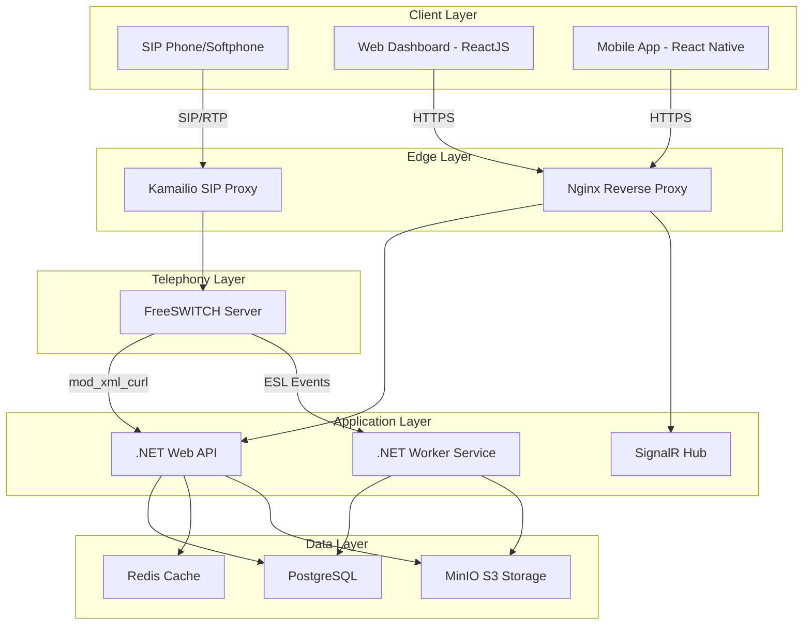
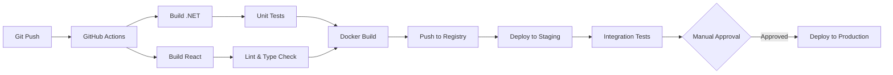
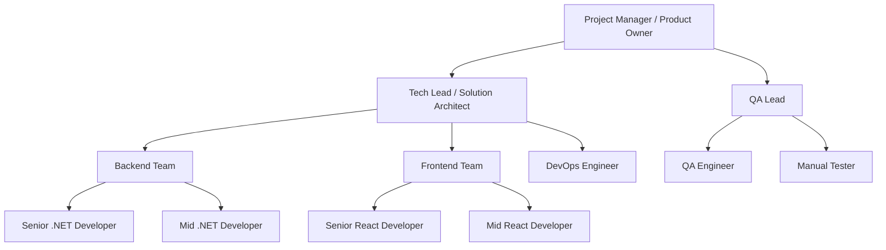

# TÀI LIỆU HẠ TẦNG & NHÂN SỰ
## Dự án: Call Center SaaS Platform

> [!IMPORTANT]
> Tài liệu này mô tả chi tiết về hạ tầng kỹ thuật, công nghệ sử dụng, cấu trúc nhân sự và ngân sách cho dự án Call Center SaaS với .NET Backend và ReactJS Frontend.

**Phiên bản:** 1.0  
**Ngày tạo:** 02/01/2026  
**Người tạo:** Tech Lead Team

---

## MỤC LỤC

1. [Tổng quan dự án](#1-tổng-quan-dự-án)
2. [Hạ tầng kỹ thuật](#2-hạ-tầng-kỹ-thuật)
3. [Công nghệ sử dụng (Tech Stack)](#3-công-nghệ-sử-dụng-tech-stack)
4. [Cấu trúc nhân sự](#4-cấu-trúc-nhân-sự)
5. [Ngân sách dự kiến](#5-ngân-sách-dự-kiến)
6. [Checklist chuẩn bị](#6-checklist-chuẩn-bị)

---

## 1. TỔNG QUAN DỰ ÁN

### 1.1. Mô hình kiến trúc
- **Backend:** .NET 8/9/10 (Clean Architecture + CQRS + MediatR)
- **Frontend:** ReactJS (Web) + React Native (Mobile App)
- **Call Server:** FreeSWITCH (Open Source Telephony Platform)
- **Deployment Model:** SaaS Multi-tenant

### 1.2. Mục tiêu
Xây dựng hệ thống Call Center SaaS cho phép:
- Nhiều khách hàng (Tenant) sử dụng chung hạ tầng
- Quản lý cuộc gọi inbound/outbound
- Ghi âm và lưu trữ cuộc gọi
- Báo cáo và phân tích chi tiết
- Tính cước tự động (Billing)

### 1.3. Quy mô mục tiêu (MVP - Phase 1)
- **Concurrent Calls:** 100-200 cuộc gọi đồng thời
- **Số Tenant:** 10-20 khách hàng
- **Số Agent:** 200-500 agent
- **Storage:** 500GB - 1TB cho ghi âm

---

## 2. HẠ TẦNG KỸ THUẬT

### 2.1. Kiến trúc hệ thống



### 2.2. Cấu hình Server (Giai đoạn MVP)

#### Option 1: All-in-One Server (Khuyến nghị cho MVP)
**Mục đích:** Tiết kiệm chi phí, nhanh chóng triển khai

| Thông số | Yêu cầu |
|----------|---------|
| **CPU** | 8 vCPU (Intel Xeon hoặc AMD EPYC) |
| **RAM** | 16GB DDR4 |
| **Storage** | 500GB SSD NVMe |
| **Network** | 1Gbps Port, IP Public tĩnh |
| **OS** | Debian 12 (Bookworm) hoặc Ubuntu 22.04 LTS |
| **Bandwidth** | Unlimited hoặc tối thiểu 10TB/tháng |

**Ưu điểm:**
- Chi phí thấp (~$100-150/tháng)
- Dễ quản lý
- Phù hợp cho POC/MVP

**Nhược điểm:**
- Single Point of Failure
- Khó scale ngang
- Performance có thể bị ảnh hưởng khi tải cao

---

#### Option 2: Kiến trúc tách biệt (Khuyến nghị cho Production)

##### Server 1: Application Server (.NET API + Database)
| Thông số | Yêu cầu |
|----------|---------|
| CPU | 4 vCPU |
| RAM | 8GB |
| Storage | 200GB SSD |
| Vai trò | Xử lý business logic, API, Database |

##### Server 2: Media Server (FreeSWITCH)
| Thông số | Yêu cầu |
|----------|---------|
| CPU | 8 vCPU |
| RAM | 16GB |
| Storage | 100GB SSD |
| Vai trò | Xử lý RTP stream, transcoding |

##### Server 3: Storage Server (MinIO)
| Thông số | Yêu cầu |
|----------|---------|
| CPU | 2 vCPU |
| RAM | 4GB |
| Storage | 1TB HDD/SSD |
| Vai trò | Lưu trữ file ghi âm |

**Tổng chi phí:** ~$250-350/tháng

---

### 2.3. Network Requirements

#### Bandwidth Calculation
- **Codec G.711:** ~87 Kbps/call (bao gồm overhead)
- **Codec G.729:** ~31 Kbps/call
- **Cho 100 concurrent calls với G.711:** 100 × 87 = 8.7 Mbps
- **Khuyến nghị:** Đường truyền tối thiểu 50 Mbps (để đảm bảo dư thừa)

#### Firewall Rules
| Port | Protocol | Service | Source |
|------|----------|---------|--------|
| 80 | TCP | HTTP | Any |
| 443 | TCP | HTTPS | Any |
| 5060 | UDP/TCP | SIP Signaling | Any |
| 5061 | TCP | SIP TLS | Any |
| 16384-32768 | UDP | RTP Media | Any |
| 8021 | TCP | FreeSWITCH ESL | Internal Only |
| 5432 | TCP | PostgreSQL | Internal Only |
| 6379 | TCP | Redis | Internal Only |
| 9000 | TCP | MinIO API | Internal Only |

> [!WARNING]
> **Bảo mật:** Chỉ mở port 8021, 5432, 6379, 9000 cho internal network. Không expose ra internet.

---

### 2.4. Hạ tầng phát triển (Development Infrastructure)

#### Version Control
- **Git Repository:** GitHub/GitLab/Azure DevOps
- **Branching Strategy:** GitFlow
  - `main`: Production code
  - `develop`: Development code
  - `feature/*`: Feature branches
  - `hotfix/*`: Hotfix branches

#### CI/CD Pipeline


#### Development Tools
| Tool | Purpose | License |
|------|---------|---------|
| Visual Studio 2022 / Rider | .NET Development | Commercial |
| VS Code | ReactJS Development | Free |
| Docker Desktop | Containerization | Free/Commercial |
| Postman | API Testing | Free |
| DBeaver | Database Management | Free |
| fs_cli | FreeSWITCH CLI | Free |
| SIPP | SIP Load Testing | Free |

---

## 3. CÔNG NGHỆ SỬ DỤNG (TECH STACK)

### 3.1. Backend Stack

#### Core Framework
- **.NET 8/9/10:** Framework chính
- **ASP.NET Core Web API:** RESTful API
- **Entity Framework Core 8:** ORM
- **MediatR:** CQRS Pattern
- **FluentValidation:** Validation
- **AutoMapper:** Object mapping

#### Libraries & Packages
```xml
<!-- Core -->
<PackageReference Include="Microsoft.AspNetCore.OpenApi" Version="8.0.0" />
<PackageReference Include="Swashbuckle.AspNetCore" Version="6.5.0" />

<!-- Database -->
<PackageReference Include="Npgsql.EntityFrameworkCore.PostgreSQL" Version="8.0.0" />
<PackageReference Include="Microsoft.EntityFrameworkCore.Design" Version="8.0.0" />

<!-- CQRS & Mediator -->
<PackageReference Include="MediatR" Version="12.2.0" />
<PackageReference Include="FluentValidation.AspNetCore" Version="11.3.0" />

<!-- Authentication & Authorization -->
<PackageReference Include="Microsoft.AspNetCore.Authentication.JwtBearer" Version="8.0.0" />
<PackageReference Include="Microsoft.AspNetCore.Identity.EntityFrameworkCore" Version="8.0.0" />

<!-- Caching -->
<PackageReference Include="StackExchange.Redis" Version="2.7.0" />
<PackageReference Include="Microsoft.Extensions.Caching.StackExchangeRedis" Version="8.0.0" />

<!-- Logging -->
<PackageReference Include="Serilog.AspNetCore" Version="8.0.0" />
<PackageReference Include="Serilog.Sinks.PostgreSQL" Version="2.3.0" />

<!-- Real-time Communication -->
<PackageReference Include="Microsoft.AspNetCore.SignalR" Version="1.1.0" />

<!-- FreeSWITCH Integration -->
<PackageReference Include="NEventSocket" Version="1.0.0" />

<!-- Object Storage -->
<PackageReference Include="Minio" Version="6.0.0" />

<!-- Testing -->
<PackageReference Include="xUnit" Version="2.6.0" />
<PackageReference Include="Moq" Version="4.20.0" />
<PackageReference Include="FluentAssertions" Version="6.12.0" />
```

---

### 3.2. Frontend Stack

#### Web Application (ReactJS)
```json
{
  "dependencies": {
    "react": "^18.2.0",
    "react-dom": "^18.2.0",
    "react-router-dom": "^6.20.0",
    "typescript": "^5.3.0",
    
    "// State Management": "",
    "@reduxjs/toolkit": "^2.0.0",
    "react-redux": "^9.0.0",
    
    "// UI Framework": "",
    "@mui/material": "^5.15.0",
    "@mui/icons-material": "^5.15.0",
    "@emotion/react": "^11.11.0",
    "@emotion/styled": "^11.11.0",
    
    "// Forms": "",
    "react-hook-form": "^7.49.0",
    "yup": "^1.3.0",
    
    "// API Client": "",
    "axios": "^1.6.0",
    "@tanstack/react-query": "^5.14.0",
    
    "// Real-time": "",
    "@microsoft/signalr": "^8.0.0",
    
    "// WebRTC/SIP": "",
    "jssip": "^3.10.0",
    
    "// Charts & Visualization": "",
    "recharts": "^2.10.0",
    "date-fns": "^3.0.0",
    
    "// Utilities": "",
    "lodash": "^4.17.21",
    "dayjs": "^1.11.0"
  }
}
```

#### Mobile Application (React Native)
```json
{
  "dependencies": {
    "react-native": "^0.73.0",
    "@react-navigation/native": "^6.1.0",
    "@react-navigation/stack": "^6.3.0",
    "react-native-webrtc": "^118.0.0",
    "react-native-callkeep": "^4.3.0",
    "react-native-voip-push-notification": "^3.3.0"
  }
}
```

---

### 3.3. Telephony Stack

#### FreeSWITCH Modules
| Module | Purpose | Priority |
|--------|---------|----------|
| mod_sofia | SIP Stack | Critical |
| mod_xml_curl | Dynamic Configuration | Critical |
| mod_event_socket | ESL Interface | Critical |
| mod_commands | CLI Commands | Critical |
| mod_dialplan_xml | Dialplan Processing | Critical |
| mod_dptools | Dialplan Tools | Critical |
| mod_conference | Conference Bridge | High |
| mod_voicemail | Voicemail System | High |
| mod_callcenter | ACD Queue | High |
| mod_db | Database Interface | Medium |
| mod_redis | Redis Integration | Medium |
| mod_shout | MP3 Streaming | Medium |
| mod_sndfile | Audio File I/O | Medium |
| mod_tone_stream | Tone Generation | Low |

#### Codecs Support
- **G.711 (PCMU/PCMA):** Chất lượng cao, băng thông lớn
- **G.729:** Tiết kiệm băng thông (cần license)
- **Opus:** WebRTC, chất lượng tốt
- **GSM:** Fallback codec

---

### 3.4. Database & Storage

#### PostgreSQL Schema
```sql
-- Databases
- callcenter_main: Dữ liệu chính (Tenants, Users, Extensions)
- callcenter_cdr: Call Detail Records (Tách riêng để tối ưu query)
- callcenter_logs: Application logs
```

#### Redis Usage
- **Cache:** User sessions, Extension configs
- **Pub/Sub:** Real-time events
- **Rate Limiting:** API throttling

#### MinIO (S3-Compatible Storage)
```
Buckets:
- recordings: File ghi âm (.wav, .mp3)
- voicemails: Tin nhắn thoại
- ivr-prompts: File IVR
- reports: Báo cáo export
```

---

## 4. CẤU TRÚC NHÂN SỰ

### 4.1. Sơ đồ tổ chức



---

### 4.2. Chi tiết vị trí và nhiệm vụ

#### 4.2.1. Project Manager / Product Owner (1 người)

**Yêu cầu:**
- Kinh nghiệm: 3+ năm quản lý dự án phần mềm
- Hiểu biết về VoIP/Telephony (ưu tiên)
- Kỹ năng: Agile/Scrum, stakeholder management

**Nhiệm vụ:**
- Quản lý timeline, budget, resources
- Thu thập và phân tích yêu cầu khách hàng
- Điều phối giữa các team
- Báo cáo tiến độ cho stakeholders
- Quản lý rủi ro dự án

**KPI:**
- On-time delivery rate
- Budget adherence
- Stakeholder satisfaction score

---

#### 4.2.2. Tech Lead / Solution Architect (1 người)

**Yêu cầu:**
- Kinh nghiệm: 5+ năm .NET, 2+ năm VoIP/FreeSWITCH
- Kỹ năng kỹ thuật:
  - **VoIP:** SIP, RTP, SDP, NAT traversal, Codec
  - **Architecture:** Microservices, Event-driven, CQRS
  - **FreeSWITCH:** mod_xml_curl, mod_event_socket, Dialplan
  - **.NET:** Clean Architecture, Design Patterns
  - **Database:** PostgreSQL optimization, Redis
- Kỹ năng mềm: Leadership, mentoring, technical writing

**Nhiệm vụ:**
- Thiết kế kiến trúc tổng thể hệ thống
- Review code và đảm bảo code quality
- Giải quyết technical challenges
- Mentoring junior/mid developers
- Thiết kế luồng XML động cho FreeSWITCH
- Tối ưu performance và scalability
- Viết technical documentation

**KPI:**
- System uptime (>99.5%)
- Code review completion rate
- Technical debt reduction
- Team skill improvement

---

#### 4.2.3. Senior .NET Developer (1 người)

**Yêu cầu:**
- Kinh nghiệm: 4+ năm .NET
- Kỹ năng:
  - **Core:** .NET 8+, ASP.NET Core, EF Core
  - **Patterns:** CQRS, MediatR, Repository, Unit of Work
  - **API:** RESTful, gRPC, SignalR
  - **Testing:** xUnit, Moq, Integration tests
  - **VoIP:** Hiểu cơ bản về SIP, ESL

**Nhiệm vụ:**
- Phát triển core business logic
- Implement CQRS handlers (Commands/Queries)
- Viết API endpoints cho Frontend
- Viết API xử lý mod_xml_curl (Directory, Dialplan)
- Implement authentication & authorization
- Viết unit tests và integration tests
- Code review cho Mid developer

**Deliverables:**
- User Management Module
- Tenant Management Module
- Extension Management Module
- XML Configuration API
- Authentication API

---

#### 4.2.4. Mid .NET Developer (1 người)

**Yêu cầu:**
- Kinh nghiệm: 2-3 năm .NET
- Kỹ năng: .NET Core, Entity Framework, SQL

**Nhiệm vụ:**
- Implement features theo design của Senior
- Viết .NET Worker Service lắng nghe ESL events
- Xử lý logic Billing (tính cước)
- Implement CDR processing
- Viết background jobs (Hangfire/Quartz)
- Upload file ghi âm lên MinIO
- Viết unit tests

**Deliverables:**
- ESL Event Listener Service
- Billing Module
- CDR Processing Module
- Recording Upload Service
- Report Generation Module

---

#### 4.2.5. Senior React Developer (1 người)

**Yêu cầu:**
- Kinh nghiệm: 4+ năm React
- Kỹ năng:
  - **Core:** React 18+, TypeScript, Hooks
  - **State:** Redux Toolkit, React Query
  - **UI:** Material-UI, Responsive Design
  - **Real-time:** SignalR, WebSocket
  - **WebRTC:** JsSIP, SIP.js

**Nhiệm vụ:**
- Thiết kế component architecture
- Implement Admin Dashboard
- Implement Tenant Dashboard
- Tích hợp WebRTC Softphone
- Implement real-time call monitoring
- Code review cho Mid developer
- Performance optimization

**Deliverables:**
- Admin Dashboard (Tenant Management, System Config)
- Tenant Dashboard (Agent Management, Reports)
- Webphone Component (SIP calling)
- Real-time Call Monitor
- CDR Report UI

---

#### 4.2.6. Mid React Developer (1 người)

**Yêu cầu:**
- Kinh nghiệm: 2-3 năm React
- Kỹ năng: React, JavaScript/TypeScript, CSS

**Nhiệm vụ:**
- Implement UI components theo design
- Tích hợp API với Backend
- Implement forms và validation
- Implement charts và reports
- Responsive design
- Viết component tests

**Deliverables:**
- Login/Register UI
- User Profile UI
- Extension Management UI
- Call History UI
- Report Charts UI

---

#### 4.2.7. DevOps Engineer (1 người)

**Yêu cầu:**
- Kinh nghiệm: 3+ năm DevOps
- Kỹ năng:
  - **OS:** Linux (Debian/Ubuntu)
  - **Container:** Docker, Docker Compose
  - **Orchestration:** Kubernetes (nice to have)
  - **CI/CD:** GitHub Actions, GitLab CI
  - **Monitoring:** Prometheus, Grafana, ELK
  - **Scripting:** Bash, Python

**Nhiệm vụ:**
- Setup và maintain servers
- Cài đặt FreeSWITCH từ source
- Cấu hình Nginx reverse proxy
- Setup CI/CD pipeline
- Docker containerization
- Setup monitoring và alerting
- Backup và disaster recovery
- Security hardening

**Deliverables:**
- Production server setup
- CI/CD pipeline
- Docker images
- Monitoring dashboard
- Backup automation
- Security audit report

---

#### 4.2.8. QA Lead (1 người)

**Yêu cầu:**
- Kinh nghiệm: 3+ năm QA/Testing
- Kỹ năng:
  - **Testing:** Manual, Automation, Load testing
  - **Tools:** Selenium, Postman, SIPP, JMeter
  - **VoIP:** Hiểu cơ bản về SIP testing

**Nhiệm vụ:**
- Viết test plan và test cases
- Thực hiện functional testing
- Viết automation tests (Selenium)
- Load testing với SIPP (SIP load test)
- API testing với Postman
- Bug tracking và reporting
- UAT coordination

**Deliverables:**
- Test Plan document
- Test Cases (100+ cases)
- Automation test scripts
- Load test reports
- Bug reports

---

#### 4.2.9. Manual Tester (1 người)

**Yêu cầu:**
- Kinh nghiệm: 1-2 năm testing
- Kỹ năng: Manual testing, bug reporting

**Nhiệm vụ:**
- Thực hiện manual testing theo test cases
- Exploratory testing
- Regression testing
- UI/UX testing
- Bug reporting và verification

---

### 4.3. Tổng hợp nhân sự

| Vị trí | Số lượng | Level | Mức lương (VND/tháng) |
|--------|----------|-------|----------------------|
| Project Manager | 1 | Senior | 30-40M |
| Tech Lead | 1 | Senior | 40-50M |
| Senior .NET Dev | 1 | Senior | 30-40M |
| Mid .NET Dev | 1 | Mid | 20-25M |
| Senior React Dev | 1 | Senior | 30-40M |
| Mid React Dev | 1 | Mid | 18-23M |
| DevOps Engineer | 1 | Mid/Senior | 25-35M |
| QA Lead | 1 | Senior | 20-25M |
| Manual Tester | 1 | Junior/Mid | 12-15M |
| **TỔNG** | **9 người** | | **225-293M/tháng** |

> [!NOTE]
> Mức lương trên là tham khảo cho thị trường Việt Nam (2026), có thể điều chỉnh tùy theo khu vực và kinh nghiệm thực tế.

---

## 5. NGÂN SÁCH DỰ KIẾN

### 5.1. Chi phí nhân sự (3 tháng MVP)

| Hạng mục | Chi tiết | Chi phí (VND) |
|----------|---------|---------------|
| Lương team (3 tháng) | 9 người × 3 tháng | 675M - 879M |
| Bảo hiểm xã hội (17.5%) | | 118M - 154M |
| **Tổng nhân sự** | | **793M - 1,033M** |

---

### 5.2. Chi phí hạ tầng (3 tháng)

#### Option 1: All-in-One (MVP)
| Hạng mục | Chi tiết | Chi phí (VND) |
|----------|---------|---------------|
| VPS Server | 8 vCPU, 16GB RAM, 500GB SSD | 3.5M × 3 = 10.5M |
| Domain | .com domain | 0.3M |
| SSL Certificate | Let's Encrypt | Free |
| Backup Storage | 500GB cloud backup | 0.5M × 3 = 1.5M |
| **Tổng** | | **12.3M** |

#### Option 2: Tách biệt (Production)
| Hạng mục | Chi tiết | Chi phí (VND) |
|----------|---------|---------------|
| App Server | 4 vCPU, 8GB RAM | 2M × 3 = 6M |
| Media Server | 8 vCPU, 16GB RAM | 3.5M × 3 = 10.5M |
| Storage Server | 2 vCPU, 4GB, 1TB | 1.5M × 3 = 4.5M |
| Load Balancer | Cloud LB | 1M × 3 = 3M |
| Domain & SSL | | 0.3M |
| Backup | | 1M × 3 = 3M |
| **Tổng** | | **27.3M** |

---

### 5.3. Chi phí SIP Trunk & Telephony

| Hạng mục | Chi tiết | Chi phí (VND) |
|----------|---------|---------------|
| SIP Trunk Setup | Phí kích hoạt đầu số | 5M - 10M |
| Concurrent Channels | 100 kênh đồng thời | 10M - 15M |
| Outbound Minutes | 10,000 phút test | 3M - 5M |
| DID Numbers | 10 số hotline | 2M - 3M |
| **Tổng** | | **20M - 33M** |

---

### 5.4. Chi phí phần mềm & công cụ

| Hạng mục | Chi tiết | Chi phí (VND) |
|----------|---------|---------------|
| Visual Studio License | 2 licenses | 3M × 3 = 9M |
| JetBrains Rider | 2 licenses (optional) | 1.5M × 3 = 4.5M |
| GitHub Team | 9 users | 0.5M × 3 = 1.5M |
| Monitoring Tools | Grafana Cloud | 1M × 3 = 3M |
| Design Tools | Figma Pro | 0.3M × 3 = 0.9M |
| **Tổng** | | **18.9M** |

---

### 5.5. Chi phí khác

| Hạng mục | Chi tiết | Chi phí (VND) |
|----------|---------|---------------|
| IP Phones | 5 cái × 2M | 10M |
| Headsets | 10 cái × 0.5M | 5M |
| Testing SIM | 10 SIM | 1M |
| Văn phòng phẩm | | 2M |
| Đào tạo | VoIP/FreeSWITCH training | 10M |
| Dự phòng (10%) | | 8M |
| **Tổng** | | **36M** |

---

### 5.6. TỔNG NGÂN SÁCH DỰ ÁN (3 THÁNG MVP)

| Hạng mục | Option 1 (All-in-One) | Option 2 (Tách biệt) |
|----------|----------------------|---------------------|
| Nhân sự | 793M - 1,033M | 793M - 1,033M |
| Hạ tầng | 12.3M | 27.3M |
| SIP Trunk | 20M - 33M | 20M - 33M |
| Phần mềm | 18.9M | 18.9M |
| Chi phí khác | 36M | 36M |
| **TỔNG CỘNG** | **880M - 1,133M** | **895M - 1,148M** |

> [!IMPORTANT]
> **Khuyến nghị:** Bắt đầu với Option 1 (All-in-One) để tiết kiệm chi phí. Sau khi có khách hàng trả tiền, scale lên Option 2.

---

## 6. CHECKLIST CHUẨN BỊ

### 6.1. Chuẩn bị hạ tầng (Tuần 1)

- [ ] **Thuê VPS/Server**
  - [ ] Chọn nhà cung cấp (AWS, DigitalOcean, Vultr, hoặc VPS Việt Nam)
  - [ ] Cấu hình: 8 vCPU, 16GB RAM, 500GB SSD
  - [ ] IP Public tĩnh
  - [ ] Bandwidth unlimited hoặc >10TB/tháng
  
- [ ] **Domain & DNS**
  - [ ] Mua domain (ví dụ: callcenter-saas.com)
  - [ ] Cấu hình DNS A record trỏ về IP server
  - [ ] Cấu hình subdomain:
    - api.callcenter-saas.com → API
    - app.callcenter-saas.com → Web Dashboard
    - sip.callcenter-saas.com → SIP Server

- [ ] **SSL Certificate**
  - [ ] Cài đặt Certbot
  - [ ] Generate Let's Encrypt SSL
  - [ ] Auto-renewal setup

---

### 6.2. Cài đặt phần mềm cơ bản (Tuần 1)

- [ ] **Operating System**
  - [ ] Cài Debian 12 hoặc Ubuntu 22.04 LTS
  - [ ] Update system: `apt update && apt upgrade -y`
  - [ ] Cài đặt essential tools: `git`, `curl`, `wget`, `vim`

- [ ] **FreeSWITCH**
  - [ ] Cài đặt từ official repository hoặc compile từ source
  - [ ] Enable modules cần thiết
  - [ ] Cấu hình SIP profiles
  - [ ] Test cuộc gọi cơ bản

- [ ] **.NET Runtime**
  - [ ] Cài .NET 8 SDK
  - [ ] Verify: `dotnet --version`

- [ ] **PostgreSQL**
  - [ ] Cài PostgreSQL 15+
  - [ ] Tạo database và user
  - [ ] Cấu hình remote access (nếu cần)

- [ ] **Redis**
  - [ ] Cài Redis 7+
  - [ ] Cấu hình persistence
  - [ ] Test connection

- [ ] **MinIO**
  - [ ] Cài MinIO server
  - [ ] Tạo buckets: recordings, voicemails, ivr-prompts
  - [ ] Cấu hình access policy

- [ ] **Nginx**
  - [ ] Cài Nginx
  - [ ] Cấu hình reverse proxy cho API
  - [ ] Cấu hình SSL

---

### 6.3. Chuẩn bị SIP Trunk (Tuần 1-2)

- [ ] **Chọn nhà cung cấp**
  - [ ] FPT Telecom
  - [ ] Viettel
  - [ ] CMC Telecom
  - [ ] Hoặc quốc tế: Twilio, SignalWire, Telnyx

- [ ] **Đăng ký dịch vụ**
  - [ ] Ký hợp đồng
  - [ ] Nhận thông tin SIP Trunk:
    - SIP Server IP/Domain
    - Username/Password
    - Codec support
    - Concurrent channels

- [ ] **Test kết nối**
  - [ ] Cấu hình Gateway trong FreeSWITCH
  - [ ] Test cuộc gọi outbound
  - [ ] Test cuộc gọi inbound
  - [ ] Kiểm tra chất lượng thoại

---

### 6.4. Chuẩn bị công cụ phát triển (Tuần 1)

- [ ] **Version Control**
  - [ ] Tạo Git repository (GitHub/GitLab)
  - [ ] Setup branching strategy
  - [ ] Invite team members

- [ ] **Development Environment**
  - [ ] Cài Visual Studio 2022 / Rider
  - [ ] Cài VS Code
  - [ ] Cài Node.js 18+ LTS
  - [ ] Cài Docker Desktop

- [ ] **Project Setup**
  - [ ] Tạo .NET Solution với Clean Architecture
  - [ ] Tạo React project với TypeScript
  - [ ] Setup ESLint, Prettier
  - [ ] Setup Git hooks (Husky)

---

### 6.5. Chuẩn bị thiết bị test (Tuần 1-2)

- [ ] **IP Phones**
  - [ ] Mua 3-5 IP Phones (Yealink, Grandstream, hoặc Cisco)
  - [ ] Cấu hình kết nối FreeSWITCH
  - [ ] Test cuộc gọi

- [ ] **Softphones**
  - [ ] Cài Zoiper, MicroSIP, hoặc X-Lite
  - [ ] Cấu hình SIP accounts
  - [ ] Test trên Windows/Mac/Linux

- [ ] **Headsets**
  - [ ] Mua tai nghe USB cho team test
  - [ ] Test audio quality

---

### 6.6. Tài liệu & Training (Tuần 1-2)

- [ ] **Documentation**
  - [ ] Đọc FreeSWITCH documentation
  - [ ] Đọc SIP RFC 3261
  - [ ] Đọc .NET Clean Architecture guides

- [ ] **Training**
  - [ ] Training VoIP basics cho team
  - [ ] Training FreeSWITCH cho Backend team
  - [ ] Training WebRTC cho Frontend team

---

### 6.7. Monitoring & Logging (Tuần 2)

- [ ] **Logging**
  - [ ] Setup Serilog trong .NET
  - [ ] Cấu hình log levels
  - [ ] Log rotation

- [ ] **Monitoring**
  - [ ] Cài Prometheus
  - [ ] Cài Grafana
  - [ ] Setup dashboards:
    - Server metrics (CPU, RAM, Disk)
    - FreeSWITCH metrics (Calls, Channels)
    - Application metrics (API response time)

- [ ] **Alerting**
  - [ ] Cấu hình alerts cho:
    - Server down
    - High CPU/RAM usage
    - Failed calls rate > 5%
    - API errors > 10/min

---

## PHỤ LỤC

### A. Danh sách nhà cung cấp VPS (Việt Nam)

| Nhà cung cấp | Website | Ghi chú |
|--------------|---------|---------|
| BKNS | bkns.vn | Giá tốt, hỗ trợ tốt |
| Nhân Hòa | nhanhoa.com | Uy tín, nhiều DC |
| Viettel IDC | viettelidc.com.vn | Băng thông lớn |
| FPT Cloud | fptcloud.com | Enterprise grade |

### B. Danh sách nhà cung cấp SIP Trunk (Việt Nam)

| Nhà cung cấp | Website | Ghi chú |
|--------------|---------|---------|
| FPT Telecom | fpt.vn | Phổ biến nhất |
| Viettel | viettel.vn | Giá tốt |
| CMC Telecom | cmctelecom.vn | Chất lượng cao |
| VNPT | vnpt.vn | Nhiều tỉnh thành |

### C. Tài liệu tham khảo

- [FreeSWITCH Official Documentation](https://freeswitch.org/confluence/)
- [SIP RFC 3261](https://www.ietf.org/rfc/rfc3261.txt)
- [.NET Clean Architecture](https://github.com/jasontaylordev/CleanArchitecture)
- [WebRTC Documentation](https://webrtc.org/)

---

**Ngày cập nhật:** 02/01/2026  
**Phiên bản:** 1.0  
**Người phê duyệt:** Tech Lead
