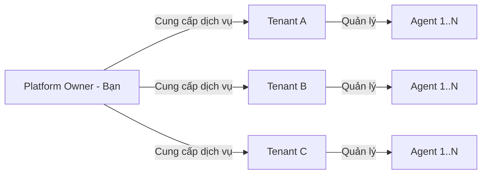
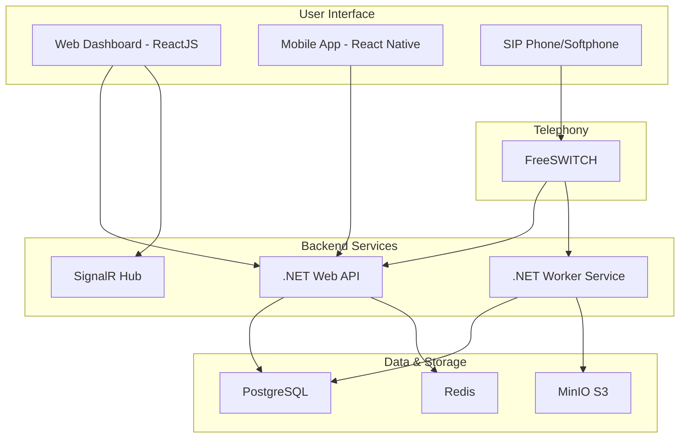
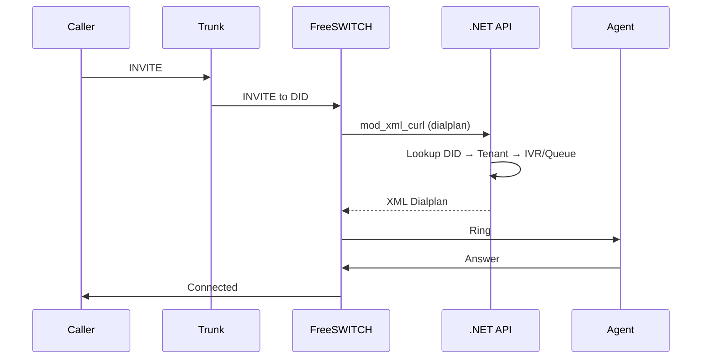
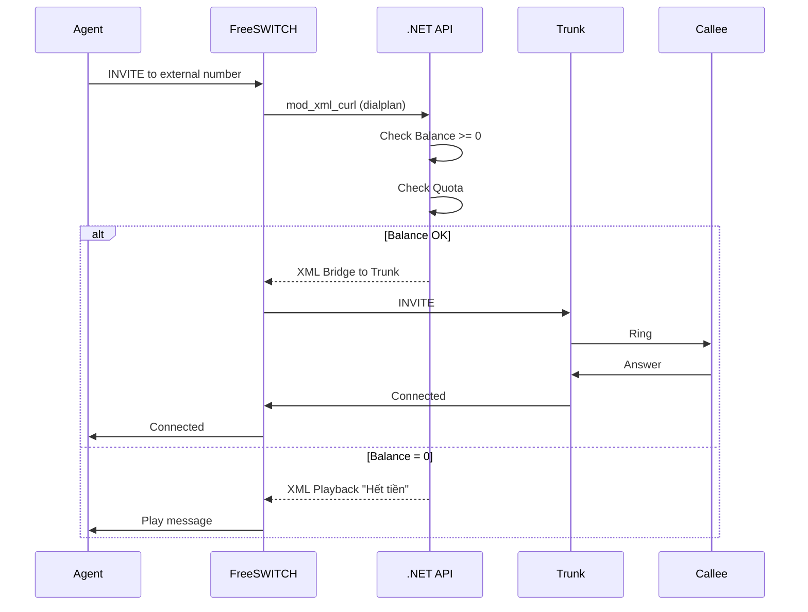
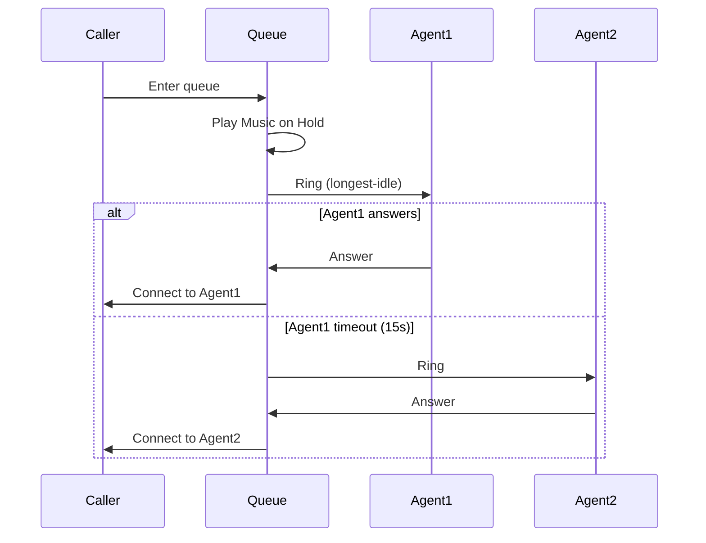

# TÀI LIỆU YÊU CẦU PHẦN MỀM (SRS)
## Software Requirements Specification
### Dự án: Call Center SaaS Platform

> [!IMPORTANT]
> Tài liệu này mô tả chi tiết các yêu cầu chức năng và phi chức năng của hệ thống Call Center SaaS. Đây là tài liệu chuẩn để team phát triển implement các tính năng.

**Phiên bản:** 1.0  
**Ngày tạo:** 02/01/2026  
**Người tạo:** Product Owner & Tech Lead

---

## MỤC LỤC

1. [Giới thiệu](#1-giới-thiệu)
2. [Tổng quan hệ thống](#2-tổng-quan-hệ-thống)
3. [Actors (Người dùng hệ thống)](#3-actors-người-dùng-hệ-thống)
4. [Yêu cầu chức năng](#4-yêu-cầu-chức-năng)
5. [Yêu cầu phi chức năng](#5-yêu-cầu-phi-chức-năng)
6. [Use Cases chi tiết](#6-use-cases-chi-tiết)
7. [API Requirements](#7-api-requirements)
8. [Data Requirements](#8-data-requirements)

---

## 1. GIỚI THIỆU

### 1.1. Mục đích tài liệu
Tài liệu này định nghĩa đầy đủ các yêu cầu chức năng và phi chức năng cho hệ thống Call Center SaaS Platform, phục vụ cho:
- Team phát triển: Hiểu rõ cần làm gì
- Team QA: Viết test cases
- Product Owner: Verify deliverables
- Stakeholders: Review và approval

### 1.2. Phạm vi dự án
Xây dựng hệ thống Call Center SaaS Multi-tenant cho phép:
- Quản lý nhiều khách hàng (Tenant) trên cùng một hạ tầng
- Xử lý cuộc gọi inbound/outbound/internal
- Ghi âm và lưu trữ cuộc gọi
- Báo cáo và phân tích chi tiết
- Tính cước tự động (Billing)
- Quản lý IVR (Interactive Voice Response)
- Quản lý Queue (Call Center ACD)

### 1.3. Định nghĩa và từ viết tắt

| Thuật ngữ | Định nghĩa |
|-----------|------------|
| **SaaS** | Software as a Service |
| **Tenant** | Khách hàng thuê dịch vụ (công ty) |
| **Agent** | Nhân viên tổng đài của Tenant |
| **Extension** | Số máy nhánh (VD: 101, 102) |
| **SIP** | Session Initiation Protocol |
| **RTP** | Real-time Transport Protocol |
| **CDR** | Call Detail Record |
| **IVR** | Interactive Voice Response |
| **ACD** | Automatic Call Distribution |
| **DID** | Direct Inward Dialing (Số hotline) |
| **Trunk** | Kết nối với nhà mạng |
| **Codec** | Audio compression algorithm |
| **ESL** | Event Socket Library |

---

## 2. TỔNG QUAN HỆ THỐNG

### 2.1. Mô hình kinh doanh


### 2.2. Kiến trúc tổng quan


---

## 3. ACTORS (NGƯỜI DÙNG HỆ THỐNG)

### 3.1. Super Admin (Platform Owner)
**Mô tả:** Người quản trị toàn bộ hệ thống (bạn)

**Quyền hạn:**
- Tạo/sửa/xóa Tenant
- Xem tất cả dữ liệu của tất cả Tenant
- Cấu hình hệ thống (SIP Trunk, Server)
- Xem doanh thu tổng
- Quản lý license và quota
- Backup/Restore dữ liệu

---

### 3.2. Tenant Admin (Khách hàng)
**Mô tả:** Quản trị viên của một công ty thuê dịch vụ

**Quyền hạn:**
- Quản lý Agent (tạo/sửa/xóa)
- Quản lý Extension
- Cấu hình IVR
- Cấu hình Queue
- Xem báo cáo của công ty mình
- Nghe file ghi âm
- Nạp tiền vào ví (Billing)
- Mua đầu số (DID)

**Giới hạn:**
- Chỉ thấy dữ liệu của công ty mình
- Không thấy dữ liệu của Tenant khác

---

### 3.3. Supervisor (Giám sát viên)
**Mô tả:** Quản lý nhóm Agent trong một Tenant

**Quyền hạn:**
- Xem real-time dashboard của team
- Nghe lén (Monitor) cuộc gọi của Agent
- Xem báo cáo của team
- Nghe file ghi âm của team
- Không được tạo/xóa Agent

---

### 3.4. Agent (Nhân viên tổng đài)
**Mô tả:** Người thực hiện cuộc gọi

**Quyền hạn:**
- Đăng nhập vào Softphone/IP Phone
- Thực hiện cuộc gọi
- Nhận cuộc gọi
- Xem lịch sử cuộc gọi của bản thân
- Nghe file ghi âm của bản thân
- Cập nhật trạng thái (Available/Busy/Break)

**Giới hạn:**
- Không thấy cuộc gọi của Agent khác
- Không thấy báo cáo tổng

---

## 4. YÊU CẦU CHỨC NĂNG

### 4.1. Module: Authentication & Authorization

#### REQ-AUTH-01: User Registration
**Mô tả:** Tenant Admin có thể đăng ký tài khoản mới

**Input:**
- Email (unique)
- Password (min 8 ký tự, có chữ hoa, số, ký tự đặc biệt)
- Company Name
- Phone Number

**Process:**
- Validate email chưa tồn tại
- Hash password (BCrypt)
- Tạo Tenant mới trong DB
- Gửi email xác nhận

**Output:**
- Tenant ID
- Confirmation email sent

**Acceptance Criteria:**
- Email phải unique
- Password phải đủ mạnh
- Tự động tạo domain: `{company-slug}.pbx.local`

---

#### REQ-AUTH-02: User Login
**Mô tả:** User đăng nhập vào hệ thống

**Input:**
- Email
- Password

**Process:**
- Verify email + password
- Generate JWT token (expire 24h)
- Generate refresh token (expire 7 days)
- Log login history

**Output:**
- Access token
- Refresh token
- User info (role, tenant_id)

**Acceptance Criteria:**
- Sai password quá 5 lần → Lock account 15 phút
- Log IP address và device

---

#### REQ-AUTH-03: Role-Based Access Control (RBAC)
**Mô tả:** Phân quyền theo role

**Roles:**
- SuperAdmin
- TenantAdmin
- Supervisor
- Agent

**Permissions Matrix:**

| Feature | SuperAdmin | TenantAdmin | Supervisor | Agent |
|---------|------------|-------------|------------|-------|
| Manage Tenants | ✅ | ❌ | ❌ | ❌ |
| Manage Agents | ✅ | ✅ | ❌ | ❌ |
| View All CDRs | ✅ | ✅ (own tenant) | ✅ (own team) | ✅ (own) |
| Listen Recordings | ✅ | ✅ | ✅ | ✅ (own) |
| Configure IVR | ✅ | ✅ | ❌ | ❌ |
| Make Calls | ✅ | ✅ | ✅ | ✅ |

---

### 4.2. Module: Tenant Management

#### REQ-TENANT-01: Create Tenant
**Mô tả:** Super Admin tạo Tenant mới

**Input:**
- Company Name
- Domain (unique, VD: `company-a`)
- Admin Email
- Max Agents (quota)
- Max Concurrent Calls (quota)
- Balance (số tiền ban đầu)

**Process:**
- Validate domain chưa tồn tại
- Tạo record trong bảng `Tenants`
- Tạo Admin user cho Tenant
- Gửi email welcome

**Output:**
- Tenant ID
- Admin credentials

**Acceptance Criteria:**
- Domain phải unique
- Tự động tạo SIP domain: `{domain}.pbx.local`

---

#### REQ-TENANT-02: Update Tenant Quota
**Mô tả:** Super Admin cập nhật quota cho Tenant

**Input:**
- Tenant ID
- Max Agents
- Max Concurrent Calls

**Process:**
- Update database
- Notify Tenant Admin qua email

**Output:**
- Success message

**Acceptance Criteria:**
- Không được giảm quota xuống dưới số đang sử dụng

---

#### REQ-TENANT-03: Suspend/Activate Tenant
**Mô tả:** Super Admin tạm ngưng hoặc kích hoạt Tenant

**Input:**
- Tenant ID
- Action (Suspend/Activate)
- Reason

**Process:**
- Update status trong DB
- Nếu Suspend → Reject tất cả cuộc gọi của Tenant đó
- Gửi email thông báo

**Output:**
- Status updated

**Acceptance Criteria:**
- Khi Suspend, Agent không thể đăng nhập SIP
- Khi Suspend, Web dashboard hiển thị thông báo

---

### 4.3. Module: Extension Management

#### REQ-EXT-01: Create Extension
**Mô tả:** Tenant Admin tạo Extension (số máy nhánh) cho Agent

**Input:**
- Extension Number (VD: 101, 102)
- Agent Name
- Email
- Password (SIP password)

**Process:**
- Validate Extension chưa tồn tại trong Tenant
- Tạo record trong bảng `Extensions`
- Hash SIP password

**Output:**
- Extension ID
- SIP credentials

**Acceptance Criteria:**
- Extension number phải unique trong Tenant
- Extension number: 3-5 chữ số
- Tự động generate SIP password nếu không nhập

---

#### REQ-EXT-02: Update Extension
**Mô tả:** Tenant Admin cập nhật thông tin Extension

**Input:**
- Extension ID
- New Name/Email/Password

**Process:**
- Update database
- Nếu đổi password → Force re-register SIP

**Output:**
- Success message

---

#### REQ-EXT-03: Delete Extension
**Mô tả:** Tenant Admin xóa Extension

**Input:**
- Extension ID

**Process:**
- Soft delete (set `is_deleted = true`)
- Kick SIP registration
- Lưu lại CDR history

**Output:**
- Success message

**Acceptance Criteria:**
- Không xóa vật lý, chỉ soft delete
- CDR history vẫn giữ nguyên

---

### 4.4. Module: Call Handling (Core)

#### REQ-CALL-01: Inbound Call (Cuộc gọi vào)
**Mô tả:** Xử lý cuộc gọi từ bên ngoài vào hệ thống

**Flow:**


**Input:**
- DID Number (số hotline)
- Caller ID

**Process:**
1. FreeSWITCH nhận INVITE từ Trunk
2. Gọi API: `POST /api/freeswitch/dialplan?did={number}`
3. API lookup DID → Tenant → Routing rule
4. Trả về XML:
   - Nếu có IVR → Play IVR
   - Nếu có Queue → Add to Queue
   - Nếu Direct Extension → Bridge

**Output:**
- Call connected
- CDR created

**Acceptance Criteria:**
- Latency API < 200ms
- Ghi âm tự động (nếu Tenant enable)

---

#### REQ-CALL-02: Outbound Call (Cuộc gọi ra)
**Mô tả:** Agent gọi ra ngoài

**Flow:**


**Input:**
- Extension (caller)
- Destination Number

**Process:**
1. Validate Balance > 0
2. Validate Concurrent Calls < Quota
3. Route qua Trunk
4. Start billing timer

**Output:**
- Call connected
- Billing started

**Acceptance Criteria:**
- Nếu Balance = 0 → Play message "Tài khoản hết tiền"
- Nếu Quota full → Play message "Hệ thống đang bận"

---

#### REQ-CALL-03: Internal Call (Cuộc gọi nội bộ)
**Mô tả:** Extension gọi Extension trong cùng Tenant

**Input:**
- Caller Extension
- Callee Extension

**Process:**
- Validate cả 2 Extension cùng Tenant
- Bridge trực tiếp (không qua Trunk)
- Không tính cước

**Output:**
- Call connected
- CDR created (cost = 0)

**Acceptance Criteria:**
- Không được gọi sang Extension của Tenant khác

---

#### REQ-CALL-04: Call Transfer
**Mô tả:** Agent chuyển cuộc gọi sang Agent khác

**Types:**
- **Blind Transfer:** Chuyển ngay không hỏi
- **Attended Transfer:** Hỏi trước, đồng ý mới chuyển

**Input:**
- Current call UUID
- Target Extension

**Process:**
- FreeSWITCH execute `uuid_transfer` command
- Update CDR (transfer_to field)

**Output:**
- Call transferred

---

#### REQ-CALL-05: Call Hold/Resume
**Mô tả:** Agent giữ máy / tiếp tục

**Input:**
- Call UUID
- Action (Hold/Resume)

**Process:**
- FreeSWITCH execute `uuid_hold` / `uuid_unhold`
- Play music on hold

**Output:**
- Call on hold / resumed

---

### 4.5. Module: IVR (Interactive Voice Response)

#### REQ-IVR-01: IVR Builder
**Mô tả:** Tenant Admin tạo kịch bản IVR

**UI:**
- Drag & drop flow builder
- Hoặc JSON config

**Components:**
- **Play Audio:** Phát file âm thanh
- **Get Digits:** Nhận phím bấm (DTMF)
- **Condition:** Điều kiện if/else
- **Transfer:** Chuyển đến Extension/Queue
- **Hangup:** Ngắt máy

**Example Flow:**
```json
{
  "name": "Main IVR",
  "steps": [
    {
      "type": "play",
      "audio": "welcome.mp3",
      "text": "Xin chào, bấm 1 gặp bộ phận kinh doanh, bấm 2 gặp kỹ thuật"
    },
    {
      "type": "get_digits",
      "timeout": 5,
      "max_digits": 1,
      "variable": "choice"
    },
    {
      "type": "condition",
      "variable": "choice",
      "cases": {
        "1": {"action": "transfer", "destination": "queue:sales"},
        "2": {"action": "transfer", "destination": "queue:support"},
        "default": {"action": "play", "audio": "invalid.mp3"}
      }
    }
  ]
}
```

**Acceptance Criteria:**
- Hỗ trợ upload file MP3/WAV
- Hỗ trợ Text-to-Speech (TTS) - optional
- Preview trước khi save

---

#### REQ-IVR-02: IVR Execution
**Mô tả:** FreeSWITCH thực thi IVR

**Process:**
1. API trả về XML Dialplan chứa IVR steps
2. FreeSWITCH execute từng step
3. Log IVR events

**Output:**
- IVR executed
- DTMF captured

---

### 4.6. Module: Queue (ACD - Automatic Call Distribution)

#### REQ-QUEUE-01: Create Queue
**Mô tả:** Tenant Admin tạo Queue

**Input:**
- Queue Name (VD: "Sales", "Support")
- Strategy:
  - `ring-all`: Đổ chuông tất cả Agent
  - `round-robin`: Lần lượt
  - `longest-idle`: Agent rảnh lâu nhất
- Max Wait Time (giây)
- Music on Hold file

**Process:**
- Tạo record trong bảng `Queues`
- Cấu hình FreeSWITCH mod_callcenter

**Output:**
- Queue ID

---

#### REQ-QUEUE-02: Add Agent to Queue
**Mô tả:** Gán Agent vào Queue

**Input:**
- Queue ID
- Extension ID

**Process:**
- Tạo record trong bảng `QueueMembers`
- Update FreeSWITCH config

**Output:**
- Agent added

---

#### REQ-QUEUE-03: Queue Call Distribution
**Mô tả:** Phân phối cuộc gọi trong Queue

**Flow:**


**Acceptance Criteria:**
- Timeout mỗi Agent: 15s
- Nếu không có Agent available → Play message + Voicemail
- Max wait time: 300s (5 phút)

---

### 4.7. Module: Recording

#### REQ-REC-01: Auto Recording
**Mô tả:** Tự động ghi âm cuộc gọi

**Input:**
- Tenant setting: `auto_record = true/false`

**Process:**
- FreeSWITCH record to `/var/lib/freeswitch/recordings/{tenant_id}/{date}/{uuid}.wav`
- .NET Worker Service:
  - Quét thư mục mỗi 1 phút
  - Convert WAV → MP3 (ffmpeg)
  - Upload lên MinIO
  - Lưu URL vào DB
  - Xóa file local

**Output:**
- Recording URL in CDR

**Acceptance Criteria:**
- Chỉ ghi âm khi Tenant enable
- Compression ratio: ~10:1 (WAV → MP3)

---

#### REQ-REC-02: Play Recording
**Mô tả:** User nghe lại file ghi âm

**Input:**
- CDR ID

**Process:**
- Validate user có quyền nghe (cùng Tenant)
- Generate presigned URL từ MinIO (expire 1h)
- Return URL

**Output:**
- Audio URL

**Acceptance Criteria:**
- Agent chỉ nghe được recording của mình
- Supervisor nghe được recording của team
- Tenant Admin nghe được tất cả

---

### 4.8. Module: CDR (Call Detail Records)

#### REQ-CDR-01: Generate CDR
**Mô tả:** Tự động tạo CDR sau mỗi cuộc gọi

**Data Fields:**
- `uuid`: Call UUID
- `tenant_id`
- `caller_number`
- `callee_number`
- `start_time`
- `answer_time`
- `end_time`
- `duration`: Tổng thời gian (giây)
- `billsec`: Thời gian đàm thoại (giây)
- `hangup_cause`: Lý do ngắt (NORMAL_CLEARING, BUSY, NO_ANSWER...)
- `direction`: inbound/outbound/internal
- `recording_url`
- `cost`: Số tiền

**Process:**
- .NET Worker Service lắng nghe ESL event `CHANNEL_HANGUP_COMPLETE`
- Parse variables
- Insert vào bảng `CallDetailRecords`

**Output:**
- CDR created

---

#### REQ-CDR-02: CDR Report
**Mô tả:** Xem báo cáo CDR

**Filters:**
- Date range
- Direction (inbound/outbound/internal)
- Agent
- Status (answered/missed/busy)

**Output:**
- Table view
- Export CSV/Excel
- Charts:
  - Total calls by date
  - Answer rate
  - Average duration

---

### 4.9. Module: Billing

#### REQ-BILL-01: Rate Table
**Mô tả:** Quản lý bảng giá cước

**Input:**
- Tenant ID
- Prefix (VD: "84", "028", "090")
- Rate (VND/phút)
- Billing Increment (6s/1s)

**Example:**
| Prefix | Description | Rate (VND/phút) | Increment |
|--------|-------------|-----------------|-----------|
| 84 | Vietnam | 500 | 6s |
| 1 | USA | 1000 | 6s |
| 86 | China | 800 | 6s |

---

#### REQ-BILL-02: Calculate Cost
**Mô tả:** Tính cước sau cuộc gọi

**Formula:**
```
billsec_rounded = CEIL(billsec / increment) * increment
cost = (billsec_rounded / 60) * rate
```

**Example:**
- billsec = 65s
- increment = 6s
- rate = 600 VND/phút

```
billsec_rounded = CEIL(65/6) * 6 = 11 * 6 = 66s
cost = (66/60) * 600 = 660 VND
```

**Process:**
- Lookup rate table by prefix
- Calculate cost
- Deduct from Tenant balance
- Update CDR

---

#### REQ-BILL-03: Balance Management
**Mô tả:** Quản lý số dư tài khoản

**Features:**
- **Top-up:** Nạp tiền
- **View Balance:** Xem số dư
- **Transaction History:** Lịch sử giao dịch
- **Low Balance Alert:** Cảnh báo khi < 100,000 VND

**Acceptance Criteria:**
- Nếu Balance < 0 → Block outbound calls
- Email alert khi Balance < threshold

---

### 4.10. Module: Real-time Dashboard

#### REQ-DASH-01: Live Call Monitor
**Mô tả:** Hiển thị cuộc gọi đang diễn ra

**Data:**
- Agent name
- Caller ID
- Duration (real-time counter)
- Status (Ringing/Talking/Hold)

**Technology:**
- SignalR WebSocket
- Update mỗi 1s

**UI:**
```
┌─────────────────────────────────────────┐
│ Live Calls (5)                          │
├─────────────────────────────────────────┤
│ Agent 101 | 0909123456 | 00:45 | Talk  │
│ Agent 102 | 0912345678 | 00:12 | Ring  │
│ Agent 103 | 0987654321 | 02:30 | Hold  │
└─────────────────────────────────────────┘
```

---

#### REQ-DASH-02: Agent Status
**Mô tả:** Hiển thị trạng thái Agent

**Status:**
- 🟢 Available
- 🔴 Busy (On Call)
- 🟡 Break
- ⚫ Offline

**Process:**
- Agent set status từ Web/App
- Broadcast qua SignalR
- Update real-time

---

### 4.11. Module: WebRTC Softphone

#### REQ-WEBRTC-01: Browser-based Calling
**Mô tả:** Gọi điện trực tiếp trên trình duyệt

**Technology:**
- JsSIP library
- WebRTC
- FreeSWITCH WebSocket (wss://)

**Features:**
- Dial pad
- Answer/Hangup
- Hold/Resume
- Transfer
- Mute/Unmute

**Acceptance Criteria:**
- Hỗ trợ Chrome, Firefox, Edge
- Audio quality tốt (Opus codec)

---

## 5. YÊU CẦU PHI CHỨC NĂNG

### 5.1. Performance

| Metric | Requirement |
|--------|-------------|
| API Response Time | < 200ms (p95) |
| Database Query Time | < 100ms (p95) |
| Concurrent Calls | 100-200 (MVP), 1000+ (Production) |
| Call Setup Time | < 3s |
| Audio Latency | < 150ms |
| WebSocket Update | < 1s |

---

### 5.2. Scalability

- **Horizontal Scaling:** Hỗ trợ thêm Media Server khi tải tăng
- **Database Sharding:** Tách CDR theo tháng
- **Caching:** Redis cache 80% read queries
- **CDN:** Static files (recordings) qua CDN

---

### 5.3. Availability

- **Uptime:** 99.5% (MVP), 99.9% (Production)
- **Backup:** Daily backup, retain 30 days
- **Disaster Recovery:** RTO < 4h, RPO < 1h

---

### 5.4. Security

#### Authentication
- JWT token với expiration
- Refresh token rotation
- Password hashing: BCrypt (cost 12)

#### Authorization
- Role-based access control (RBAC)
- Row-level security (Tenant isolation)

#### Network Security
- HTTPS only (TLS 1.3)
- SIP over TLS (port 5061)
- SRTP for media encryption
- Firewall: Whitelist IP ranges

#### Data Security
- Encrypt sensitive data at rest (AES-256)
- Encrypt recordings
- PII data masking in logs

#### SIP Security
- Fail2Ban: Block IP sau 5 lần sai password
- Rate limiting: Max 100 requests/min/IP
- SIP authentication required
- No anonymous calls

---

### 5.5. Reliability

- **Error Handling:** Graceful degradation
- **Retry Logic:** Exponential backoff
- **Circuit Breaker:** Ngắt kết nối khi service down
- **Health Checks:** `/health` endpoint

---

### 5.6. Usability

- **UI/UX:** Material Design, responsive
- **Accessibility:** WCAG 2.1 Level AA
- **Multi-language:** Vietnamese, English
- **Help & Documentation:** In-app tooltips

---

### 5.7. Maintainability

- **Code Quality:** SonarQube score > 80%
- **Test Coverage:** > 70%
- **Documentation:** API docs (Swagger), code comments
- **Logging:** Structured logging (Serilog)

---

### 5.8. Compatibility

#### Browsers
- Chrome 90+
- Firefox 88+
- Edge 90+
- Safari 14+

#### SIP Devices
- Yealink
- Grandstream
- Cisco
- Polycom
- Softphones: Zoiper, MicroSIP, X-Lite

#### Codecs
- G.711 (PCMU/PCMA)
- G.729
- Opus (WebRTC)

---

## 6. USE CASES CHI TIẾT

### 6.1. UC-01: Tenant Admin tạo Agent mới

**Actor:** Tenant Admin

**Precondition:**
- Tenant Admin đã đăng nhập
- Quota chưa full

**Main Flow:**
1. Tenant Admin vào menu "Agents"
2. Click "Add New Agent"
3. Nhập thông tin:
   - Name: "Nguyễn Văn A"
   - Email: "a@company.com"
   - Extension: "101"
   - Password: (auto-generate hoặc nhập)
4. Click "Save"
5. Hệ thống validate:
   - Extension chưa tồn tại
   - Email chưa tồn tại
   - Quota còn
6. Hệ thống tạo Extension
7. Gửi email cho Agent với SIP credentials
8. Hiển thị thông báo "Agent created successfully"

**Postcondition:**
- Agent có thể đăng nhập SIP
- Agent có thể đăng nhập Web

**Alternative Flow:**
- 5a. Extension đã tồn tại → Hiển thị lỗi "Extension already exists"
- 5b. Quota full → Hiển thị lỗi "Quota exceeded"

---

### 6.2. UC-02: Agent thực hiện cuộc gọi outbound

**Actor:** Agent

**Precondition:**
- Agent đã đăng nhập SIP
- Tenant có Balance > 0

**Main Flow:**
1. Agent mở Softphone
2. Nhập số điện thoại: "0909123456"
3. Click "Call"
4. Softphone gửi INVITE đến FreeSWITCH
5. FreeSWITCH gọi API kiểm tra Balance
6. API trả về XML Bridge to Trunk
7. FreeSWITCH route qua Trunk
8. Cuộc gọi kết nối
9. Agent đàm thoại
10. Agent click "Hangup"
11. Hệ thống tính cước
12. Trừ tiền từ Balance
13. Lưu CDR

**Postcondition:**
- CDR created
- Balance deducted
- Recording uploaded (nếu enable)

**Alternative Flow:**
- 5a. Balance = 0 → Play "Tài khoản hết tiền" → Hangup
- 8a. Callee không nghe máy → CDR status = NO_ANSWER

---

### 6.3. UC-03: Supervisor nghe lén cuộc gọi

**Actor:** Supervisor

**Precondition:**
- Supervisor đã đăng nhập Web
- Có cuộc gọi đang diễn ra

**Main Flow:**
1. Supervisor vào "Live Calls"
2. Thấy Agent 101 đang gọi
3. Click "Monitor"
4. Hệ thống:
   - Gọi FreeSWITCH ESL: `uuid_bridge` (3-way call)
   - Supervisor nghe được cả 2 bên
   - Agent và Caller không nghe thấy Supervisor
5. Supervisor nghe
6. Supervisor click "Stop Monitor"

**Postcondition:**
- Log monitor event

---

## 7. API REQUIREMENTS

### 7.1. RESTful API Endpoints

#### Authentication
```
POST   /api/auth/register
POST   /api/auth/login
POST   /api/auth/refresh-token
POST   /api/auth/logout
```

#### Tenants (Super Admin only)
```
GET    /api/tenants
POST   /api/tenants
GET    /api/tenants/{id}
PUT    /api/tenants/{id}
DELETE /api/tenants/{id}
PATCH  /api/tenants/{id}/suspend
PATCH  /api/tenants/{id}/activate
```

#### Extensions
```
GET    /api/extensions
POST   /api/extensions
GET    /api/extensions/{id}
PUT    /api/extensions/{id}
DELETE /api/extensions/{id}
```

#### CDRs
```
GET    /api/cdrs
GET    /api/cdrs/{id}
GET    /api/cdrs/export (CSV/Excel)
GET    /api/cdrs/stats
```

#### Recordings
```
GET    /api/recordings/{cdr_id}
GET    /api/recordings/{cdr_id}/download
```

#### IVR
```
GET    /api/ivrs
POST   /api/ivrs
GET    /api/ivrs/{id}
PUT    /api/ivrs/{id}
DELETE /api/ivrs/{id}
POST   /api/ivrs/{id}/upload-audio
```

#### Queues
```
GET    /api/queues
POST   /api/queues
GET    /api/queues/{id}
PUT    /api/queues/{id}
DELETE /api/queues/{id}
POST   /api/queues/{id}/members (Add agent)
DELETE /api/queues/{id}/members/{ext_id}
```

#### Billing
```
GET    /api/billing/balance
POST   /api/billing/topup
GET    /api/billing/transactions
GET    /api/billing/rates
PUT    /api/billing/rates
```

#### Real-time (SignalR)
```
/hubs/call-monitor
  - OnCallStarted
  - OnCallEnded
  - OnAgentStatusChanged
```

---

### 7.2. FreeSWITCH Integration API

#### mod_xml_curl Endpoints
```
POST   /api/freeswitch/configuration
  - section=directory → Return user auth XML
  - section=dialplan → Return dialplan XML
```

#### ESL Events (Worker Service listens)
```
CHANNEL_CREATE
CHANNEL_ANSWER
CHANNEL_HANGUP_COMPLETE
CUSTOM::callcenter::info
```

---

## 8. DATA REQUIREMENTS

### 8.1. Data Retention

| Data Type | Retention Period |
|-----------|------------------|
| CDRs | 12 months |
| Recordings | 6 months |
| Logs | 3 months |
| Backups | 30 days |

---

### 8.2. Data Volume Estimation (100 concurrent calls)

| Data | Volume |
|------|--------|
| CDRs per day | ~5,000 records |
| CDRs per month | ~150,000 records |
| Recordings per day | ~5,000 files × 5 min × 1MB/min = 25GB |
| Recordings per month | ~750GB |

---

### 8.3. Backup Strategy

- **Database:** Daily full backup + hourly incremental
- **Recordings:** Weekly backup to cold storage
- **Config:** Git version control

---

## PHỤ LỤC

### A. Glossary (Bảng thuật ngữ)

| Term | Definition |
|------|------------|
| Billsec | Thời gian đàm thoại thực tế (không tính ringing) |
| Duration | Tổng thời gian cuộc gọi (từ lúc bắt đầu đến lúc kết thúc) |
| DTMF | Dual-Tone Multi-Frequency (phím bấm) |
| Hangup Cause | Lý do ngắt máy (NORMAL_CLEARING, BUSY, NO_ANSWER...) |
| Presigned URL | URL có chữ ký, expire sau 1 khoảng thời gian |

---

### B. References

- [SIP RFC 3261](https://www.ietf.org/rfc/rfc3261.txt)
- [FreeSWITCH Documentation](https://freeswitch.org/confluence/)
- [WebRTC Specification](https://www.w3.org/TR/webrtc/)

---

**Ngày cập nhật:** 02/01/2026  
**Phiên bản:** 1.0  
**Người phê duyệt:** Product Owner & Tech Lead
