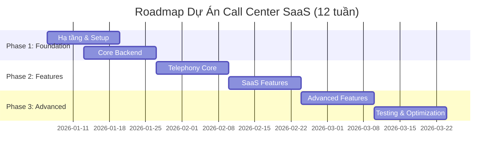

# ROADMAP & TIMELINE DỰ ÁN
## Call Center SaaS Platform - Chi tiết từng tuần

> [!IMPORTANT]
> Tài liệu này mô tả chi tiết roadmap, timeline từng tuần, phân công công việc cho từng vị trí trong team, và các milestones quan trọng.

**Phiên bản:** 1.0  
**Ngày tạo:** 02/01/2026  
**Thời gian dự kiến:** 12 tuần (3 tháng)  
**Mục tiêu:** MVP (Minimum Viable Product)

---

## MỤC LỤC

1. [Tổng quan Roadmap](#1-tổng-quan-roadmap)
2. [Timeline chi tiết từng tuần](#2-timeline-chi-tiết-từng-tuần)
3. [Phân công công việc theo team](#3-phân-công-công-việc-theo-team)
4. [Milestones & Deliverables](#4-milestones--deliverables)
5. [Risk Management](#5-risk-management)
6. [Daily Standup & Weekly Review](#6-daily-standup--weekly-review)

---

## 1. TỔNG QUAN ROADMAP

### 1.1. Các giai đoạn chính

---

### 1.2. Mục tiêu từng giai đoạn

#### Phase 1: Foundation (Tuần 1-4)
**Mục tiêu:** Xây dựng nền tảng cơ bản
- ✅ Hạ tầng server hoàn chỉnh
- ✅ FreeSWITCH cài đặt và test được
- ✅ Backend API cơ bản (Auth, Tenant, Extension)
- ✅ Frontend Dashboard cơ bản
- ✅ Database schema hoàn chỉnh

#### Phase 2: Features (Tuần 5-8)
**Mục tiêu:** Phát triển tính năng SaaS
- ✅ Cuộc gọi inbound/outbound/internal hoạt động
- ✅ IVR và Queue
- ✅ Billing system
- ✅ CDR và Recording
- ✅ Real-time dashboard

#### Phase 3: Advanced & Polish (Tuần 9-12)
**Mục tiêu:** Hoàn thiện và tối ưu
- ✅ WebRTC Softphone
- ✅ Advanced reports
- ✅ Performance optimization
- ✅ Security hardening
- ✅ Load testing
- ✅ Production deployment

---

## 2. TIMELINE CHI TIẾT TỪNG TUẦN

### TUẦN 1: Hạ tầng & Hello World (06/01 - 12/01/2026)

#### Mục tiêu tuần
- Setup server và môi trường phát triển
- Cài đặt FreeSWITCH cơ bản
- Tạo project structure
- Test cuộc gọi đầu tiên

#### Công việc chi tiết

**DevOps (100%)**
- [ ] **Ngày 1-2:** Setup VPS
  - Thuê VPS (8 vCPU, 16GB RAM)
  - Cài Debian 12
  - Cấu hình firewall cơ bản
  - Cài Docker, Git, Nginx
- [ ] **Ngày 3-4:** Cài FreeSWITCH
  - Compile FreeSWITCH từ source
  - Enable modules cần thiết
  - Cấu hình SIP profiles
  - Test với Softphone
- [ ] **Ngày 5:** Cài PostgreSQL, Redis, MinIO
  - Setup databases
  - Cấu hình backup
  - Test connections

**Backend Team (Senior + Mid)**
- [ ] **Ngày 1-2:** Project Setup
  - Tạo .NET Solution (Clean Architecture)
  - Setup Entity Framework Core
  - Cấu hình Serilog logging
  - Setup Swagger
- [ ] **Ngày 3-4:** Database Migration
  - Tạo entities (Tenant, User, Extension)
  - Tạo migrations
  - Seed initial data
- [ ] **Ngày 5:** API Hello World
  - Implement health check endpoint
  - Test API với Postman

**Frontend Team (Senior + Mid)**
- [ ] **Ngày 1-2:** Project Setup
  - Create React app với TypeScript
  - Setup Redux Toolkit
  - Setup Material-UI
  - Setup routing
- [ ] **Ngày 3-5:** Login UI
  - Design login page
  - Implement login form
  - Connect to API (mock)

**QA Team**
- [ ] **Ngày 1-3:** Test Plan
  - Viết test plan document
  - Chuẩn bị test environment
- [ ] **Ngày 4-5:** Smoke Testing
  - Test server accessibility
  - Test API endpoints

#### Deliverables
- ✅ Server đã setup xong
- ✅ FreeSWITCH chạy được, test call OK
- ✅ .NET project structure
- ✅ React project structure
- ✅ Database schema v1

#### Meeting
- **Monday:** Sprint Planning
- **Friday:** Sprint Review & Retro

---

### TUẦN 2: Directory & Dialplan Handler (13/01 - 19/01/2026)

#### Mục tiêu tuần
- FreeSWITCH kết nối được với .NET API
- Extension đăng ký thành công
- Cuộc gọi nội bộ thông nhau

#### Công việc chi tiết

**Backend Senior**
- [ ] **Ngày 1-2:** mod_xml_curl Integration
  - Implement `/api/freeswitch/configuration` endpoint
  - Handle `section=directory` request
  - Generate XML response cho user authentication
- [ ] **Ngày 3-4:** Dialplan Handler
  - Handle `section=dialplan` request
  - Generate XML cho internal calls
  - Implement caching (Redis)
- [ ] **Ngày 5:** Testing & Debugging
  - Test với FreeSWITCH
  - Debug XML responses
  - Performance tuning

**Backend Mid**
- [ ] **Ngày 1-3:** Extension CRUD API
  - Implement CreateExtensionCommand
  - Implement GetExtensionsQuery
  - Implement UpdateExtensionCommand
  - Implement DeleteExtensionCommand
- [ ] **Ngày 4-5:** Unit Tests
  - Write unit tests cho Extension handlers
  - Code coverage > 70%

**Frontend Senior**
- [ ] **Ngày 1-3:** Extension Management UI
  - Extension list page
  - Create extension dialog
  - Edit extension dialog
- [ ] **Ngày 4-5:** Integration
  - Connect to Backend API
  - Handle errors
  - Loading states

**Frontend Mid**
- [ ] **Ngày 1-5:** UI Components
  - Data table component
  - Form components
  - Dialog components

**DevOps**
- [ ] **Ngày 1-2:** CI/CD Pipeline
  - Setup GitHub Actions
  - Build .NET project
  - Build React project
- [ ] **Ngày 3-5:** Monitoring
  - Setup Prometheus
  - Setup Grafana
  - Create basic dashboards

**QA**
- [ ] **Ngày 1-5:** Test Cases
  - Write test cases cho Extension module
  - Manual testing
  - Bug reporting

#### Deliverables
- ✅ Extension có thể đăng ký vào FreeSWITCH
- ✅ Cuộc gọi nội bộ (101 → 102) thành công
- ✅ Extension CRUD API hoàn chỉnh
- ✅ Extension Management UI
- ✅ CI/CD pipeline cơ bản

---

### TUẦN 3: Authentication & Tenant Management (20/01 - 26/01/2026)

#### Mục tiêu tuần
- User có thể đăng ký, đăng nhập
- Multi-tenancy hoạt động
- RBAC implementation

#### Công việc chi tiết

**Backend Senior**
- [ ] **Ngày 1-2:** Authentication
  - Implement JWT authentication
  - Implement refresh token
  - Password hashing (BCrypt)
- [ ] **Ngày 3-4:** Authorization
  - Implement RBAC policies
  - Tenant isolation (Global Query Filter)
  - Permission checks
- [ ] **Ngày 5:** Testing
  - Test authentication flow
  - Test authorization rules

**Backend Mid**
- [ ] **Ngày 1-3:** Tenant CRUD API
  - CreateTenantCommand
  - GetTenantsQuery
  - UpdateTenantCommand
  - Suspend/Activate Tenant
- [ ] **Ngày 4-5:** User Management API
  - CreateUserCommand
  - GetUsersQuery
  - UpdateUserCommand

**Frontend Senior**
- [ ] **Ngày 1-2:** Login/Register Pages
  - Login page
  - Register page
  - Forgot password page
- [ ] **Ngày 3-4:** Dashboard Layout
  - Main layout với sidebar
  - Header với user menu
  - Routing setup
- [ ] **Ngày 5:** Tenant Management UI (Admin)
  - Tenant list page
  - Create tenant dialog

**Frontend Mid**
- [ ] **Ngày 1-5:** Auth Integration
  - Implement auth context
  - Token storage (localStorage)
  - Protected routes
  - Auto logout on token expire

**DevOps**
- [ ] **Ngày 1-3:** SSL Certificate
  - Setup Let's Encrypt
  - Configure Nginx HTTPS
- [ ] **Ngày 4-5:** Backup Automation
  - Database backup script
  - Cron job setup

**QA**
- [ ] **Ngày 1-5:** Security Testing
  - Test authentication
  - Test authorization
  - Test tenant isolation
  - Penetration testing cơ bản

#### Deliverables
- ✅ Login/Register hoạt động
- ✅ JWT authentication
- ✅ Multi-tenancy isolation
- ✅ Tenant Management UI
- ✅ HTTPS enabled

---

### TUẦN 4: SIP Trunking & Outbound Calls (27/01 - 02/02/2026)

#### Mục tiêu tuần
- Kết nối SIP Trunk với nhà mạng
- Cuộc gọi outbound thành công
- Billing logic cơ bản

#### Công việc chi tiết

**DevOps**
- [ ] **Ngày 1-2:** SIP Trunk Setup
  - Đăng ký SIP Trunk với nhà mạng
  - Cấu hình Gateway trong FreeSWITCH
  - Test kết nối
- [ ] **Ngày 3-5:** Network Optimization
  - Cấu hình QoS
  - NAT traversal
  - Codec optimization

**Backend Senior**
- [ ] **Ngày 1-3:** Outbound Dialplan
  - Generate XML cho outbound calls
  - Balance check logic
  - Quota check logic
- [ ] **Ngày 4-5:** Rate Table API
  - CRUD API cho rate tables
  - Prefix matching logic

**Backend Mid**
- [ ] **Ngày 1-3:** ESL Worker Service
  - Connect to FreeSWITCH ESL (port 8021)
  - Listen to CHANNEL_HANGUP_COMPLETE
  - Parse event variables
- [ ] **Ngày 4-5:** Billing Logic
  - Calculate cost from billsec
  - Deduct from tenant balance
  - Save transaction history

**Frontend Senior**
- [ ] **Ngày 1-3:** Rate Table UI
  - Rate table list
  - Create/Edit rate
  - Import CSV
- [ ] **Ngày 4-5:** Balance Management UI
  - View balance
  - Top-up dialog
  - Transaction history

**Frontend Mid**
- [ ] **Ngày 1-5:** Dashboard Widgets
  - Balance widget
  - Active calls widget
  - Today's stats widget

**QA**
- [ ] **Ngày 1-5:** Call Testing
  - Test outbound calls
  - Test billing calculation
  - Test balance deduction
  - Test quota limits

#### Deliverables
- ✅ Outbound calls hoạt động
- ✅ SIP Trunk kết nối thành công
- ✅ Billing system cơ bản
- ✅ ESL Worker Service
- ✅ Rate Table Management

---

### TUẦN 5: CDR & Recording (03/02 - 09/02/2026)

#### Mục tiêu tuần
- CDR được lưu tự động
- Recording được xử lý và upload
- CDR Report UI

#### Công việc chi tiết

**Backend Senior**
- [ ] **Ngày 1-2:** CDR API
  - GetCDRsQuery với filters
  - GetCDRStatsQuery
  - Export CDR to CSV
- [ ] **Ngày 3-5:** Recording API
  - Get recording URL (presigned)
  - Download recording
  - Delete recording

**Backend Mid**
- [ ] **Ngày 1-3:** Recording Worker
  - Scan recording directory
  - Convert WAV → MP3 (ffmpeg)
  - Upload to MinIO
  - Update CDR table
  - Delete local file
- [ ] **Ngày 4-5:** CDR Processing
  - Save CDR from ESL event
  - Calculate statistics
  - Indexing optimization

**Frontend Senior**
- [ ] **Ngày 1-3:** CDR Report Page
  - CDR table với filters
  - Date range picker
  - Direction filter
  - Agent filter
  - Export button
- [ ] **Ngày 4-5:** CDR Details
  - CDR detail modal
  - Play recording
  - Call timeline visualization

**Frontend Mid**
- [ ] **Ngày 1-3:** Charts & Visualization
  - Calls by hour chart (Recharts)
  - Answer rate pie chart
  - Duration histogram
- [ ] **Ngày 4-5:** Audio Player Component
  - Custom audio player
  - Waveform visualization

**DevOps**
- [ ] **Ngày 1-3:** MinIO Setup
  - Create buckets
  - Configure access policy
  - Test upload/download
- [ ] **Ngày 4-5:** Storage Optimization
  - Lifecycle policy (delete old recordings)
  - Compression settings

**QA**
- [ ] **Ngày 1-5:** CDR Testing
  - Test CDR creation
  - Test recording upload
  - Test CDR filters
  - Test export functionality
  - Performance testing (1000+ CDRs)

#### Deliverables
- ✅ CDR tự động lưu sau mỗi cuộc gọi
- ✅ Recording tự động upload lên MinIO
- ✅ CDR Report UI với filters
- ✅ Audio player để nghe recording
- ✅ Export CDR to CSV

---

### TUẦN 6: IVR & Queue (10/02 - 16/02/2026)

#### Mục tiêu tuần
- IVR Builder UI
- Queue Management
- Inbound calls với IVR

#### Công việc chi tiết

**Backend Senior**
- [ ] **Ngày 1-3:** IVR Engine
  - Parse IVR JSON flow
  - Generate FreeSWITCH XML
  - Handle DTMF input
  - IVR execution logic
- [ ] **Ngày 4-5:** Queue Integration
  - mod_callcenter configuration
  - Queue API (CRUD)
  - Add/Remove agents from queue

**Backend Mid**
- [ ] **Ngày 1-3:** IVR API
  - CreateIVRCommand
  - GetIVRsQuery
  - UpdateIVRCommand
  - Upload audio file
- [ ] **Ngày 4-5:** Queue API
  - CreateQueueCommand
  - GetQueuesQuery
  - AddAgentToQueueCommand

**Frontend Senior**
- [ ] **Ngày 1-3:** IVR Builder
  - Drag & drop flow builder (React Flow)
  - Node types: Play, GetDigits, Condition, Transfer
  - Save/Load flow
- [ ] **Ngày 4-5:** Audio Upload
  - Upload MP3/WAV files
  - Audio preview
  - TTS integration (optional)

**Frontend Mid**
- [ ] **Ngày 1-3:** Queue Management UI
  - Queue list
  - Create/Edit queue
  - Queue members management
- [ ] **Ngày 4-5:** Queue Dashboard
  - Queue statistics
  - Waiting calls
  - Agent status in queue

**DevOps**
- [ ] **Ngày 1-2:** FreeSWITCH mod_callcenter
  - Enable module
  - Configure tiers
  - Test queue
- [ ] **Ngày 3-5:** Load Balancing
  - Setup Nginx load balancer
  - Health checks

**QA**
- [ ] **Ngày 1-5:** IVR & Queue Testing
  - Test IVR flow execution
  - Test DTMF input
  - Test queue distribution
  - Test queue strategies
  - Test audio playback

#### Deliverables
- ✅ IVR Builder UI
- ✅ IVR execution hoạt động
- ✅ Queue Management
- ✅ Inbound calls qua IVR
- ✅ Queue distribution strategies

---

### TUẦN 7: Real-time Dashboard (17/02 - 23/02/2026)

#### Mục tiêu tuần
- Live call monitoring
- Agent status real-time
- SignalR integration

#### Công việc chi tiết

**Backend Senior**
- [ ] **Ngày 1-3:** SignalR Hub
  - Implement CallMonitorHub
  - Tenant group isolation
  - Event broadcasting
- [ ] **Ngày 4-5:** Real-time Events
  - OnCallStarted event
  - OnCallEnded event
  - OnAgentStatusChanged event

**Backend Mid**
- [ ] **Ngày 1-3:** ESL Event Broadcasting
  - Listen to CHANNEL_CREATE
  - Listen to CHANNEL_ANSWER
  - Broadcast to SignalR
- [ ] **Ngày 4-5:** Agent Status API
  - Set agent status (Available/Busy/Break)
  - Get agent status
  - Status history

**Frontend Senior**
- [ ] **Ngày 1-3:** Live Call Monitor
  - Real-time call list
  - SignalR connection
  - Auto-update UI
- [ ] **Ngày 4-5:** Agent Status Board
  - Agent grid với status
  - Color-coded status
  - Click to change status

**Frontend Mid**
- [ ] **Ngày 1-3:** Dashboard Charts
  - Real-time call count chart
  - Answer rate gauge
  - Average wait time
- [ ] **Ngày 4-5:** Notifications
  - Toast notifications cho events
  - Sound alerts
  - Browser notifications

**DevOps**
- [ ] **Ngày 1-3:** WebSocket Configuration
  - Nginx WebSocket proxy
  - SSL for WebSocket
- [ ] **Ngày 4-5:** Performance Tuning
  - Redis pub/sub optimization
  - Connection pooling

**QA**
- [ ] **Ngày 1-5:** Real-time Testing
  - Test SignalR connection
  - Test event broadcasting
  - Test with multiple clients
  - Stress test (100 concurrent connections)

#### Deliverables
- ✅ Live call monitoring
- ✅ Real-time agent status
- ✅ SignalR Hub hoạt động
- ✅ Dashboard với real-time data
- ✅ Notifications

---

### TUẦN 8: Mobile App Foundation (24/02 - 02/03/2026)

#### Mục tiêu tuần
- React Native app cơ bản
- Login/Dashboard trên mobile
- Push notifications

#### Công việc chi tiết

**Frontend Senior**
- [ ] **Ngày 1-2:** React Native Setup
  - Create React Native project
  - Setup navigation
  - Setup Redux
- [ ] **Ngày 3-5:** Core Screens
  - Login screen
  - Dashboard screen
  - CDR list screen

**Frontend Mid**
- [ ] **Ngày 1-3:** UI Components
  - Button, Input components
  - Card components
  - List components
- [ ] **Ngày 4-5:** API Integration
  - Axios setup
  - Auth interceptor
  - Error handling

**Backend Senior**
- [ ] **Ngày 1-3:** Push Notification API
  - FCM integration
  - Send notification API
  - Device token management
- [ ] **Ngày 4-5:** Mobile-specific APIs
  - Optimize responses for mobile
  - Pagination improvements

**DevOps**
- [ ] **Ngày 1-5:** Mobile CI/CD
  - Setup build pipeline
  - Android APK build
  - iOS IPA build (if needed)

**QA**
- [ ] **Ngày 1-5:** Mobile Testing
  - Test on Android
  - Test on iOS
  - UI/UX testing
  - Performance testing

#### Deliverables
- ✅ React Native app cơ bản
- ✅ Login/Dashboard trên mobile
- ✅ Push notifications
- ✅ APK build

---

### TUẦN 9: WebRTC Softphone (03/03 - 09/03/2026)

#### Mục tiêu tuần
- Gọi điện trực tiếp trên browser
- WebRTC integration
- Softphone UI

#### Công việc chi tiết

**DevOps**
- [ ] **Ngày 1-2:** FreeSWITCH WebSocket
  - Enable mod_verto hoặc mod_sofia WebSocket
  - Configure WSS (WebSocket Secure)
  - Test với SIP.js

**Frontend Senior**
- [ ] **Ngày 1-3:** Softphone Component
  - Integrate JsSIP library
  - SIP registration
  - Make call / Answer call
  - Hangup / Hold / Transfer
- [ ] **Ngày 4-5:** Softphone UI
  - Dial pad
  - Call controls
  - Call history
  - Settings

**Frontend Mid**
- [ ] **Ngày 1-3:** Audio Handling
  - Microphone permission
  - Speaker selection
  - Audio level indicator
- [ ] **Ngày 4-5:** Call Notifications
  - Incoming call popup
  - Ringtone
  - Call timer

**Backend Senior**
- [ ] **Ngày 1-3:** WebRTC Support
  - Configure FreeSWITCH for WebRTC
  - STUN/TURN server setup
  - Codec negotiation (Opus)
- [ ] **Ngày 4-5:** API Enhancements
  - Click-to-call API
  - Call control API (hold, transfer)

**QA**
- [ ] **Ngày 1-5:** WebRTC Testing
  - Test on Chrome, Firefox, Edge
  - Test audio quality
  - Test NAT traversal
  - Test with different networks

#### Deliverables
- ✅ WebRTC Softphone hoạt động
- ✅ Gọi được trên browser
- ✅ Audio quality tốt
- ✅ Cross-browser compatible

---

### TUẦN 10: Advanced Reports & Analytics (10/03 - 16/03/2026)

#### Mục tiêu tuần
- Advanced reporting
- Data visualization
- Export reports

#### Công việc chi tiết

**Backend Senior**
- [ ] **Ngày 1-3:** Analytics API
  - Calls by hour/day/month
  - Agent performance report
  - Queue performance report
  - Revenue report
- [ ] **Ngày 4-5:** Export API
  - Export to Excel (EPPlus)
  - Export to PDF
  - Scheduled reports

**Backend Mid**
- [ ] **Ngày 1-3:** Data Aggregation
  - Materialized views
  - Cron job for daily stats
  - Caching aggregated data
- [ ] **Ngày 4-5:** Performance Optimization
  - Query optimization
  - Index tuning
  - Partitioning

**Frontend Senior**
- [ ] **Ngày 1-3:** Reports Page
  - Report builder UI
  - Custom date ranges
  - Multiple filters
- [ ] **Ngày 4-5:** Advanced Charts
  - Heatmap (calls by hour)
  - Funnel chart (call flow)
  - Comparison charts

**Frontend Mid**
- [ ] **Ngày 1-3:** Export Functionality
  - Export button
  - Download progress
  - Format selection
- [ ] **Ngày 4-5:** Dashboard Customization
  - Widget selection
  - Drag & drop layout
  - Save preferences

**QA**
- [ ] **Ngày 1-5:** Report Testing
  - Test report accuracy
  - Test export formats
  - Test with large datasets
  - Performance testing

#### Deliverables
- ✅ Advanced reports
- ✅ Data visualization
- ✅ Export to Excel/PDF
- ✅ Customizable dashboard

---

### TUẦN 11: Security & Performance (17/03 - 23/03/2026)

#### Mục tiêu tuần
- Security hardening
- Performance optimization
- Load testing

#### Công việc chi tiết

**DevOps**
- [ ] **Ngày 1-2:** Security Hardening
  - Fail2Ban configuration
  - Firewall rules review
  - SSL/TLS optimization
  - Security headers (Nginx)
- [ ] **Ngày 3-5:** Load Testing
  - SIPP load test (200 concurrent calls)
  - API load test (JMeter)
  - Database stress test
  - Identify bottlenecks

**Backend Senior**
- [ ] **Ngày 1-2:** Security Audit
  - SQL injection prevention
  - XSS prevention
  - CSRF protection
  - Input validation review
- [ ] **Ngày 3-5:** Performance Optimization
  - Query optimization
  - Caching improvements
  - Async/await optimization
  - Connection pooling

**Backend Mid**
- [ ] **Ngày 1-3:** API Rate Limiting
  - Implement rate limiting middleware
  - Per-user limits
  - IP-based limits
- [ ] **Ngày 4-5:** Logging & Monitoring
  - Structured logging
  - Error tracking (Sentry)
  - APM (Application Performance Monitoring)

**Frontend Senior**
- [ ] **Ngày 1-3:** Frontend Optimization
  - Code splitting
  - Lazy loading
  - Image optimization
  - Bundle size reduction
- [ ] **Ngày 4-5:** Security
  - XSS prevention
  - CSRF token
  - Secure storage

**QA**
- [ ] **Ngày 1-5:** Security Testing
  - Penetration testing
  - Vulnerability scanning
  - OWASP Top 10 check
  - Load testing validation

#### Deliverables
- ✅ Security hardened
- ✅ Performance optimized
- ✅ Load test passed (200 concurrent calls)
- ✅ Security audit report

---

### TUẦN 12: Deployment & Go Live (24/03 - 30/03/2026)

#### Mục tiêu tuần
- Production deployment
- User training
- Go live

#### Công việc chi tiết

**DevOps**
- [ ] **Ngày 1-2:** Production Deployment
  - Deploy to production server
  - Database migration
  - SSL certificate
  - DNS configuration
- [ ] **Ngày 3:** Monitoring Setup
  - Alerts configuration
  - Dashboard setup
  - Log aggregation
- [ ] **Ngày 4-5:** Backup & DR
  - Automated backup
  - Disaster recovery plan
  - Backup restoration test

**Backend Team**
- [ ] **Ngày 1-2:** Final Bug Fixes
  - Fix critical bugs
  - Code review
  - Documentation
- [ ] **Ngày 3-5:** API Documentation
  - Swagger documentation
  - Postman collection
  - Integration guide

**Frontend Team**
- [ ] **Ngày 1-2:** Final UI Polish
  - Fix UI bugs
  - Responsive design check
  - Browser compatibility
- [ ] **Ngày 3-5:** User Guide
  - User manual
  - Video tutorials
  - FAQ

**QA**
- [ ] **Ngày 1-3:** UAT (User Acceptance Testing)
  - Test all features
  - End-to-end testing
  - Regression testing
- [ ] **Ngày 4-5:** Sign-off
  - Test report
  - Bug summary
  - Go/No-go decision

**Project Manager**
- [ ] **Ngày 1-2:** User Training
  - Training sessions
  - Demo videos
  - Q&A
- [ ] **Ngày 3:** Soft Launch
  - Invite beta users
  - Monitor closely
  - Collect feedback
- [ ] **Ngày 4-5:** Official Launch
  - Announcement
  - Marketing
  - Support readiness

#### Deliverables
- ✅ Production deployment
- ✅ User training completed
- ✅ Documentation complete
- ✅ Go live!

---

## 3. PHÂN CÔNG CÔNG VIỆC THEO TEAM

### 3.1. Backend Team

#### Senior .NET Developer
**Trách nhiệm chính:**
- Thiết kế API architecture
- FreeSWITCH integration (mod_xml_curl, ESL)
- Security implementation
- Code review

**Workload phân bổ:**
- Tuần 1-2: 40% Setup, 60% Core API
- Tuần 3-4: 80% FreeSWITCH integration, 20% Review
- Tuần 5-8: 60% Features, 40% Review
- Tuần 9-12: 40% Advanced features, 60% Optimization

---

#### Mid .NET Developer
**Trách nhiệm chính:**
- Implement CQRS handlers
- Worker Services (ESL, Recording)
- Unit tests
- Bug fixes

**Workload phân bổ:**
- Tuần 1-2: 60% Learning, 40% Basic CRUD
- Tuần 3-4: 80% Implementation, 20% Testing
- Tuần 5-8: 70% Features, 30% Testing
- Tuần 9-12: 50% Features, 50% Bug fixes

---

### 3.2. Frontend Team

#### Senior React Developer
**Trách nhiệm chính:**
- Component architecture
- Complex features (IVR Builder, WebRTC)
- State management
- Code review

**Workload phân bổ:**
- Tuần 1-2: 40% Setup, 60% Core UI
- Tuần 3-4: 80% Dashboard, 20% Review
- Tuần 5-8: 70% Features, 30% Review
- Tuần 9-12: 50% Advanced, 50% Optimization

---

#### Mid React Developer
**Trách nhiệm chính:**
- UI components
- API integration
- Forms & validation
- Bug fixes

**Workload phân bổ:**
- Tuần 1-2: 60% Learning, 40% Components
- Tuần 3-4: 80% Implementation, 20% Testing
- Tuần 5-8: 70% Features, 30% Testing
- Tuần 9-12: 50% Features, 50% Bug fixes

---

### 3.3. DevOps Engineer

**Trách nhiệm chính:**
- Infrastructure setup
- FreeSWITCH installation
- CI/CD pipeline
- Monitoring & alerting
- Security

**Workload phân bổ:**
- Tuần 1-2: 100% Infrastructure setup
- Tuần 3-4: 60% FreeSWITCH, 40% CI/CD
- Tuần 5-8: 40% Support, 60% Monitoring
- Tuần 9-12: 30% Support, 70% Production deployment

---

### 3.4. QA Team

#### QA Lead
**Trách nhiệm chính:**
- Test planning
- Automation tests
- Load testing
- Security testing

**Workload phân bổ:**
- Tuần 1-2: 100% Test planning
- Tuần 3-4: 60% Manual, 40% Automation
- Tuần 5-8: 50% Manual, 50% Automation
- Tuần 9-12: 30% Manual, 70% Load & Security testing

---

#### Manual Tester
**Trách nhiệm chính:**
- Manual testing
- Bug reporting
- Regression testing
- UAT support

**Workload phân bổ:**
- Tuần 1-2: 100% Learning & Test cases
- Tuần 3-8: 100% Manual testing
- Tuần 9-12: 80% Testing, 20% UAT support

---

## 4. MILESTONES & DELIVERABLES

### Milestone 1: Foundation Complete (Tuần 4)
**Date:** 02/02/2026

**Deliverables:**
- ✅ Server infrastructure ready
- ✅ FreeSWITCH operational
- ✅ Authentication & Authorization
- ✅ Extension Management
- ✅ Internal calls working
- ✅ Outbound calls working

**Acceptance Criteria:**
- 2 extensions có thể gọi cho nhau
- Extension có thể gọi ra ngoài
- Login/Register hoạt động
- Multi-tenancy isolation verified

---

### Milestone 2: SaaS Features Complete (Tuần 8)
**Date:** 02/03/2026

**Deliverables:**
- ✅ CDR & Recording
- ✅ Billing system
- ✅ IVR & Queue
- ✅ Real-time dashboard
- ✅ Mobile app basic

**Acceptance Criteria:**
- Inbound call qua IVR hoạt động
- Queue distribution hoạt động
- CDR được lưu tự động
- Recording được upload
- Billing tính toán chính xác
- Real-time dashboard update

---

### Milestone 3: Production Ready (Tuần 12)
**Date:** 30/03/2026

**Deliverables:**
- ✅ WebRTC Softphone
- ✅ Advanced reports
- ✅ Security hardened
- ✅ Performance optimized
- ✅ Load tested
- ✅ Documentation complete
- ✅ Production deployed

**Acceptance Criteria:**
- Load test passed (200 concurrent calls)
- Security audit passed
- All critical bugs fixed
- UAT signed off
- Production deployment successful

---

## 5. RISK MANAGEMENT

### 5.1. Rủi ro kỹ thuật

| Rủi ro | Mức độ | Giải pháp | Owner |
|--------|--------|-----------|-------|
| FreeSWITCH integration phức tạp | High | Có Senior với kinh nghiệm VoIP, tham khảo documentation | Tech Lead |
| Performance không đạt | Medium | Load testing sớm (tuần 6), tối ưu dần | DevOps |
| SIP Trunk không ổn định | Medium | Test nhiều nhà cung cấp, có backup trunk | DevOps |
| WebRTC audio quality kém | Medium | STUN/TURN server, codec optimization | Frontend Senior |
| Database bottleneck | Low | Indexing, caching, partitioning | Backend Senior |

---

### 5.2. Rủi ro nhân sự

| Rủi ro | Mức độ | Giải pháp | Owner |
|--------|--------|-----------|-------|
| Team member nghỉ việc | Medium | Knowledge sharing, documentation | PM |
| Skill gap (VoIP) | High | Training, mentoring, external consultant | Tech Lead |
| Overwork, burnout | Medium | Realistic timeline, không overtime quá nhiều | PM |

---

### 5.3. Rủi ro dự án

| Rủi ro | Mức độ | Giải pháp | Owner |
|--------|--------|-----------|-------|
| Scope creep | High | Strict scope control, change request process | PM |
| Timeline delay | Medium | Buffer time, prioritize features | PM |
| Budget overrun | Low | Monthly budget review | PM |

---

## 6. DAILY STANDUP & WEEKLY REVIEW

### 6.1. Daily Standup (15 phút)
**Thời gian:** 9:00 AM mỗi ngày

**Format:**
- What did I do yesterday?
- What will I do today?
- Any blockers?

**Tool:** Slack/Teams/Zoom

---

### 6.2. Weekly Sprint Review (1 giờ)
**Thời gian:** Friday 4:00 PM

**Agenda:**
1. Demo deliverables (30 phút)
2. Review metrics (10 phút)
   - Velocity
   - Bug count
   - Code coverage
3. Retrospective (20 phút)
   - What went well?
   - What can be improved?
   - Action items

---

### 6.3. Weekly Sprint Planning (1 giờ)
**Thời gian:** Monday 9:00 AM

**Agenda:**
1. Review last week (10 phút)
2. Plan this week (40 phút)
   - Assign tasks
   - Estimate effort
   - Identify dependencies
3. Q&A (10 phút)

---

## 7. METRICS & KPIs

### 7.1. Development Metrics

| Metric | Target | Measurement |
|--------|--------|-------------|
| Velocity | 40-50 story points/week | Jira/Azure DevOps |
| Code Coverage | > 70% | SonarQube |
| Bug Density | < 5 bugs/1000 LOC | SonarQube |
| Code Review Time | < 24 hours | GitHub |
| Build Success Rate | > 95% | CI/CD |

---

### 7.2. Quality Metrics

| Metric | Target | Measurement |
|--------|--------|-------------|
| Critical Bugs | 0 | Jira |
| High Bugs | < 5 | Jira |
| Test Pass Rate | > 95% | Test reports |
| Regression Rate | < 5% | QA reports |

---

### 7.3. Performance Metrics

| Metric | Target | Measurement |
|--------|--------|-------------|
| API Response Time | < 200ms (p95) | Application Insights |
| Concurrent Calls | 200+ | SIPP load test |
| System Uptime | > 99.5% | Monitoring |
| Call Setup Time | < 3s | FreeSWITCH logs |

---

## PHỤ LỤC

### A. Tools & Software

| Category | Tool | Purpose |
|----------|------|---------|
| Project Management | Jira / Azure DevOps | Task tracking |
| Communication | Slack / Teams | Team chat |
| Version Control | GitHub / GitLab | Code repository |
| CI/CD | GitHub Actions | Automation |
| Monitoring | Grafana + Prometheus | System monitoring |
| Logging | ELK Stack | Log aggregation |
| Testing | Postman, SIPP, Selenium | API, Load, UI testing |

---

### B. Communication Plan

| Stakeholder | Frequency | Channel | Content |
|-------------|-----------|---------|---------|
| Team | Daily | Standup | Progress, blockers |
| PM | Weekly | Meeting | Sprint review |
| Stakeholders | Bi-weekly | Email/Meeting | Status report |
| Users | Monthly | Newsletter | Updates, features |

---

### C. Definition of Done

**Feature is Done when:**
- ✅ Code implemented
- ✅ Unit tests written (coverage > 70%)
- ✅ Code reviewed and approved
- ✅ Integration tests passed
- ✅ QA tested and approved
- ✅ Documentation updated
- ✅ Deployed to staging
- ✅ Product Owner accepted

---

**Ngày cập nhật:** 02/01/2026  
**Phiên bản:** 1.0  
**Người phê duyệt:** Project Manager & Tech Lead

---

> [!NOTE]
> **Lưu ý quan trọng:**
> - Timeline này là ước tính, có thể điều chỉnh dựa trên thực tế
> - Ưu tiên features theo business value
> - Luôn có buffer time cho unexpected issues
> - Communication là chìa khóa thành công!

**Chúc team thành công! 🚀**
