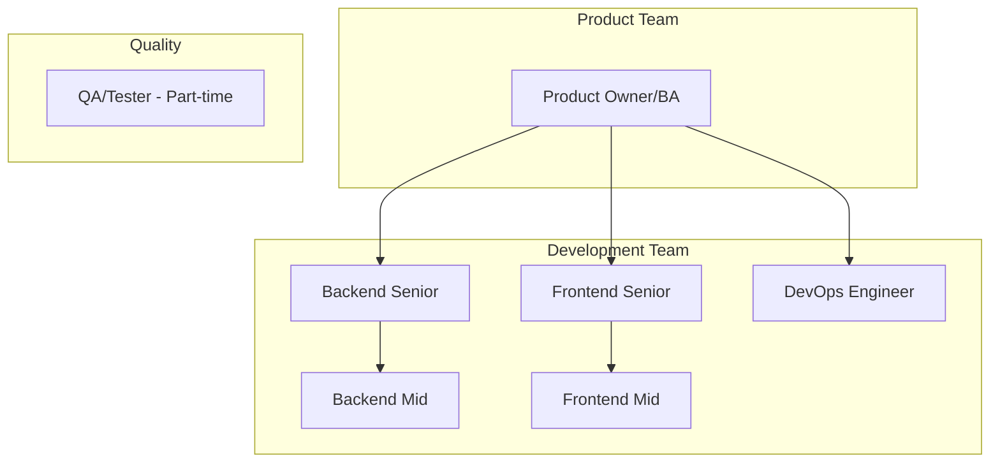
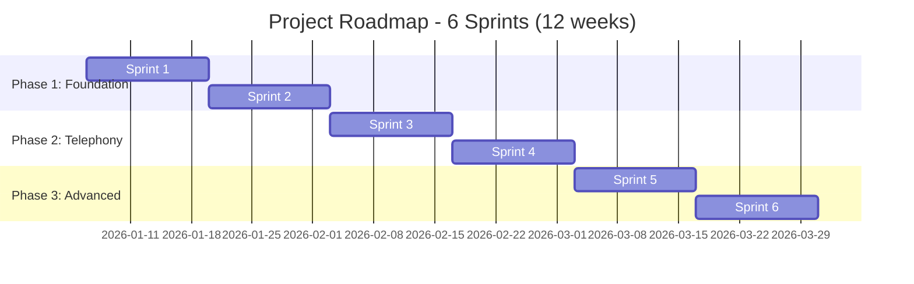
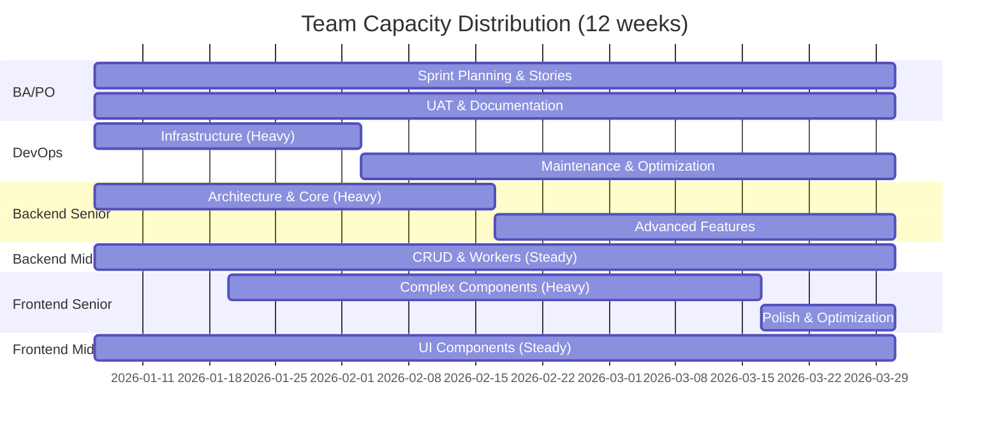
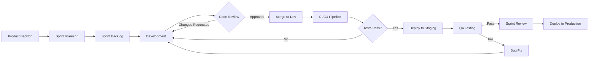
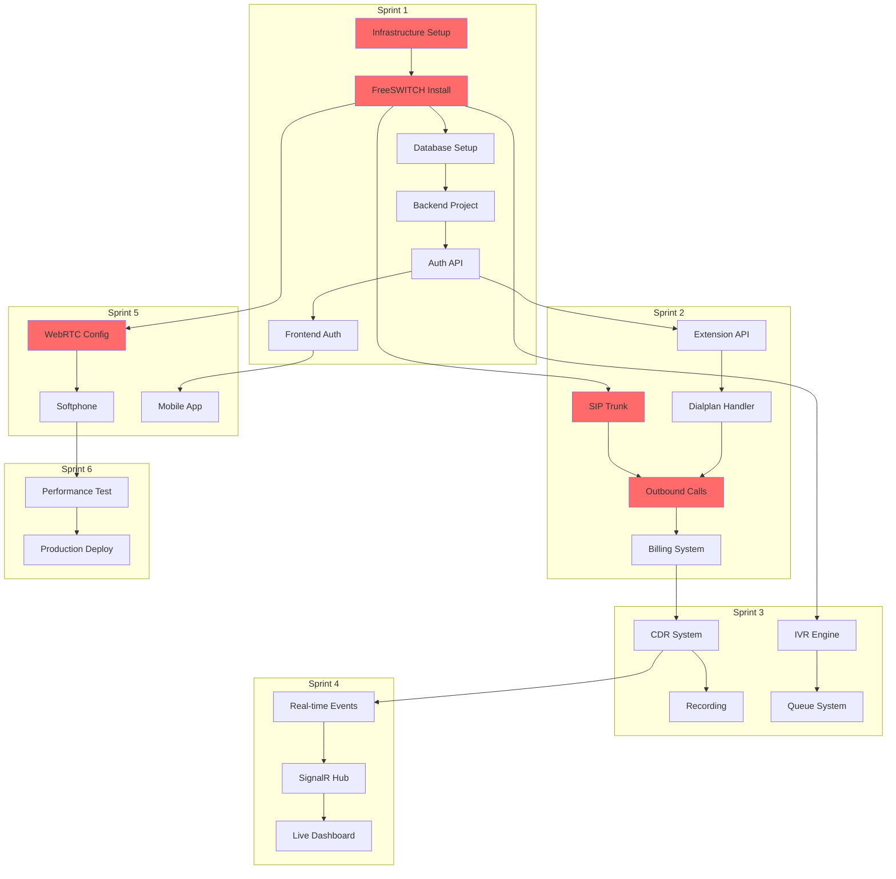

# ROADMAP DEMO - PHÂN CHIA CÔNG VIỆC THEO TEAM
## Call Center SaaS Platform - Team Structure & Sprint Planning

> [!IMPORTANT]
> Tài liệu này mô tả chi tiết cách phân chia công việc cho team gồm: Backend, Frontend, BA, DevOps theo mô hình Agile với các Phases và Sprints.

**Phiên bản:** 1.0  
**Ngày tạo:** 05/01/2026  
**Thời gian dự án:** 12 tuần (6 sprints × 2 tuần)  
**Team size:** 6 người (2 BE, 2 FE, 1 BA, 1 DevOps)

---

## MỤC LỤC

1. [Cấu trúc Team](#1-cấu-trúc-team)
2. [Phân chia Phases & Sprints](#2-phân-chia-phases--sprints)
3. [Chi tiết từng Sprint](#3-chi-tiết-từng-sprint)
4. [Phân công theo Agent/Role](#4-phân-công-theo-agentrole)
5. [Workflow & Ceremonies](#5-workflow--ceremonies)
6. [Dependencies & Critical Path](#6-dependencies--critical-path)

---

## 1. CẤU TRÚC TEAM

### 1.1. Team Members & Roles



### 1.2. Vai trò & Trách nhiệm

#### **Business Analyst (BA) / Product Owner**
- **Trách nhiệm chính:**
  - Viết User Stories & Acceptance Criteria
  - Quản lý Product Backlog
  - Prioritize features
  - Sprint Planning & Review
  - Stakeholder communication
  - UAT (User Acceptance Testing)

- **Deliverables:**
  - Product Backlog Items (PBIs)
  - User Stories với AC
  - Sprint Goals
  - Release Notes
  - Documentation

#### **Backend Senior**
- **Trách nhiệm chính:**
  - Architecture design
  - Core API development
  - FreeSWITCH integration
  - Code review
  - Mentor Backend Mid
  - Performance optimization

- **Tech stack:**
  - .NET 8, Clean Architecture
  - Entity Framework Core
  - SignalR, ESL
  - PostgreSQL, Redis

#### **Backend Mid**
- **Trách nhiệm chính:**
  - CRUD APIs implementation
  - Unit testing
  - Worker Services
  - Bug fixing
  - Documentation

- **Focus areas:**
  - Business logic implementation
  - Database migrations
  - API endpoints
  - Integration testing

#### **Frontend Senior**
- **Trách nhiệm chính:**
  - UI/UX architecture
  - Complex components (IVR Builder, Softphone)
  - State management
  - Code review
  - Mentor Frontend Mid
  - Performance optimization

- **Tech stack:**
  - React 18, TypeScript
  - Redux Toolkit
  - Material-UI
  - SignalR Client
  - WebRTC (JsSIP)

#### **Frontend Mid**
- **Trách nhiệm chính:**
  - UI components development
  - API integration
  - Form handling
  - Bug fixing
  - Responsive design

- **Focus areas:**
  - Reusable components
  - Charts & visualization
  - CRUD pages
  - Mobile responsive

#### **DevOps Engineer**
- **Trách nhiệm chính:**
  - Infrastructure setup
  - FreeSWITCH installation & config
  - CI/CD pipeline
  - Monitoring & logging
  - Security hardening
  - Backup & disaster recovery

- **Tech stack:**
  - Linux (Debian 12)
  - Docker, Nginx
  - GitHub Actions
  - Prometheus, Grafana
  - PostgreSQL, Redis, MinIO

---

## 2. PHÂN CHIA PHASES & SPRINTS

### 2.1. Overview



### 2.2. Phase Breakdown

#### **Phase 1: Foundation (Sprint 1-2) - Tuần 1-4**
**Goal:** Xây dựng nền tảng cơ bản, authentication, và core features

**Key Deliverables:**
- ✅ Infrastructure ready
- ✅ FreeSWITCH operational
- ✅ Authentication & Authorization
- ✅ Multi-tenancy
- ✅ Extension management
- ✅ Internal calls working

**Success Criteria:**
- User có thể đăng ký, đăng nhập
- Extension có thể đăng ký vào FreeSWITCH
- Cuộc gọi nội bộ (101 → 102) thành công

---

#### **Phase 2: Telephony (Sprint 3-4) - Tuần 5-8**
**Goal:** Phát triển tính năng telephony core và SaaS features

**Key Deliverables:**
- ✅ SIP Trunking
- ✅ Outbound/Inbound calls
- ✅ Billing system
- ✅ CDR & Recording
- ✅ IVR & Queue

**Success Criteria:**
- Gọi ra ngoài thành công
- Billing tự động tính tiền
- CDR được lưu và có thể xem
- IVR flow hoạt động
- Queue phân phối cuộc gọi

---

#### **Phase 3: Advanced (Sprint 5-6) - Tuần 9-12**
**Goal:** Tính năng nâng cao, tối ưu hóa, và chuẩn bị production

**Key Deliverables:**
- ✅ Real-time dashboard
- ✅ WebRTC Softphone
- ✅ Advanced reports
- ✅ Mobile app
- ✅ Performance optimization
- ✅ Security hardening
- ✅ Production deployment

**Success Criteria:**
- Gọi được trên browser (WebRTC)
- Dashboard real-time updates
- Load test pass (100 concurrent calls)
- Security audit pass
- Production ready

---

## 3. CHI TIẾT TỪNG SPRINT

### **SPRINT 1: Infrastructure & Authentication (Tuần 1-2)**
**Duration:** 06/01/2026 - 19/01/2026  
**Sprint Goal:** Setup infrastructure, implement authentication, và test first call

#### Sprint Planning

##### **BA/PO Tasks**
| Task | Story Points | Priority | Deliverable |
|------|--------------|----------|-------------|
| Viết User Stories cho Authentication | 3 | P0 | User Stories document |
| Viết User Stories cho Extension Management | 3 | P0 | User Stories document |
| Define Acceptance Criteria | 2 | P0 | AC checklist |
| Create Sprint Backlog | 1 | P0 | Sprint backlog in Jira |
| Prepare test scenarios | 2 | P1 | Test scenarios doc |

**User Stories Example:**
```
US-001: User Registration
As a new tenant admin
I want to register an account
So that I can access the call center platform

Acceptance Criteria:
- User can fill registration form (email, password, company name)
- Password must be at least 8 characters
- Email must be unique
- Success message shown after registration
- Confirmation email sent
```

##### **DevOps Tasks**
| Task | Story Points | Priority | Dependencies | Deliverable |
|------|--------------|----------|--------------|-------------|
| Setup VPS (8 vCPU, 16GB RAM) | 2 | P0 | - | Server access |
| Install Debian 12 | 1 | P0 | VPS | OS ready |
| Configure firewall (UFW) | 2 | P0 | OS | Firewall rules |
| Install Docker, Nginx | 2 | P0 | OS | Docker running |
| Install FreeSWITCH from source | 5 | P0 | OS | FreeSWITCH running |
| Configure SIP profiles | 3 | P0 | FreeSWITCH | SIP profile |
| Install PostgreSQL 15 | 2 | P0 | Docker | DB ready |
| Install Redis 7 | 1 | P0 | Docker | Redis ready |
| Install MinIO | 2 | P0 | Docker | MinIO ready |
| Setup SSL (Let's Encrypt) | 2 | P1 | Nginx | HTTPS enabled |
| Basic monitoring (Prometheus) | 3 | P1 | - | Metrics available |

**Total:** 25 SP

##### **Backend Senior Tasks**
| Task | Story Points | Priority | Dependencies | Deliverable |
|------|--------------|----------|--------------|-------------|
| Create .NET Solution (Clean Arch) | 3 | P0 | - | Solution structure |
| Setup EF Core + Migrations | 3 | P0 | PostgreSQL | DB context |
| Implement JWT Authentication | 5 | P0 | - | Auth API |
| Implement Refresh Token | 3 | P0 | JWT | Refresh endpoint |
| Implement RBAC | 5 | P0 | Auth | Authorization |
| mod_xml_curl Directory Handler | 8 | P0 | FreeSWITCH | XML endpoint |
| mod_xml_curl Dialplan Handler | 8 | P0 | Directory | Dialplan XML |
| Redis caching for XML | 3 | P1 | Redis | Cache layer |

**Total:** 38 SP

##### **Backend Mid Tasks**
| Task | Story Points | Priority | Dependencies | Deliverable |
|------|--------------|----------|--------------|-------------|
| Create Entities (Tenant, User, Extension) | 3 | P0 | - | Entity classes |
| Create Migrations | 2 | P0 | Entities | Migration files |
| Seed initial data | 2 | P0 | Migrations | Seed script |
| Extension CRUD API | 5 | P0 | Entities | CRUD endpoints |
| Tenant CRUD API | 5 | P0 | Entities | CRUD endpoints |
| User Management API | 5 | P0 | Entities | User endpoints |
| Unit Tests (70% coverage) | 5 | P1 | APIs | Test suite |
| API Documentation (Swagger) | 2 | P1 | - | Swagger docs |

**Total:** 29 SP

##### **Frontend Senior Tasks**
| Task | Story Points | Priority | Dependencies | Deliverable |
|------|--------------|----------|--------------|-------------|
| Create React + TypeScript project | 2 | P0 | - | Project structure |
| Setup Redux Toolkit | 3 | P0 | React | Store config |
| Setup Material-UI theme | 2 | P0 | React | Theme config |
| Setup React Router | 2 | P0 | React | Routing |
| Login Page | 5 | P0 | Auth API | Login UI |
| Register Page | 5 | P0 | Auth API | Register UI |
| Dashboard Layout | 5 | P0 | Auth | Layout component |
| Extension Management Page | 8 | P0 | Extension API | Extension UI |
| Protected Routes | 3 | P1 | Auth | Route guards |

**Total:** 35 SP

##### **Frontend Mid Tasks**
| Task | Story Points | Priority | Dependencies | Deliverable |
|------|--------------|----------|--------------|-------------|
| Create reusable components (Button, Input) | 3 | P0 | - | Component library |
| Create DataTable component | 5 | P0 | - | Table component |
| Create Dialog component | 3 | P0 | - | Dialog component |
| Create Form components | 3 | P0 | - | Form components |
| Implement Auth Context | 5 | P0 | Auth API | Auth context |
| Token storage (localStorage) | 2 | P0 | Auth | Token manager |
| API client setup (Axios) | 3 | P0 | - | API client |
| Error handling interceptor | 3 | P1 | API client | Error handler |
| Loading states | 2 | P1 | - | Loading component |

**Total:** 29 SP

#### Sprint Ceremonies

**Sprint Planning (Monday, Week 1)**
- Duration: 2 hours
- Participants: All team
- Output: Sprint Backlog, Task assignments

**Daily Standup (Every day, 9:00 AM)**
- Duration: 15 minutes
- Format: What did I do? What will I do? Any blockers?

**Sprint Review (Friday, Week 2)**
- Duration: 1 hour
- Demo: Live demo of features
- Stakeholder feedback

**Sprint Retrospective (Friday, Week 2)**
- Duration: 1 hour
- What went well? What can improve?

#### Sprint Metrics
- **Total Story Points:** 156 SP
- **Velocity Target:** 150-160 SP
- **Team Capacity:** 6 people × 10 days × 8 hours = 480 hours
- **Planned Capacity:** 400 hours (buffer for meetings, blockers)

---

### **SPRINT 2: Core Features & Calling (Tuần 3-4)**
**Duration:** 20/01/2026 - 02/02/2026  
**Sprint Goal:** Implement SIP trunking, outbound calls, và billing system

#### Sprint Planning

##### **BA/PO Tasks**
| Task | Story Points | Priority | Deliverable |
|------|--------------|----------|-------------|
| Viết User Stories cho SIP Trunk | 3 | P0 | User Stories |
| Viết User Stories cho Billing | 3 | P0 | User Stories |
| Define rate table structure | 2 | P0 | Rate table spec |
| UAT cho Sprint 1 features | 5 | P0 | UAT report |
| Update Product Backlog | 1 | P1 | Backlog |

**Total:** 14 SP

##### **DevOps Tasks**
| Task | Story Points | Priority | Dependencies | Deliverable |
|------|--------------|----------|--------------|-------------|
| Đăng ký SIP Trunk với nhà mạng | 3 | P0 | - | Trunk credentials |
| Configure Gateway trong FreeSWITCH | 5 | P0 | Trunk | Gateway config |
| Test outbound connectivity | 2 | P0 | Gateway | Test report |
| Configure QoS | 3 | P1 | - | QoS rules |
| NAT traversal configuration | 3 | P1 | - | NAT config |
| Setup CI/CD pipeline (GitHub Actions) | 5 | P0 | - | Pipeline |
| Docker build automation | 3 | P1 | CI/CD | Docker images |

**Total:** 24 SP

##### **Backend Senior Tasks**
| Task | Story Points | Priority | Dependencies | Deliverable |
|------|--------------|----------|--------------|-------------|
| Outbound Dialplan XML generation | 8 | P0 | Gateway | Dialplan logic |
| Balance check logic | 5 | P0 | Billing | Balance check |
| Rate Table API | 5 | P0 | - | Rate CRUD |
| Prefix matching algorithm | 5 | P0 | Rate Table | Matching logic |
| ESL Worker Service | 8 | P0 | FreeSWITCH | ESL service |
| CHANNEL_HANGUP_COMPLETE handler | 5 | P0 | ESL | Event handler |
| Billing calculation engine | 8 | P0 | CDR | Billing engine |

**Total:** 44 SP

##### **Backend Mid Tasks**
| Task | Story Points | Priority | Dependencies | Deliverable |
|------|--------------|----------|--------------|-------------|
| CDR Entity & Migration | 3 | P0 | - | CDR table |
| Transaction Entity & Migration | 3 | P0 | - | Transaction table |
| Rate Table Entity & Migration | 3 | P0 | - | Rate table |
| Save CDR from ESL event | 5 | P0 | ESL | CDR save logic |
| Deduct balance transaction | 5 | P0 | Billing | Deduct logic |
| Transaction history API | 3 | P0 | Transaction | History endpoint |
| Balance top-up API | 3 | P0 | Transaction | Top-up endpoint |
| Unit tests | 5 | P1 | - | Test suite |

**Total:** 30 SP

##### **Frontend Senior Tasks**
| Task | Story Points | Priority | Dependencies | Deliverable |
|------|--------------|----------|--------------|-------------|
| Rate Table Management Page | 8 | P0 | Rate API | Rate UI |
| Import CSV for rates | 5 | P0 | Rate API | Import feature |
| Balance Management Page | 5 | P0 | Balance API | Balance UI |
| Top-up Dialog | 3 | P0 | Top-up API | Top-up UI |
| Transaction History Page | 5 | P0 | Transaction API | History UI |
| Dashboard widgets (Balance, Calls) | 5 | P0 | APIs | Widgets |

**Total:** 31 SP

##### **Frontend Mid Tasks**
| Task | Story Points | Priority | Dependencies | Deliverable |
|------|--------------|----------|--------------|-------------|
| CSV upload component | 3 | P0 | - | Upload component |
| Balance widget component | 3 | P0 | - | Widget |
| Active calls widget | 3 | P0 | - | Widget |
| Stats widget | 3 | P0 | - | Widget |
| Chart components (Recharts) | 5 | P0 | - | Charts |
| Export functionality | 3 | P1 | - | Export button |

**Total:** 20 SP

#### Sprint Metrics
- **Total Story Points:** 163 SP
- **Velocity Target:** 160-170 SP

---

### **SPRINT 3: CDR & IVR (Tuần 5-6)**
**Duration:** 03/02/2026 - 16/02/2026  
**Sprint Goal:** Implement CDR reporting, recording, và IVR system

#### Sprint Planning

##### **BA/PO Tasks**
| Task | Story Points | Priority | Deliverable |
|------|--------------|----------|-------------|
| Viết User Stories cho CDR | 3 | P0 | User Stories |
| Viết User Stories cho IVR | 5 | P0 | User Stories |
| Define IVR flow structure | 3 | P0 | IVR spec |
| UAT Sprint 2 | 5 | P0 | UAT report |
| Create IVR demo flows | 3 | P1 | Demo flows |

**Total:** 19 SP

##### **DevOps Tasks**
| Task | Story Points | Priority | Dependencies | Deliverable |
|------|--------------|----------|--------------|-------------|
| Setup MinIO buckets | 2 | P0 | MinIO | Buckets |
| Configure recording path | 2 | P0 | FreeSWITCH | Recording config |
| Install ffmpeg | 1 | P0 | - | ffmpeg |
| Lifecycle policy for recordings | 3 | P1 | MinIO | Policy |
| Enable mod_callcenter | 3 | P0 | FreeSWITCH | Queue module |
| Configure queue tiers | 2 | P0 | mod_callcenter | Queue config |

**Total:** 13 SP

##### **Backend Senior Tasks**
| Task | Story Points | Priority | Dependencies | Deliverable |
|------|--------------|----------|--------------|-------------|
| CDR Query API với filters | 5 | P0 | CDR | Query endpoint |
| CDR Statistics API | 5 | P0 | CDR | Stats endpoint |
| Export CDR to CSV | 3 | P0 | CDR | Export feature |
| Recording presigned URL | 3 | P0 | MinIO | URL endpoint |
| IVR Engine - Parse JSON flow | 8 | P0 | - | IVR engine |
| IVR Engine - Generate XML | 8 | P0 | IVR engine | XML generator |
| IVR DTMF handling | 5 | P0 | IVR engine | DTMF handler |
| Queue API (CRUD) | 5 | P0 | mod_callcenter | Queue API |

**Total:** 42 SP

##### **Backend Mid Tasks**
| Task | Story Points | Priority | Dependencies | Deliverable |
|------|--------------|----------|--------------|-------------|
| Recording Worker Service | 8 | P0 | - | Worker service |
| WAV to MP3 conversion | 5 | P0 | ffmpeg | Conversion logic |
| Upload to MinIO | 3 | P0 | MinIO | Upload logic |
| Update CDR with recording URL | 2 | P0 | CDR | Update logic |
| IVR CRUD API | 5 | P0 | - | IVR endpoints |
| Upload audio file API | 3 | P0 | MinIO | Upload endpoint |
| Queue member management API | 3 | P0 | Queue | Member API |

**Total:** 29 SP

##### **Frontend Senior Tasks**
| Task | Story Points | Priority | Dependencies | Deliverable |
|------|--------------|----------|--------------|-------------|
| CDR Report Page | 8 | P0 | CDR API | CDR UI |
| CDR filters (date, direction, agent) | 5 | P0 | CDR API | Filters |
| CDR detail modal | 3 | P0 | CDR API | Detail modal |
| Audio player component | 5 | P0 | Recording API | Player |
| IVR Builder (React Flow) | 13 | P0 | IVR API | IVR Builder |
| IVR node types (Play, GetDigits, etc.) | 8 | P0 | IVR Builder | Node components |

**Total:** 42 SP

##### **Frontend Mid Tasks**
| Task | Story Points | Priority | Dependencies | Deliverable |
|------|--------------|----------|--------------|-------------|
| Charts (calls by hour, answer rate) | 5 | P0 | CDR API | Charts |
| Waveform visualization | 5 | P1 | Audio | Waveform |
| Queue Management UI | 5 | P0 | Queue API | Queue UI |
| Queue dashboard | 5 | P0 | Queue API | Dashboard |
| Audio upload component | 3 | P0 | Upload API | Upload UI |

**Total:** 23 SP

#### Sprint Metrics
- **Total Story Points:** 168 SP

---

### **SPRINT 4: Real-time & Queue (Tuần 7-8)**
**Duration:** 17/02/2026 - 02/03/2026  
**Sprint Goal:** Implement real-time dashboard và advanced queue features

#### Sprint Planning

##### **BA/PO Tasks**
| Task | Story Points | Priority | Deliverable |
|------|--------------|----------|-------------|
| Viết User Stories cho Real-time | 3 | P0 | User Stories |
| Define real-time events | 2 | P0 | Event spec |
| UAT Sprint 3 | 5 | P0 | UAT report |
| Performance requirements | 2 | P1 | Perf spec |

**Total:** 12 SP

##### **DevOps Tasks**
| Task | Story Points | Priority | Dependencies | Deliverable |
|------|--------------|----------|--------------|-------------|
| Configure Nginx WebSocket proxy | 3 | P0 | Nginx | WS config |
| SSL for WebSocket | 2 | P0 | SSL | WSS |
| Redis pub/sub optimization | 3 | P0 | Redis | Pub/sub config |
| Connection pooling | 2 | P1 | - | Pool config |
| Load balancer setup | 5 | P1 | Nginx | LB config |

**Total:** 15 SP

##### **Backend Senior Tasks**
| Task | Story Points | Priority | Dependencies | Deliverable |
|------|--------------|----------|--------------|-------------|
| SignalR Hub implementation | 8 | P0 | - | SignalR Hub |
| Tenant group isolation | 5 | P0 | SignalR | Isolation logic |
| OnCallStarted event | 3 | P0 | SignalR | Event |
| OnCallEnded event | 3 | P0 | SignalR | Event |
| OnAgentStatusChanged event | 3 | P0 | SignalR | Event |
| Agent Status API | 5 | P0 | - | Status API |
| Real-time statistics API | 5 | P0 | - | Stats API |

**Total:** 32 SP

##### **Backend Mid Tasks**
| Task | Story Points | Priority | Dependencies | Deliverable |
|------|--------------|----------|--------------|-------------|
| ESL CHANNEL_CREATE listener | 3 | P0 | ESL | Listener |
| ESL CHANNEL_ANSWER listener | 3 | P0 | ESL | Listener |
| Broadcast to SignalR | 5 | P0 | SignalR | Broadcast logic |
| Agent status history | 3 | P0 | Status API | History |
| Queue statistics | 5 | P0 | Queue | Stats logic |

**Total:** 19 SP

##### **Frontend Senior Tasks**
| Task | Story Points | Priority | Dependencies | Deliverable |
|------|--------------|----------|--------------|-------------|
| SignalR client setup | 5 | P0 | SignalR Hub | Client |
| Live Call Monitor page | 8 | P0 | SignalR | Monitor UI |
| Agent Status Board | 8 | P0 | Status API | Status UI |
| Real-time call list | 5 | P0 | SignalR | Call list |
| Auto-update UI logic | 5 | P0 | SignalR | Update logic |

**Total:** 31 SP

##### **Frontend Mid Tasks**
| Task | Story Points | Priority | Dependencies | Deliverable |
|------|--------------|----------|--------------|-------------|
| Real-time charts | 5 | P0 | SignalR | Charts |
| Toast notifications | 3 | P0 | - | Notifications |
| Sound alerts | 3 | P0 | - | Alerts |
| Browser notifications | 3 | P1 | - | Notifications |
| Dashboard real-time widgets | 5 | P0 | SignalR | Widgets |

**Total:** 19 SP

#### Sprint Metrics
- **Total Story Points:** 128 SP

---

### **SPRINT 5: WebRTC & Mobile (Tuần 9-10)**
**Duration:** 03/03/2026 - 16/03/2026  
**Sprint Goal:** Implement WebRTC softphone và mobile app foundation

#### Sprint Planning

##### **BA/PO Tasks**
| Task | Story Points | Priority | Deliverable |
|------|--------------|----------|-------------|
| Viết User Stories cho WebRTC | 3 | P0 | User Stories |
| Viết User Stories cho Mobile | 3 | P0 | User Stories |
| UAT Sprint 4 | 5 | P0 | UAT report |
| Mobile UX requirements | 2 | P1 | UX spec |

**Total:** 13 SP

##### **DevOps Tasks**
| Task | Story Points | Priority | Dependencies | Deliverable |
|------|--------------|----------|--------------|-------------|
| Enable FreeSWITCH WebSocket | 5 | P0 | FreeSWITCH | WS config |
| Configure WSS (WebSocket Secure) | 3 | P0 | SSL | WSS |
| STUN/TURN server setup | 5 | P0 | - | TURN server |
| Codec optimization (Opus) | 3 | P0 | FreeSWITCH | Codec config |
| Mobile CI/CD pipeline | 5 | P0 | - | Mobile pipeline |
| Android APK build | 3 | P1 | Mobile CI | APK |

**Total:** 24 SP

##### **Backend Senior Tasks**
| Task | Story Points | Priority | Dependencies | Deliverable |
|------|--------------|----------|--------------|-------------|
| WebRTC configuration | 5 | P0 | FreeSWITCH | WebRTC config |
| Click-to-call API | 5 | P0 | - | API endpoint |
| Call control API (hold, transfer) | 5 | P0 | - | Control API |
| Push Notification API (FCM) | 5 | P0 | - | Push API |
| Device token management | 3 | P0 | Push API | Token API |
| Mobile-optimized APIs | 3 | P1 | - | Optimized endpoints |

**Total:** 26 SP

##### **Backend Mid Tasks**
| Task | Story Points | Priority | Dependencies | Deliverable |
|------|--------------|----------|--------------|-------------|
| WebRTC SIP profile | 3 | P0 | WebRTC | SIP profile |
| NAT traversal testing | 3 | P0 | TURN | Test report |
| Send notification logic | 3 | P0 | FCM | Send logic |
| Pagination improvements | 2 | P1 | - | Pagination |

**Total:** 11 SP

##### **Frontend Senior Tasks**
| Task | Story Points | Priority | Dependencies | Deliverable |
|------|--------------|----------|--------------|-------------|
| Integrate JsSIP library | 8 | P0 | WebRTC | JsSIP integration |
| SIP registration logic | 5 | P0 | JsSIP | Registration |
| Make/Answer/Hangup call | 8 | P0 | JsSIP | Call controls |
| Hold/Transfer functionality | 5 | P0 | JsSIP | Advanced controls |
| Softphone UI (dial pad, controls) | 8 | P0 | - | Softphone UI |
| React Native project setup | 5 | P0 | - | RN project |
| Mobile Login/Dashboard screens | 8 | P0 | - | Mobile screens |

**Total:** 47 SP

##### **Frontend Mid Tasks**
| Task | Story Points | Priority | Dependencies | Deliverable |
|------|--------------|----------|--------------|-------------|
| Microphone permission | 2 | P0 | - | Permission |
| Speaker selection | 3 | P0 | - | Speaker UI |
| Audio level indicator | 3 | P0 | - | Indicator |
| Incoming call popup | 3 | P0 | - | Popup |
| Ringtone | 2 | P0 | - | Ringtone |
| Mobile UI components | 5 | P0 | RN | Components |
| Mobile API integration | 5 | P0 | - | API client |

**Total:** 23 SP

#### Sprint Metrics
- **Total Story Points:** 144 SP

---

### **SPRINT 6: Polish & Launch (Tuần 11-12)**
**Duration:** 17/03/2026 - 30/03/2026  
**Sprint Goal:** Performance optimization, security hardening, và production deployment

#### Sprint Planning

##### **BA/PO Tasks**
| Task | Story Points | Priority | Deliverable |
|------|--------------|----------|-------------|
| UAT Sprint 5 | 5 | P0 | UAT report |
| Final UAT (all features) | 8 | P0 | Final UAT |
| Release notes | 3 | P0 | Release notes |
| User documentation | 5 | P0 | User docs |
| Training materials | 3 | P1 | Training docs |

**Total:** 24 SP

##### **DevOps Tasks**
| Task | Story Points | Priority | Dependencies | Deliverable |
|------|--------------|----------|--------------|-------------|
| Fail2Ban configuration | 3 | P0 | - | Security |
| Firewall rules review | 2 | P0 | - | Firewall |
| SSL/TLS optimization | 2 | P0 | SSL | SSL config |
| Security headers (Nginx) | 2 | P0 | Nginx | Headers |
| Load testing (100 concurrent calls) | 8 | P0 | - | Load test report |
| Performance tuning | 5 | P0 | Load test | Tuning |
| Backup automation | 3 | P0 | - | Backup script |
| Disaster recovery plan | 3 | P1 | - | DR plan |
| Production deployment | 5 | P0 | All | Production |
| Monitoring dashboards | 3 | P0 | Grafana | Dashboards |

**Total:** 36 SP

##### **Backend Senior Tasks**
| Task | Story Points | Priority | Dependencies | Deliverable |
|------|--------------|----------|--------------|-------------|
| Analytics API (advanced reports) | 8 | P0 | - | Analytics API |
| Export to Excel (EPPlus) | 5 | P0 | - | Excel export |
| Export to PDF | 5 | P1 | - | PDF export |
| Query optimization | 5 | P0 | - | Optimized queries |
| Index tuning | 3 | P0 | - | Indexes |
| Security audit | 5 | P0 | - | Audit report |
| API rate limiting | 3 | P0 | - | Rate limiter |

**Total:** 34 SP

##### **Backend Mid Tasks**
| Task | Story Points | Priority | Dependencies | Deliverable |
|------|--------------|----------|--------------|-------------|
| Materialized views for stats | 5 | P0 | - | Views |
| Cron job for daily stats | 3 | P0 | - | Cron job |
| Data partitioning | 5 | P1 | - | Partitions |
| Bug fixes | 8 | P0 | - | Bug fixes |
| Code cleanup | 3 | P1 | - | Clean code |

**Total:** 24 SP

##### **Frontend Senior Tasks**
| Task | Story Points | Priority | Dependencies | Deliverable |
|------|--------------|----------|--------------|-------------|
| Advanced Reports Page | 8 | P0 | Analytics API | Reports UI |
| Report builder UI | 5 | P0 | - | Builder |
| Advanced charts (heatmap, funnel) | 8 | P0 | - | Charts |
| Dashboard customization | 5 | P1 | - | Customization |
| Performance optimization | 5 | P0 | - | Optimized UI |
| Bug fixes | 8 | P0 | - | Bug fixes |

**Total:** 39 SP

##### **Frontend Mid Tasks**
| Task | Story Points | Priority | Dependencies | Deliverable |
|------|--------------|----------|--------------|-------------|
| Export functionality (Excel, PDF) | 5 | P0 | Export API | Export UI |
| Widget selection | 3 | P1 | - | Widget picker |
| Drag & drop layout | 5 | P1 | - | Layout editor |
| UI polish | 5 | P0 | - | Polished UI |
| Bug fixes | 5 | P0 | - | Bug fixes |

**Total:** 23 SP

#### Sprint Metrics
- **Total Story Points:** 180 SP

---

## 4. PHÂN CÔNG THEO AGENT/ROLE

### 4.1. Capacity Planning



### 4.2. Story Points Distribution per Sprint

| Role | S1 | S2 | S3 | S4 | S5 | S6 | Total | Avg/Sprint |
|------|----|----|----|----|----|----|-------|------------|
| **BA/PO** | 11 | 14 | 19 | 12 | 13 | 24 | 93 | 15.5 |
| **DevOps** | 25 | 24 | 13 | 15 | 24 | 36 | 137 | 22.8 |
| **BE Senior** | 38 | 44 | 42 | 32 | 26 | 34 | 216 | 36.0 |
| **BE Mid** | 29 | 30 | 29 | 19 | 11 | 24 | 142 | 23.7 |
| **FE Senior** | 35 | 31 | 42 | 31 | 47 | 39 | 225 | 37.5 |
| **FE Mid** | 29 | 20 | 23 | 19 | 23 | 23 | 137 | 22.8 |
| **Total** | 167 | 163 | 168 | 128 | 144 | 180 | 950 | 158.3 |

### 4.3. Workload Analysis

**High Load Periods:**
- **DevOps:** Sprint 1 (infrastructure), Sprint 6 (deployment)
- **Backend Senior:** Sprint 1-3 (core architecture)
- **Frontend Senior:** Sprint 3 (IVR Builder), Sprint 5 (WebRTC)

**Recommendations:**
- Sprint 1: DevOps focus 100% on infrastructure
- Sprint 2-3: Backend Senior may need support from Mid
- Sprint 5: Frontend Senior may need support from Mid for WebRTC
- Sprint 6: All hands on deck for final push

---

## 5. WORKFLOW & CEREMONIES

### 5.1. Agile Ceremonies Schedule

```mermaid
gantt
    title Sprint Ceremonies (2-week cycle)
    dateFormat YYYY-MM-DD
    
    section Week 1
    Sprint Planning (Mon 9-11 AM)     :milestone, 2026-01-06, 0d
    Daily Standup (9-9:15 AM)         :2026-01-06, 5d
    Backlog Refinement (Wed 2-3 PM)   :milestone, 2026-01-08, 0d
    
    section Week 2
    Daily Standup (9-9:15 AM)         :2026-01-13, 5d
    Sprint Review (Fri 2-3 PM)        :milestone, 2026-01-17, 0d
    Sprint Retro (Fri 3-4 PM)         :milestone, 2026-01-17, 0d
```

### 5.2. Meeting Details

#### **Sprint Planning (2 hours, Monday Week 1)**
**Participants:** All team  
**Agenda:**
1. Review Sprint Goal (BA presents)
2. Review Product Backlog items
3. Team estimates Story Points (Planning Poker)
4. Commit to Sprint Backlog
5. Break down tasks
6. Assign tasks

**Output:** Sprint Backlog in Jira

---

#### **Daily Standup (15 minutes, Every day 9:00 AM)**
**Participants:** All team  
**Format:**
- What did I complete yesterday?
- What will I work on today?
- Any blockers?

**Rules:**
- Stand up (keep it short)
- No problem-solving (take offline)
- Update Jira board before standup

---

#### **Backlog Refinement (1 hour, Wednesday)**
**Participants:** BA, Tech Leads (BE Senior, FE Senior, DevOps)  
**Agenda:**
1. Review upcoming stories
2. Add details & acceptance criteria
3. Technical feasibility discussion
4. Estimate complexity
5. Identify dependencies

**Output:** Refined backlog for next sprint

---

#### **Sprint Review (1 hour, Friday Week 2)**
**Participants:** All team + Stakeholders  
**Agenda:**
1. Demo completed features (live demo)
2. Review Sprint Goal achievement
3. Stakeholder feedback
4. Update Product Backlog

**Output:** Feedback, updated backlog

---

#### **Sprint Retrospective (1 hour, Friday Week 2)**
**Participants:** Development team only  
**Format:** Start-Stop-Continue
1. What went well?
2. What didn't go well?
3. What should we improve?
4. Action items for next sprint

**Output:** Action items

---

### 5.3. Development Workflow



### 5.4. Git Workflow

**Branch Strategy:**
```
main (production)
  └── develop (integration)
       ├── feature/US-001-user-registration
       ├── feature/US-002-extension-crud
       ├── bugfix/BUG-123-login-error
       └── hotfix/HOTFIX-001-critical-bug
```

**Naming Convention:**
- Feature: `feature/US-XXX-short-description`
- Bug: `bugfix/BUG-XXX-short-description`
- Hotfix: `hotfix/HOTFIX-XXX-short-description`

**Commit Message:**
```
[US-001] Add user registration API

- Implement CreateUserCommand
- Add password hashing with BCrypt
- Add email validation
- Add unit tests
```

**Pull Request Process:**
1. Create PR from feature branch to develop
2. Assign reviewer (Senior dev)
3. CI/CD runs automatically
4. Code review (1 approval required)
5. Merge to develop
6. Delete feature branch

---

## 6. DEPENDENCIES & CRITICAL PATH

### 6.1. Dependency Matrix



**Critical Path (Red nodes):**
1. Infrastructure Setup → FreeSWITCH → SIP Trunk → Outbound Calls → WebRTC

**Risk Mitigation:**
- Start infrastructure setup immediately
- FreeSWITCH installation has 2-day buffer
- SIP Trunk registration can be done in parallel with Sprint 1
- WebRTC testing should start early in Sprint 5

### 6.2. Inter-team Dependencies

| Sprint | Dependency | Blocker | Blocked | Mitigation |
|--------|------------|---------|---------|------------|
| 1 | FreeSWITCH | DevOps | Backend Senior | DevOps priority, daily sync |
| 1 | Auth API | Backend Senior | Frontend Senior | Mock API for FE development |
| 2 | SIP Trunk | DevOps | Backend Senior | Early registration |
| 2 | ESL Worker | Backend Senior | Backend Mid | Pair programming |
| 3 | IVR Engine | Backend Senior | Frontend Senior | API contract first |
| 4 | SignalR Hub | Backend Senior | Frontend Senior | WebSocket test early |
| 5 | WebRTC Config | DevOps | Frontend Senior | Test environment ready |
| 6 | Load Test | DevOps | All | Schedule test window |

---

## 7. RISK MANAGEMENT

### 7.1. Identified Risks

| Risk | Probability | Impact | Mitigation | Owner |
|------|-------------|--------|------------|-------|
| FreeSWITCH compilation fails | Medium | High | Use Docker image as backup | DevOps |
| SIP Trunk registration delay | Medium | High | Start registration in Sprint 1 | DevOps |
| WebRTC NAT issues | High | Medium | TURN server ready early | DevOps |
| IVR Builder complexity | Medium | High | Use React Flow library | FE Senior |
| Performance issues | Medium | High | Load test in Sprint 6 | DevOps |
| Team member sick | Low | Medium | Knowledge sharing, documentation | All |
| Scope creep | Medium | Medium | BA strict on Sprint Goal | BA/PO |

### 7.2. Contingency Plans

**If DevOps blocked (sick/leave):**
- Backend Senior can handle basic server tasks
- Delay non-critical infrastructure tasks

**If Backend Senior blocked:**
- Backend Mid takes over with support from BA
- Simplify complex features

**If Frontend Senior blocked:**
- Frontend Mid takes over UI tasks
- Delay complex components (IVR Builder, WebRTC)

**If Sprint velocity drops:**
- Move low-priority stories to next sprint
- Focus on Sprint Goal essentials
- Add overtime (max 10 hours/week)

---

## 8. DEFINITION OF DONE

### 8.1. Story Level

- [ ] Code complete and follows coding standards
- [ ] Unit tests written (70% coverage minimum)
- [ ] Code reviewed and approved
- [ ] Integration tests pass
- [ ] API documented (Swagger)
- [ ] UI matches design (if applicable)
- [ ] Acceptance criteria met
- [ ] QA tested and approved
- [ ] Merged to develop branch
- [ ] Deployed to staging

### 8.2. Sprint Level

- [ ] All committed stories Done
- [ ] Sprint Goal achieved
- [ ] No critical bugs
- [ ] Documentation updated
- [ ] Demo prepared
- [ ] Retrospective completed
- [ ] Next sprint planned

### 8.3. Release Level

- [ ] All features tested (UAT)
- [ ] Performance test passed
- [ ] Security audit passed
- [ ] User documentation complete
- [ ] Training materials ready
- [ ] Production deployment successful
- [ ] Monitoring configured
- [ ] Backup verified
- [ ] Rollback plan ready

---

## 9. METRICS & KPIs

### 9.1. Sprint Metrics

**Velocity Tracking:**
- Target: 150-160 SP per sprint
- Track actual vs planned
- Adjust capacity for next sprint

**Burndown Chart:**
- Daily tracking of remaining work
- Identify blockers early
- Adjust sprint scope if needed

**Code Quality:**
- Code coverage > 70%
- Zero critical bugs
- Code review within 24 hours

### 9.2. Project KPIs

| KPI | Target | Measurement |
|-----|--------|-------------|
| Sprint Velocity | 150-160 SP | Story points completed |
| Sprint Goal Achievement | 100% | Goals met per sprint |
| Code Coverage | > 70% | Unit test coverage |
| Bug Escape Rate | < 5% | Bugs found in production |
| Deployment Frequency | 1x per sprint | Deploys to staging |
| Lead Time | < 3 days | Story start to done |
| Cycle Time | < 2 days | Dev start to code review |
| Code Review Time | < 24 hours | PR creation to merge |

---

## 10. COMMUNICATION PLAN

### 10.1. Daily Communication

**Slack Channels:**
- `#call-center-general` - General discussion
- `#call-center-backend` - Backend team
- `#call-center-frontend` - Frontend team
- `#call-center-devops` - DevOps & infrastructure
- `#call-center-bugs` - Bug reports
- `#call-center-releases` - Release announcements

**Response Time:**
- Urgent: < 1 hour
- Normal: < 4 hours
- Low priority: < 24 hours

### 10.2. Weekly Communication

**Monday:**
- Sprint Planning (if new sprint)
- Week kickoff (if mid-sprint)

**Wednesday:**
- Backlog Refinement
- Technical sync (if needed)

**Friday:**
- Sprint Review (if end of sprint)
- Sprint Retro (if end of sprint)
- Week review (if mid-sprint)

### 10.3. Stakeholder Communication

**Weekly Status Report (Friday):**
- Progress update
- Completed features
- Upcoming work
- Risks & issues
- Help needed

**Demo (Every 2 weeks):**
- Live demo of features
- Feedback session
- Next sprint preview

---

## SUMMARY

Roadmap này cung cấp:

✅ **Cấu trúc team rõ ràng:** 2 BE, 2 FE, 1 BA, 1 DevOps  
✅ **6 Sprints × 2 tuần:** Phân chia hợp lý theo năng lực team  
✅ **3 Phases:** Foundation → Telephony → Advanced  
✅ **Chi tiết công việc:** Story points, dependencies, deliverables  
✅ **Agile ceremonies:** Planning, Standup, Review, Retro  
✅ **Risk management:** Identified risks và mitigation plans  
✅ **Clear DoD:** Story, Sprint, Release level  

**Next Steps:**
1. Review và approve roadmap
2. Setup Jira/Azure DevOps board
3. Create initial Product Backlog
4. Schedule Sprint 1 Planning
5. Kick off project! 🚀
