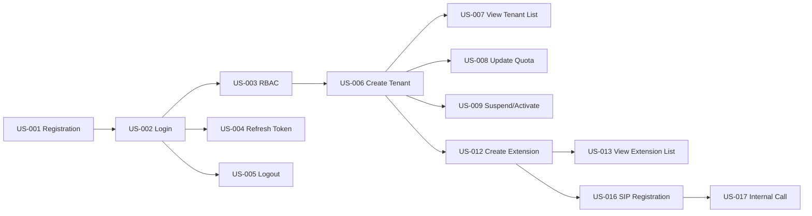

# SPRINT PLANNING - SPRINT 2
## Call Center SaaS Platform

> [!IMPORTANT]
> Đây là kế hoạch chi tiết cho Sprint 2. Sprint này tập trung vào Authentication, Tenant Management và Extension Management.

**Sprint:** Sprint 2  
**Duration:** 20/01/2026 - 02/02/2026 (2 tuần)  
**Sprint Goal:** Hoàn thành Authentication, Tenant Management và Extension Management để user có thể đăng ký, đăng nhập và tạo Extension  
**Scrum Master:** [Tên SM]  
**Product Owner:** [Tên PO]

---

## 📊 SPRINT OVERVIEW

### Sprint Goal
```
Xây dựng foundation cho hệ thống SaaS:
- User có thể đăng ký và đăng nhập
- SuperAdmin có thể tạo và quản lý Tenant
- TenantAdmin có thể tạo và quản lý Extension
- Extension có thể đăng ký SIP và gọi nội bộ
```

### Key Metrics
| Metric | Target | Actual |
|--------|--------|--------|
| **Story Points Committed** | 45 | - |
| **Team Velocity (Last Sprint)** | N/A (Sprint 1 was setup) | - |
| **Team Capacity** | 45 points | - |
| **Working Days** | 10 days | - |
| **Holidays/Leave** | None | - |

---

## 👥 TEAM CAPACITY

### Team Members & Availability

| Member | Role | Capacity (%) | Story Points | Notes |
|--------|------|--------------|--------------|-------|
| **[Tech Lead]** | Tech Lead | 60% | 12 | 40% cho review, architecture |
| **[Senior BE]** | Senior .NET Dev | 100% | 20 | Full capacity |
| **[Mid BE]** | Mid .NET Dev | 100% | 18 | Full capacity |
| **[Senior FE]** | Senior React Dev | 100% | 20 | Full capacity |
| **[Mid FE]** | Mid React Dev | 100% | 15 | Full capacity |
| **[DevOps]** | DevOps | 50% | 10 | 50% cho infrastructure support |
| **[QA Lead]** | QA Lead | 80% | 12 | 20% cho test planning |
| **[Tester]** | Manual Tester | 100% | 15 | Full capacity |
| **TOTAL** | | | **122** | Overcommit buffer |

**Committed Capacity:** 45 story points (conservative estimate)

---

## 📋 SPRINT BACKLOG

### EPIC-01: Authentication & Authorization (25 points)

#### ✅ US-001: User Registration (5 points)
**Assigned to:** Senior BE (Backend) + Mid FE (Frontend)  
**Priority:** Must Have

**Tasks:**
- [x] **BE-001.1:** Design User & Tenant entities (2h) - Senior BE
- [ ] **BE-001.2:** Implement CreateTenantCommand (CQRS) (4h) - Senior BE
- [ ] **BE-001.3:** Implement email validation (1h) - Senior BE
- [ ] **BE-001.4:** Implement password hashing (BCrypt) (2h) - Senior BE
- [ ] **BE-001.5:** Generate domain slug from company name (1h) - Mid BE
- [ ] **BE-001.6:** Send welcome email (2h) - Mid BE
- [ ] **BE-001.7:** Write unit tests (3h) - Senior BE
- [ ] **FE-001.1:** Design registration form UI (3h) - Mid FE
- [ ] **FE-001.2:** Implement form validation (Yup) (2h) - Mid FE
- [ ] **FE-001.3:** Connect to API (2h) - Mid FE
- [ ] **FE-001.4:** Handle success/error states (1h) - Mid FE
- [ ] **QA-001.1:** Write test cases (2h) - QA Lead
- [ ] **QA-001.2:** Manual testing (2h) - Tester

**Acceptance Criteria:**
- [ ] Email phải unique trong hệ thống
- [ ] Password tối thiểu 8 ký tự, có chữ hoa, số, ký tự đặc biệt
- [ ] Tự động tạo Tenant với domain slug từ company name
- [ ] Gửi email xác nhận đăng ký
- [ ] Hiển thị thông báo thành công với thông tin đăng nhập

**Dependencies:** None

**Estimated Hours:** 27h  
**Story Points:** 5

---

#### ✅ US-002: User Login (3 points)
**Assigned to:** Senior BE (Backend) + Mid FE (Frontend)  
**Priority:** Must Have

**Tasks:**
- [ ] **BE-002.1:** Implement LoginCommand (2h) - Senior BE
- [ ] **BE-002.2:** Generate JWT token (3h) - Senior BE
- [ ] **BE-002.3:** Generate refresh token (2h) - Senior BE
- [ ] **BE-002.4:** Implement login attempt tracking (2h) - Mid BE
- [ ] **BE-002.5:** Account lockout logic (2h) - Mid BE
- [ ] **BE-002.6:** Write unit tests (2h) - Senior BE
- [ ] **FE-002.1:** Design login form UI (2h) - Mid FE
- [ ] **FE-002.2:** Implement form validation (1h) - Mid FE
- [ ] **FE-002.3:** Store tokens in localStorage (1h) - Mid FE
- [ ] **FE-002.4:** Redirect after login (1h) - Mid FE
- [ ] **QA-002.1:** Test login scenarios (3h) - Tester

**Acceptance Criteria:**
- [ ] Login với email + password
- [ ] Trả về JWT access token (expire 24h)
- [ ] Trả về refresh token (expire 7 days)
- [ ] Sai password 5 lần → Lock account 15 phút
- [ ] Log login history (IP, device, timestamp)

**Dependencies:** US-001

**Estimated Hours:** 21h  
**Story Points:** 3

---

#### ✅ US-003: Role-Based Access Control (8 points)
**Assigned to:** Tech Lead + Senior BE  
**Priority:** Must Have

**Tasks:**
- [ ] **BE-003.1:** Design RBAC architecture (3h) - Tech Lead
- [ ] **BE-003.2:** Implement Authorization policies (4h) - Senior BE
- [ ] **BE-003.3:** Implement Global Query Filter (tenant isolation) (4h) - Senior BE
- [ ] **BE-003.4:** Create custom [Authorize] attributes (3h) - Senior BE
- [ ] **BE-003.5:** Implement ICurrentUserService (2h) - Mid BE
- [ ] **BE-003.6:** Write unit tests (4h) - Senior BE
- [ ] **BE-003.7:** Integration tests (4h) - Senior BE
- [ ] **QA-003.1:** Test permission matrix (4h) - QA Lead

**Acceptance Criteria:**
- [ ] Implement 4 roles: SuperAdmin, TenantAdmin, Supervisor, Agent
- [ ] SuperAdmin: Full access tất cả Tenant
- [ ] TenantAdmin: Quản lý Tenant của mình
- [ ] Supervisor: Xem báo cáo team, nghe lén
- [ ] Agent: Chỉ xem dữ liệu của bản thân
- [ ] API endpoints có @Authorize decorator với policy

**Dependencies:** US-002

**Estimated Hours:** 28h  
**Story Points:** 8

---

#### ✅ US-004: Refresh Token (5 points)
**Assigned to:** Senior BE  
**Priority:** Should Have

**Tasks:**
- [ ] **BE-004.1:** Design refresh token table (1h) - Senior BE
- [ ] **BE-004.2:** Implement RefreshTokenCommand (3h) - Senior BE
- [ ] **BE-004.3:** Token rotation logic (2h) - Senior BE
- [ ] **BE-004.4:** Revoke old tokens (1h) - Senior BE
- [ ] **BE-004.5:** Write unit tests (2h) - Senior BE
- [ ] **FE-004.1:** Implement auto-refresh logic (3h) - Senior FE
- [ ] **FE-004.2:** Handle token expiration (2h) - Senior FE
- [ ] **QA-004.1:** Test refresh scenarios (2h) - Tester

**Dependencies:** US-002

**Estimated Hours:** 16h  
**Story Points:** 5

---

#### ✅ US-005: Logout (2 points)
**Assigned to:** Mid BE + Mid FE  
**Priority:** Must Have

**Tasks:**
- [ ] **BE-005.1:** Implement LogoutCommand (1h) - Mid BE
- [ ] **BE-005.2:** Revoke refresh token (1h) - Mid BE
- [ ] **BE-005.3:** Write unit tests (1h) - Mid BE
- [ ] **FE-005.1:** Clear tokens from storage (1h) - Mid FE
- [ ] **FE-005.2:** Redirect to login (0.5h) - Mid FE
- [ ] **QA-005.1:** Test logout (1h) - Tester

**Dependencies:** US-002

**Estimated Hours:** 5.5h  
**Story Points:** 2

---

### EPIC-02: Tenant Management (14 points selected)

#### ✅ US-006: Create Tenant (5 points)
**Assigned to:** Senior BE + Senior FE  
**Priority:** Must Have

**Tasks:**
- [ ] **BE-006.1:** Implement CreateTenantCommand (3h) - Senior BE
- [ ] **BE-006.2:** Domain uniqueness validation (1h) - Senior BE
- [ ] **BE-006.3:** Create TenantAdmin user (2h) - Senior BE
- [ ] **BE-006.4:** Generate temporary password (1h) - Mid BE
- [ ] **BE-006.5:** Send welcome email (2h) - Mid BE
- [ ] **BE-006.6:** Write unit tests (3h) - Senior BE
- [ ] **FE-006.1:** Create Tenant form UI (SuperAdmin) (4h) - Senior FE
- [ ] **FE-006.2:** Form validation (2h) - Senior FE
- [ ] **FE-006.3:** Connect to API (2h) - Senior FE
- [ ] **QA-006.1:** Test tenant creation (3h) - Tester

**Dependencies:** US-003

**Estimated Hours:** 23h  
**Story Points:** 5

---

#### ✅ US-007: View Tenant List (3 points)
**Assigned to:** Mid BE + Senior FE  
**Priority:** Must Have

**Tasks:**
- [ ] **BE-007.1:** Implement GetTenantsQuery (2h) - Mid BE
- [ ] **BE-007.2:** Implement pagination (2h) - Mid BE
- [ ] **BE-007.3:** Implement search/filter (2h) - Mid BE
- [ ] **BE-007.4:** Write unit tests (2h) - Mid BE
- [ ] **FE-007.1:** Tenant list page UI (4h) - Senior FE
- [ ] **FE-007.2:** Data table component (3h) - Senior FE
- [ ] **FE-007.3:** Search/filter UI (2h) - Mid FE
- [ ] **QA-007.1:** Test list/search/filter (2h) - Tester

**Dependencies:** US-006

**Estimated Hours:** 19h  
**Story Points:** 3

---

#### ✅ US-008: Update Tenant Quota (3 points)
**Assigned to:** Mid BE + Mid FE  
**Priority:** Must Have

**Tasks:**
- [ ] **BE-008.1:** Implement UpdateTenantQuotaCommand (2h) - Mid BE
- [ ] **BE-008.2:** Validation logic (1h) - Mid BE
- [ ] **BE-008.3:** Send notification email (1h) - Mid BE
- [ ] **BE-008.4:** Write unit tests (2h) - Mid BE
- [ ] **FE-008.1:** Edit quota dialog (3h) - Mid FE
- [ ] **FE-008.2:** Validation (1h) - Mid FE
- [ ] **QA-008.1:** Test quota update (2h) - Tester

**Dependencies:** US-006

**Estimated Hours:** 12h  
**Story Points:** 3

---

#### ✅ US-009: Suspend/Activate Tenant (3 points)
**Assigned to:** Mid BE + Mid FE  
**Priority:** Must Have

**Tasks:**
- [ ] **BE-009.1:** Implement SuspendTenantCommand (2h) - Mid BE
- [ ] **BE-009.2:** Implement ActivateTenantCommand (1h) - Mid BE
- [ ] **BE-009.3:** Update is_active flag (1h) - Mid BE
- [ ] **BE-009.4:** Send notification email (1h) - Mid BE
- [ ] **BE-009.5:** Write unit tests (2h) - Mid BE
- [ ] **FE-009.1:** Suspend/Activate buttons (2h) - Mid FE
- [ ] **FE-009.2:** Confirmation dialog (1h) - Mid FE
- [ ] **QA-009.1:** Test suspend/activate (2h) - Tester

**Dependencies:** US-006

**Estimated Hours:** 12h  
**Story Points:** 3

---

### EPIC-03: Extension Management (11 points selected)

#### ✅ US-012: Create Extension (5 points)
**Assigned to:** Senior BE + Senior FE  
**Priority:** Must Have

**Tasks:**
- [ ] **BE-012.1:** Design Extension entity (2h) - Senior BE
- [ ] **BE-012.2:** Implement CreateExtensionCommand (3h) - Senior BE
- [ ] **BE-012.3:** Extension uniqueness validation (1h) - Senior BE
- [ ] **BE-012.4:** Auto-generate SIP password (1h) - Mid BE
- [ ] **BE-012.5:** Send SIP credentials email (2h) - Mid BE
- [ ] **BE-012.6:** Write unit tests (3h) - Senior BE
- [ ] **FE-012.1:** Create Extension form UI (4h) - Senior FE
- [ ] **FE-012.2:** Form validation (2h) - Senior FE
- [ ] **FE-012.3:** Display SIP credentials (2h) - Senior FE
- [ ] **QA-012.1:** Test extension creation (3h) - Tester

**Dependencies:** US-006

**Estimated Hours:** 23h  
**Story Points:** 5

---

#### ✅ US-013: View Extension List (3 points)
**Assigned to:** Mid BE + Mid FE  
**Priority:** Must Have

**Tasks:**
- [ ] **BE-013.1:** Implement GetExtensionsQuery (2h) - Mid BE
- [ ] **BE-013.2:** Implement pagination/search (2h) - Mid BE
- [ ] **BE-013.3:** Write unit tests (2h) - Mid BE
- [ ] **FE-013.1:** Extension list page UI (4h) - Mid FE
- [ ] **FE-013.2:** Data table component (3h) - Mid FE
- [ ] **QA-013.1:** Test list/search (2h) - Tester

**Dependencies:** US-012

**Estimated Hours:** 15h  
**Story Points:** 3

---

#### ✅ US-016: Extension SIP Registration (8 points)
**Assigned to:** Tech Lead + Senior BE + DevOps  
**Priority:** Must Have

**Tasks:**
- [ ] **BE-016.1:** Design mod_xml_curl handler (3h) - Tech Lead
- [ ] **BE-016.2:** Implement `/api/freeswitch/configuration` endpoint (4h) - Senior BE
- [ ] **BE-016.3:** Parse FreeSWITCH request (2h) - Senior BE
- [ ] **BE-016.4:** Generate Directory XML (4h) - Senior BE
- [ ] **BE-016.5:** Implement Redis caching (3h) - Senior BE
- [ ] **BE-016.6:** Write unit tests (3h) - Senior BE
- [ ] **BE-016.7:** Integration tests (4h) - Senior BE
- [ ] **DEV-016.1:** Configure FreeSWITCH mod_xml_curl (4h) - DevOps
- [ ] **DEV-016.2:** Test SIP registration (3h) - DevOps
- [ ] **QA-016.1:** Test with Softphone (4h) - QA Lead

**Dependencies:** US-012

**Estimated Hours:** 34h  
**Story Points:** 8

---

#### ✅ US-017: Internal Call (5 points)
**Assigned to:** Senior BE + DevOps  
**Priority:** Must Have

**Tasks:**
- [ ] **BE-017.1:** Implement Dialplan XML for internal calls (4h) - Senior BE
- [ ] **BE-017.2:** Validate same tenant (1h) - Senior BE
- [ ] **BE-017.3:** Generate Bridge XML (2h) - Senior BE
- [ ] **BE-017.4:** Write unit tests (2h) - Senior BE
- [ ] **DEV-017.1:** Configure FreeSWITCH dialplan (3h) - DevOps
- [ ] **DEV-017.2:** Test internal calls (3h) - DevOps
- [ ] **QA-017.1:** Test with 2 Softphones (4h) - QA Lead

**Dependencies:** US-016

**Estimated Hours:** 19h  
**Story Points:** 5

---

## 📅 SPRINT TIMELINE

### Week 1 (20-26/01)

**Monday 20/01:**
- Sprint Planning Meeting (9:00-11:00 AM)
- Team starts US-001, US-006, US-012

**Tuesday 21/01:**
- Daily Standup (9:00 AM)
- Continue US-001, US-006, US-012

**Wednesday 22/01:**
- Daily Standup (9:00 AM)
- US-001 Demo (internal)
- Start US-002, US-007, US-013

**Thursday 23/01:**
- Daily Standup (9:00 AM)
- Continue US-002, US-007, US-013

**Friday 24/01:**
- Daily Standup (9:00 AM)
- US-002, US-006, US-012 Code Review
- Start US-003, US-008, US-009

---

### Week 2 (27/01-02/02)

**Monday 27/01:**
- Daily Standup (9:00 AM)
- Continue US-003, US-008, US-009
- Start US-016 (Critical path)

**Tuesday 28/01:**
- Daily Standup (9:00 AM)
- US-003 Code Review
- Continue US-016

**Wednesday 29/01:**
- Daily Standup (9:00 AM)
- Start US-004, US-005
- Continue US-016

**Thursday 30/01:**
- Daily Standup (9:00 AM)
- US-016 Integration Testing
- Start US-017

**Friday 31/01:**
- Daily Standup (9:00 AM)
- Final testing & bug fixes
- Sprint Review preparation

**Sunday 02/02:**
- Sprint Review (4:00-5:00 PM)
- Sprint Retrospective (5:00-6:00 PM)

---

## 🎯 SPRINT GOALS & SUCCESS CRITERIA

### Must Complete
- [ ] US-001: User Registration
- [ ] US-002: User Login
- [ ] US-003: RBAC
- [ ] US-006: Create Tenant
- [ ] US-012: Create Extension
- [ ] US-016: SIP Registration
- [ ] US-017: Internal Call

### Should Complete
- [ ] US-004: Refresh Token
- [ ] US-005: Logout
- [ ] US-007: View Tenant List
- [ ] US-008: Update Tenant Quota
- [ ] US-009: Suspend/Activate Tenant
- [ ] US-013: View Extension List

### Success Criteria
- [ ] All Must Complete stories are Done
- [ ] At least 80% Should Complete stories are Done
- [ ] 2 Extensions có thể gọi cho nhau (internal call)
- [ ] No critical bugs
- [ ] Code coverage > 70%
- [ ] All tests passed

---

## ⚠️ RISKS & MITIGATION

| Risk | Probability | Impact | Mitigation | Owner |
|------|-------------|--------|------------|-------|
| FreeSWITCH mod_xml_curl phức tạp | High | High | Tech Lead pair programming với Senior BE, tham khảo documentation | Tech Lead |
| SIP registration không hoạt động | Medium | High | DevOps test sớm (Thứ 4), có backup plan dùng static XML | DevOps |
| Team chưa quen CQRS/MediatR | Medium | Medium | Tech Lead code review kỹ, mentoring | Tech Lead |
| Scope creep | Low | Medium | Strict adherence to acceptance criteria | Scrum Master |

---

## 📊 DEPENDENCIES

### External Dependencies
- [ ] VPS server đã setup (Sprint 1) - DevOps
- [ ] FreeSWITCH đã cài đặt (Sprint 1) - DevOps
- [ ] PostgreSQL đã setup (Sprint 1) - DevOps
- [ ] Redis đã setup (Sprint 1) - DevOps

### Internal Dependencies


---

## 🛠️ TECHNICAL SETUP

### Development Environment
- [ ] .NET 8 SDK installed
- [ ] Node.js 18+ installed
- [ ] PostgreSQL client (DBeaver)
- [ ] Redis client (RedisInsight)
- [ ] Postman for API testing
- [ ] Softphone (Zoiper/MicroSIP) for SIP testing

### Code Repository
- **Backend:** `https://github.com/company/callcenter-backend`
- **Frontend:** `https://github.com/company/callcenter-frontend`
- **Branch:** `sprint-2`

### CI/CD
- [ ] GitHub Actions configured
- [ ] Auto-build on push
- [ ] Auto-test on PR
- [ ] Deploy to staging on merge to develop

---

## 📝 DAILY STANDUP FORMAT

**Time:** 9:00 AM daily  
**Duration:** 15 minutes max  
**Location:** Zoom/Teams

**Questions:**
1. What did I complete yesterday?
2. What will I work on today?
3. Any blockers?

**Scrum Master notes:**
- Update Jira board
- Track blockers
- Update burndown chart

---

## 📈 TRACKING & METRICS

### Burndown Chart
- Update daily after standup
- Track remaining story points
- Ideal line vs actual line

### Velocity Tracking
- Target: 45 story points
- Track actual completed points
- Use for Sprint 3 planning

### Quality Metrics
- Code coverage: Target > 70%
- Bug count: Target < 5 bugs
- Code review time: Target < 24h

---

## 🎉 SPRINT CEREMONIES

### Sprint Planning (Completed)
- **Date:** 20/01/2026, 9:00-11:00 AM
- **Attendees:** All team members
- **Output:** This document

### Daily Standup
- **Time:** 9:00 AM daily
- **Duration:** 15 min
- **Format:** See above

### Sprint Review
- **Date:** 02/02/2026, 4:00-5:00 PM
- **Attendees:** Team + Product Owner + Stakeholders
- **Agenda:**
  - Demo completed stories
  - Get feedback
  - Accept/Reject stories

### Sprint Retrospective
- **Date:** 02/02/2026, 5:00-6:00 PM
- **Attendees:** Team only
- **Format:** Start-Stop-Continue
- **Agenda:**
  - What went well?
  - What can be improved?
  - Action items for Sprint 3

---

## ✅ CHECKLIST

### Before Sprint Starts
- [x] Product Backlog refined
- [x] Sprint Goal defined
- [x] User Stories estimated
- [x] Team capacity calculated
- [x] Dependencies identified
- [x] Definition of Done reviewed
- [x] Sprint Planning completed

### During Sprint
- [ ] Daily Standups conducted
- [ ] Burndown chart updated daily
- [ ] Blockers resolved quickly
- [ ] Code reviews within 24h
- [ ] Tests written for all code
- [ ] Documentation updated

### End of Sprint
- [ ] All stories tested
- [ ] Sprint Review conducted
- [ ] Demo recorded
- [ ] Retrospective completed
- [ ] Action items documented
- [ ] Velocity calculated
- [ ] Incomplete stories moved to backlog

---

## 📞 CONTACTS

| Role | Name | Email | Slack |
|------|------|-------|-------|
| Scrum Master | [Tên SM] | sm@company.com | @sm |
| Product Owner | [Tên PO] | po@company.com | @po |
| Tech Lead | [Tên TL] | tl@company.com | @tl |

---

**Created:** 20/01/2026  
**Last Updated:** 20/01/2026  
**Status:** 🟢 Active  
**Next Review:** Daily Standup 21/01/2026
