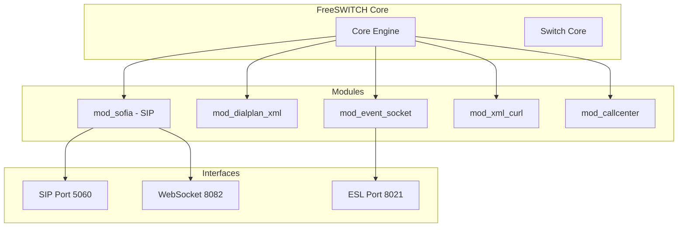
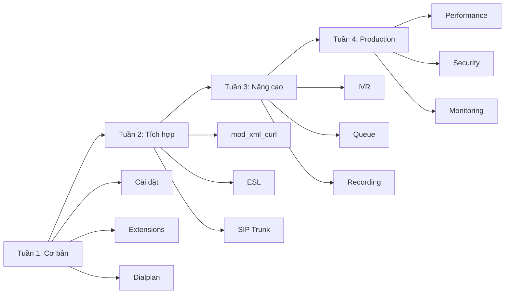

# TỔNG QUAN VỀ FREESWITCH

> [!IMPORTANT]
> Tài liệu này giới thiệu tổng quan về FreeSWITCH - nền tảng để bạn bắt đầu học

## FreeSWITCH là gì?

**FreeSWITCH** là một nền tảng telephony mã nguồn mở, được sử dụng để xây dựng các hệ thống:
- ☎️ **PBX** (Private Branch Exchange) - Tổng đài nội bộ
- 📞 **Call Center** - Trung tâm cuộc gọi
- 🎙️ **IVR** (Interactive Voice Response) - Trả lời tự động
- 💬 **VoIP Gateway** - Cổng kết nối VoIP
- 🌐 **WebRTC** - Gọi điện trên trình duyệt

## Tại sao chọn FreeSWITCH?

### ✅ Ưu điểm
1. **Mã nguồn mở** - Miễn phí, có thể tùy chỉnh
2. **Hiệu năng cao** - Xử lý hàng nghìn cuộc gọi đồng thời
3. **Linh hoạt** - Hỗ trợ nhiều giao thức (SIP, WebRTC, H.323)
4. **Mở rộng dễ dàng** - Module system
5. **Cộng đồng lớn** - Nhiều tài liệu, hỗ trợ tốt

### ⚠️ Nhược điểm
1. **Khó học** - Đường cong học tập dốc
2. **Cấu hình phức tạp** - Nhiều file XML
3. **Tài liệu rải rác** - Cần thời gian tìm hiểu

## Kiến trúc FreeSWITCH



## Các khái niệm cơ bản

### 1. SIP (Session Initiation Protocol)
- Giao thức để thiết lập, duy trì và kết thúc cuộc gọi
- Port mặc định: **5060** (UDP/TCP)
- Các message chính:
  - `REGISTER` - Đăng ký
  - `INVITE` - Bắt đầu cuộc gọi
  - `BYE` - Kết thúc cuộc gọi
  - `ACK` - Xác nhận

### 2. Extension (Máy nhánh)
- Số điện thoại nội bộ (VD: 101, 102, 103)
- Mỗi user có 1 extension
- Cấu hình trong `/etc/freeswitch/directory/`

### 3. Dialplan (Kế hoạch quay số)
- Quy tắc routing cuộc gọi
- "Khi gọi số X, làm gì?"
- Cấu hình trong `/etc/freeswitch/dialplan/`

### 4. Gateway (Cổng kết nối)
- Kết nối với nhà mạng (SIP Trunk)
- Cho phép gọi ra ngoài
- Cấu hình trong `/etc/freeswitch/sip_profiles/external/`

### 5. Module (Mô-đun)
- Các thành phần mở rộng chức năng
- Load/Unload động
- Cấu hình trong `/etc/freeswitch/autoload_configs/`

## Cấu trúc thư mục quan trọng

```
/etc/freeswitch/
├── freeswitch.xml          # File cấu hình chính
├── vars.xml                # Biến toàn cục
├── autoload_configs/       # Cấu hình modules
│   ├── modules.conf.xml    # Modules nào được load
│   ├── sofia.conf.xml      # SIP configuration
│   ├── event_socket.conf.xml
│   └── xml_curl.conf.xml
├── directory/              # User directory (extensions)
│   └── default/
│       ├── 101.xml
│       └── 102.xml
├── dialplan/               # Dialplan rules
│   ├── default.xml
│   └── public.xml
└── sip_profiles/           # SIP profiles
    ├── internal.xml        # Internal extensions
    └── external/           # SIP trunks
        └── viettel.xml
```

## Luồng hoạt động cơ bản

### Khi Extension đăng ký:
```
1. IP Phone gửi SIP REGISTER → FreeSWITCH (port 5060)
2. FreeSWITCH tìm user trong directory/
3. Kiểm tra password
4. Trả về 200 OK (đăng ký thành công)
```

### Khi thực hiện cuộc gọi:
```
1. Extension 101 gọi 102
2. IP Phone gửi SIP INVITE → FreeSWITCH
3. FreeSWITCH tìm dialplan matching "102"
4. Dialplan chỉ định: bridge đến user/102
5. FreeSWITCH gọi Extension 102
6. Extension 102 nhấc máy → 200 OK
7. Cuộc gọi kết nối (RTP stream)
```

## Các công cụ quan trọng

### 1. fs_cli (FreeSWITCH Command Line Interface)
```bash
fs_cli                    # Kết nối console
sofia status              # Xem trạng thái SIP
show channels             # Xem cuộc gọi đang hoạt động
reloadxml                 # Reload cấu hình
```

### 2. ESL (Event Socket Layer)
- Giao tiếp với FreeSWITCH qua TCP (port 8021)
- Nhận events (CHANNEL_CREATE, CHANNEL_HANGUP, etc.)
- Gửi commands (originate, uuid_kill, etc.)

### 3. mod_xml_curl
- FreeSWITCH hỏi Backend API để lấy cấu hình
- Thay vì đọc file XML tĩnh
- Cho phép dynamic configuration

## Modules quan trọng trong dự án

| Module | Chức năng | Sử dụng trong dự án |
|--------|-----------|---------------------|
| **mod_sofia** | SIP stack | ✅ Bắt buộc - Xử lý SIP |
| **mod_dialplan_xml** | XML dialplan | ✅ Routing cuộc gọi |
| **mod_event_socket** | ESL | ✅ Tích hợp Backend |
| **mod_xml_curl** | HTTP XML | ✅ Dynamic config từ API |
| **mod_callcenter** | Queue/ACD | ✅ Hàng đợi cuộc gọi |
| **mod_conference** | Conference | ❌ Không dùng (Phase 2) |
| **mod_verto** | WebRTC | ✅ Softphone trên browser |

## Giao thức và Port

| Service | Protocol | Port | Mô tả |
|---------|----------|------|-------|
| SIP Internal | UDP/TCP | 5060 | Extensions đăng ký |
| SIP External | UDP/TCP | 5080 | SIP Trunk |
| RTP Media | UDP | 16384-32768 | Audio stream |
| ESL | TCP | 8021 | Event Socket |
| WebSocket | WSS | 8082 | WebRTC |

## Workflow học FreeSWITCH



## Tài liệu tham khảo

### Official
- 📚 [FreeSWITCH Wiki](https://freeswitch.org/confluence/)
- 📖 [FreeSWITCH Book](https://freeswitch.org/confluence/display/FREESWITCH/FreeSWITCH+Explained)

### Community
- 💬 [FreeSWITCH Slack](https://signalwire.community/)
- 🐛 [GitHub Issues](https://github.com/signalwire/freeswitch)

### Vietnamese
- 🇻🇳 Các tài liệu trong thư mục này

---

## Bước tiếp theo

Sau khi đọc xong tài liệu này, hãy chuyển sang:
- 📄 [Ngày 1-2: Cài đặt FreeSWITCH](./NGAY_01_02_CAI_DAT_FREESWITCH.md)

**Chúc bạn học tốt!** 🚀
