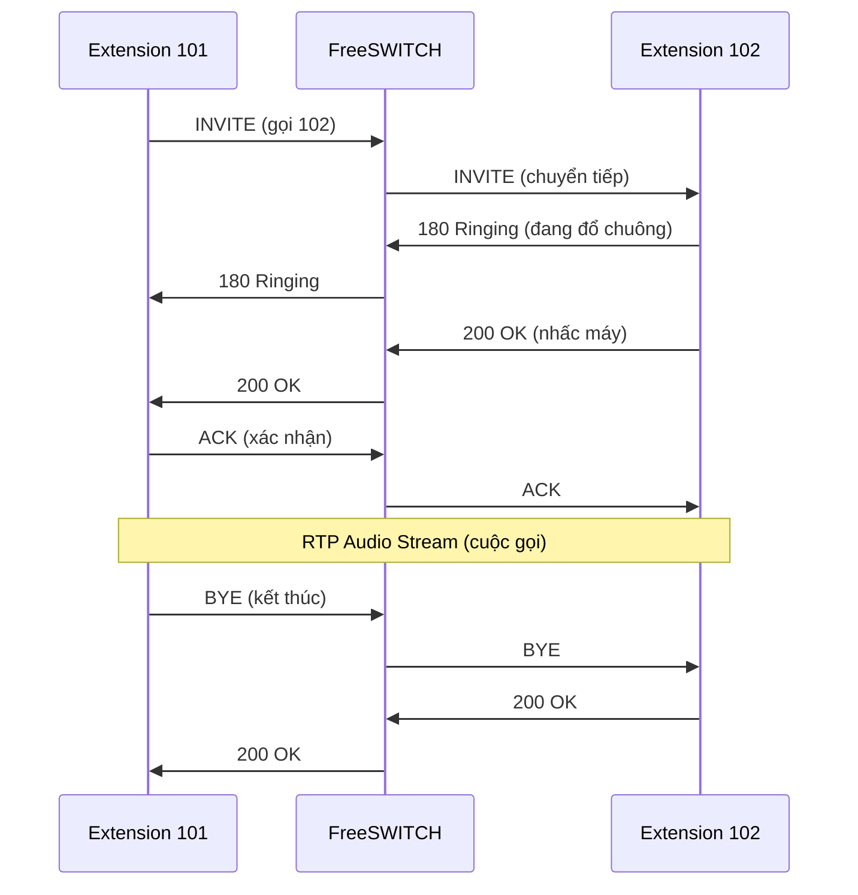

# NGÀY 1-2: CÀI ĐẶT FREESWITCH (16 giờ)

> [!IMPORTANT]
> Mục tiêu: Cài đặt FreeSWITCH thành công và hiểu cấu trúc cơ bản

## Phần 1: Lý thuyết (4 giờ)

### 1.1. VoIP là gì? (1 giờ)

**VoIP (Voice over Internet Protocol)** = Gọi điện qua Internet

**So sánh với điện thoại truyền thống:**

| Điện thoại truyền thống (PSTN) | VoIP |
|--------------------------------|------|
| Dây đồng (copper wire) | Internet (IP network) |
| Tín hiệu analog | Tín hiệu digital (packets) |
| Chất lượng ổn định | Phụ thuộc băng thông |
| Đắt (đường dài) | Rẻ hơn nhiều |

**Cách VoIP hoạt động:**
```
1. Microphone thu âm thanh (analog)
2. ADC (Analog-to-Digital Converter) chuyển thành digital
3. Codec nén audio (G.711, Opus, etc.)
4. Chia thành packets (RTP - Real-time Transport Protocol)
5. Gửi qua Internet
6. Bên nhận giải nén và phát lại
```

### 1.2. SIP Protocol (1.5 giờ)

**SIP (Session Initiation Protocol)** - Giao thức thiết lập cuộc gọi

**Các SIP Message chính:**

#### REGISTER (Đăng ký)
```
REGISTER sip:domain.com SIP/2.0
Via: SIP/2.0/UDP 192.168.1.100:5060
From: <sip:101@domain.com>
To: <sip:101@domain.com>
Contact: <sip:101@192.168.1.100:5060>
Authorization: Digest username="101", password="..."
```

#### INVITE (Bắt đầu cuộc gọi)
```
INVITE sip:102@domain.com SIP/2.0
From: "John" <sip:101@domain.com>
To: <sip:102@domain.com>
Contact: <sip:101@192.168.1.100:5060>
Content-Type: application/sdp

v=0
o=- 123456 123456 IN IP4 192.168.1.100
s=Call
c=IN IP4 192.168.1.100
m=audio 16384 RTP/AVP 0 8
a=rtpmap:0 PCMU/8000
```

#### Luồng SIP Call:


### 1.3. FreeSWITCH Architecture (1.5 giờ)

**FreeSWITCH Core Components:**

```
┌─────────────────────────────────────┐
│         FreeSWITCH Core             │
├─────────────────────────────────────┤
│  Switch Core (Routing Engine)       │
│  - Call routing                     │
│  - Channel management               │
│  - Event system                     │
└─────────────────────────────────────┘
           ↓         ↓         ↓
    ┌──────────┐ ┌──────────┐ ┌──────────┐
    │ Endpoint │ │ Dialplan │ │  Event   │
    │ Modules  │ │ Modules  │ │ Modules  │
    └──────────┘ └──────────┘ └──────────┘
    │          │ │          │ │          │
    │mod_sofia │ │mod_dpxml │ │mod_esl   │
    │(SIP)     │ │(XML)     │ │(ESL)     │
    └──────────┘ └──────────┘ └──────────┘
```

**Module Types:**

1. **Endpoint Modules** - Giao thức kết nối
   - `mod_sofia` - SIP
   - `mod_verto` - WebRTC
   
2. **Dialplan Modules** - Routing logic
   - `mod_dialplan_xml` - XML dialplan
   
3. **Application Modules** - Chức năng
   - `mod_callcenter` - Queue
   - `mod_conference` - Conference
   
4. **Event Modules** - Tích hợp
   - `mod_event_socket` - ESL
   - `mod_xml_curl` - HTTP integration

---

## Phần 2: Cài đặt trên Debian 12 (8 giờ)

### 2.1. Chuẩn bị môi trường (1 giờ)

```bash
# Update system
sudo apt update && sudo apt upgrade -y

# Cài đặt dependencies
sudo apt install -y \
    build-essential \
    cmake \
    automake \
    autoconf \
    libtool \
    pkg-config \
    git \
    wget \
    curl \
    vim \
    net-tools

# Cài đặt libraries
sudo apt install -y \
    libssl-dev \
    zlib1g-dev \
    libncurses5-dev \
    libjpeg-dev \
    libsqlite3-dev \
    libpcre3-dev \
    libspeex-dev \
    libspeexdsp-dev \
    libldns-dev \
    libedit-dev \
    libtiff-dev \
    yasm \
    libopus-dev \
    libsndfile1-dev \
    libshout3-dev \
    libmpg123-dev \
    libmp3lame-dev
```

### 2.2. Compile từ source (4 giờ)

**Tại sao compile từ source?**
- ✅ Version mới nhất
- ✅ Tùy chỉnh modules
- ✅ Hiểu rõ cấu trúc

```bash
# Clone source code
cd /usr/src
sudo git clone https://github.com/signalwire/freeswitch.git
cd freeswitch

# Checkout stable version
sudo git checkout v1.10

# Bootstrap
sudo ./bootstrap.sh -j

# Configure modules
sudo vim modules.conf
```

**Chỉnh sửa `modules.conf`** (bỏ comment các module cần thiết):

```conf
# Endpoints
endpoints/mod_sofia

# Applications
applications/mod_commands
applications/mod_conference
applications/mod_dptools
applications/mod_expr
applications/mod_hash
applications/mod_db
applications/mod_callcenter

# Dialplan
dialplan/mod_dialplan_xml

# Codecs
codecs/mod_g711
codecs/mod_opus

# Event Handlers
event_handlers/mod_event_socket
event_handlers/mod_cdr_csv

# Formats
formats/mod_local_stream
formats/mod_native_file
formats/mod_sndfile
formats/mod_tone_stream

# Languages
languages/mod_say_en

# Loggers
loggers/mod_console
loggers/mod_logfile

# Say
say/mod_say_en

# XML Interfaces
xml_int/mod_xml_curl
xml_int/mod_xml_cdr
```

**Compile:**

```bash
# Configure
sudo ./configure \
    --prefix=/usr/local/freeswitch \
    --enable-core-pgsql-support \
    --enable-core-odbc-support

# Make (mất 30-60 phút)
sudo make -j$(nproc)

# Install
sudo make install

# Tạo symlinks
sudo ln -s /usr/local/freeswitch/bin/freeswitch /usr/bin/freeswitch
sudo ln -s /usr/local/freeswitch/bin/fs_cli /usr/bin/fs_cli
```

### 2.3. Cấu hình systemd (1 giờ)

**Tạo service file:**

```bash
sudo vim /etc/systemd/system/freeswitch.service
```

**Nội dung:**

```ini
[Unit]
Description=FreeSWITCH
After=network.target

[Service]
Type=forking
User=freeswitch
Group=freeswitch
Environment="DAEMON_OPTS=-nonat"
EnvironmentFile=-/etc/default/freeswitch
ExecStart=/usr/local/freeswitch/bin/freeswitch -nc -nf $DAEMON_OPTS
ExecReload=/usr/bin/kill -HUP $MAINPID
PIDFile=/usr/local/freeswitch/run/freeswitch.pid
Restart=on-failure
RestartSec=10s

[Install]
WantedBy=multi-user.target
```

**Tạo user freeswitch:**

```bash
# Tạo user
sudo groupadd freeswitch
sudo useradd -r -g freeswitch -d /usr/local/freeswitch -s /bin/false freeswitch

# Phân quyền
sudo chown -R freeswitch:freeswitch /usr/local/freeswitch

# Enable service
sudo systemctl daemon-reload
sudo systemctl enable freeswitch
```

### 2.4. Cấu hình Firewall (1 giờ)

```bash
# Cài đặt UFW
sudo apt install ufw -y

# Allow SSH
sudo ufw allow 22/tcp

# FreeSWITCH ports
sudo ufw allow 5060/udp    # SIP
sudo ufw allow 5060/tcp    # SIP over TCP
sudo ufw allow 5080/udp    # SIP External
sudo ufw allow 8021/tcp    # ESL
sudo ufw allow 8082/tcp    # WebSocket
sudo ufw allow 16384:32768/udp  # RTP

# Enable firewall
sudo ufw enable
sudo ufw status
```

### 2.5. Khởi động FreeSWITCH (1 giờ)

```bash
# Start service
sudo systemctl start freeswitch

# Check status
sudo systemctl status freeswitch

# Xem logs
sudo tail -f /usr/local/freeswitch/log/freeswitch.log

# Kết nối console
fs_cli
```

**Trong fs_cli, test các lệnh:**

```
freeswitch@internal> version
freeswitch@internal> status
freeswitch@internal> sofia status
freeswitch@internal> show modules
freeswitch@internal> show channels
```

---

## Phần 3: Cấu hình cơ bản (4 giờ)

### 3.1. Hiểu cấu trúc file (1 giờ)

```bash
cd /usr/local/freeswitch/conf

# Cấu trúc thư mục
tree -L 2
```

**File quan trọng:**

```
conf/
├── freeswitch.xml              # Main config (include tất cả)
├── vars.xml                    # Biến toàn cục
├── autoload_configs/           # Module configs
│   ├── modules.conf.xml        # Modules load
│   ├── sofia.conf.xml          # SIP config
│   ├── event_socket.conf.xml   # ESL config
│   └── switch.conf.xml         # Core config
├── directory/                  # User directory
│   └── default/
│       └── *.xml               # User files
├── dialplan/                   # Dialplan
│   ├── default.xml             # Internal dialplan
│   └── public.xml              # External dialplan
└── sip_profiles/               # SIP profiles
    ├── internal.xml            # Internal profile
    └── external.xml            # External profile
```

### 3.2. Cấu hình vars.xml (1 giờ)

```bash
sudo vim /usr/local/freeswitch/conf/vars.xml
```

**Các biến quan trọng:**

```xml
<X-PRE-PROCESS cmd="set" data="domain=yourdomain.com"/>
<X-PRE-PROCESS cmd="set" data="domain_name=$${domain}"/>

<!-- IP addresses -->
<X-PRE-PROCESS cmd="set" data="local_ip_v4=auto"/>
<X-PRE-PROCESS cmd="set" data="external_rtp_ip=auto"/>
<X-PRE-PROCESS cmd="set" data="external_sip_ip=auto"/>

<!-- Passwords -->
<X-PRE-PROCESS cmd="set" data="default_password=1234"/>

<!-- Codecs -->
<X-PRE-PROCESS cmd="set" data="global_codec_prefs=OPUS,G722,PCMU,PCMA"/>
<X-PRE-PROCESS cmd="set" data="outbound_codec_prefs=OPUS,G722,PCMU,PCMA"/>
```

### 3.3. Cấu hình SIP Profile (2 giờ)

```bash
sudo vim /usr/local/freeswitch/conf/sip_profiles/internal.xml
```

**Các tham số quan trọng:**

```xml
<profile name="internal">
  <settings>
    <!-- Địa chỉ bind -->
    <param name="sip-ip" value="$${local_ip_v4}"/>
    <param name="sip-port" value="5060"/>
    <param name="rtp-ip" value="$${local_ip_v4}"/>
    
    <!-- Context -->
    <param name="context" value="default"/>
    <param name="dialplan" value="XML"/>
    
    <!-- Authentication -->
    <param name="auth-calls" value="true"/>
    <param name="auth-all-packets" value="false"/>
    
    <!-- Codecs -->
    <param name="inbound-codec-prefs" value="$${global_codec_prefs}"/>
    <param name="outbound-codec-prefs" value="$${outbound_codec_prefs}"/>
    
    <!-- NAT -->
    <param name="ext-rtp-ip" value="$${external_rtp_ip}"/>
    <param name="ext-sip-ip" value="$${external_sip_ip}"/>
    
    <!-- DTMF -->
    <param name="dtmf-type" value="rfc2833"/>
  </settings>
</profile>
```

---

## Bài tập thực hành

### ✅ Checklist hoàn thành

- [ ] Cài đặt FreeSWITCH thành công
- [ ] Khởi động service thành công
- [ ] Kết nối fs_cli được
- [ ] Hiểu cấu trúc thư mục conf/
- [ ] Chỉnh sửa vars.xml
- [ ] Hiểu SIP profile

### 🎯 Bài tập

**Bài 1:** Kiểm tra version
```bash
fs_cli -x "version"
```

**Bài 2:** Xem modules đã load
```bash
fs_cli -x "show modules"
```

**Bài 3:** Xem SIP profiles
```bash
fs_cli -x "sofia status"
```

**Bài 4:** Reload XML
```bash
fs_cli -x "reloadxml"
```

---

## Troubleshooting

### Lỗi thường gặp:

**1. FreeSWITCH không start:**
```bash
# Check logs
sudo journalctl -u freeswitch -n 50

# Check permissions
ls -la /usr/local/freeswitch/
```

**2. Port 5060 đã được sử dụng:**
```bash
sudo netstat -tulpn | grep 5060
sudo kill -9 <PID>
```

**3. Module không load:**
```bash
# Trong fs_cli
load mod_sofia
reload mod_sofia
```

---

## Bước tiếp theo

📄 [Ngày 3-4: SIP & Extensions](./NGAY_03_04_SIP_EXTENSIONS.md)
