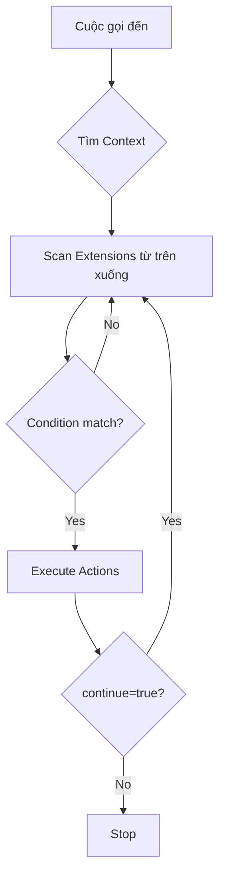

# NGÀY 5: DIALPLAN NÂNG CAO (8 giờ)

> [!IMPORTANT]
> Mục tiêu: Thành thạo Dialplan XML, regex, conditions, và applications

## Phần 1: Dialplan Fundamentals (2 giờ)

### 1.1. Dialplan là gì?

**Dialplan** = Bộ não của FreeSWITCH
- Quyết định cuộc gọi đi đâu
- Xử lý logic routing
- Giống như "if-else" trong lập trình

### 1.2. Cấu trúc Dialplan

```xml
<context name="tên_context">
  <extension name="tên_extension">
    <condition field="trường" expression="regex">
      <action application="app" data="params"/>
      <action application="app2" data="params2"/>
    </condition>
  </extension>
</context>
```

**Ví dụ thực tế:**

```xml
<context name="default">
  <!-- Extension 1: Gọi nội bộ -->
  <extension name="local_calls">
    <condition field="destination_number" expression="^(10[0-9])$">
      <action application="bridge" data="user/$1@${domain_name}"/>
    </condition>
  </extension>
  
  <!-- Extension 2: Gọi ra ngoài -->
  <extension name="outbound_calls">
    <condition field="destination_number" expression="^(0[0-9]{9})$">
      <action application="bridge" data="sofia/gateway/viettel/$1"/>
    </condition>
  </extension>
</context>
```

### 1.3. Dialplan Processing Order



---

## Phần 2: Regex trong Dialplan (2 giờ)

### 2.1. Regex Basics

| Pattern | Ý nghĩa | Ví dụ |
|---------|---------|-------|
| `^` | Bắt đầu | `^101$` = chính xác "101" |
| `$` | Kết thúc | `^10[0-9]$` = 100-109 |
| `[0-9]` | Số từ 0-9 | `[0-9]` = 1 số |
| `[0-9]{3}` | 3 số | `[0-9]{3}` = 000-999 |
| `[0-9]{9,10}` | 9-10 số | Mobile hoặc landline |
| `(...)` | Capture group | `^(10[0-9])$` → $1 |
| `\|` | OR | `^(101\|102)$` = 101 hoặc 102 |
| `.` | Bất kỳ ký tự | `^.*$` = tất cả |
| `*` | 0 hoặc nhiều | `^10*$` = 1, 10, 100... |
| `+` | 1 hoặc nhiều | `^10+$` = 10, 100, 1000... |

### 2.2. Ví dụ Regex thực tế

```xml
<!-- 1. Extensions 101-199 -->
<condition field="destination_number" expression="^(1[0-9]{2})$">

<!-- 2. Mobile Vietnam (09x, 08x, 07x, 03x) -->
<condition field="destination_number" expression="^(0[3789][0-9]{8})$">

<!-- 3. Landline Hanoi (024 + 8 số) -->
<condition field="destination_number" expression="^(024[0-9]{8})$">

<!-- 4. International (00 + country code + number) -->
<condition field="destination_number" expression="^(00[0-9]{8,15})$">

<!-- 5. Emergency numbers -->
<condition field="destination_number" expression="^(113|114|115)$">

<!-- 6. Hotline 1900 -->
<condition field="destination_number" expression="^(1900[0-9]{4,6})$">
```

### 2.3. Capture Groups

```xml
<extension name="capture_demo">
  <!-- Gọi *101 để spy extension 101 -->
  <condition field="destination_number" expression="^\*([0-9]{3})$">
    <action application="log" data="INFO Spying on extension $1"/>
    <action application="eavesdrop" data="$1"/>
  </condition>
</extension>
```

**$1, $2, $3** = Capture groups

---

## Phần 3: Conditions Nâng cao (2 giờ)

### 3.1. Multiple Conditions (AND)

```xml
<extension name="business_hours_only">
  <!-- Chỉ cho gọi trong giờ hành chính -->
  <condition field="destination_number" expression="^(0[0-9]{9})$"/>
  <condition wday="2-6" time-of-day="08:00-17:00">
    <action application="bridge" data="sofia/gateway/viettel/$1"/>
    <anti-action application="playback" data="ivr/closed.wav"/>
  </condition>
</extension>
```

### 3.2. Inline Conditions

```xml
<extension name="inline_condition">
  <condition field="destination_number" expression="^(10[0-9])$">
    <!-- Nếu caller_id_number = 101 thì không cho gọi -->
    <action application="set" data="continue_on_fail=true"/>
    <action application="set" data="hangup_after_bridge=true"/>
    
    <action application="execute_extension" 
            data="block_101 XML features" 
            inline="true"/>
    
    <action application="bridge" data="user/$1@${domain_name}"/>
  </condition>
</extension>
```

### 3.3. Anti-Actions

```xml
<extension name="check_balance">
  <condition field="${user_data(${caller_id_number}@${domain_name} var balance)}" expression="^([1-9][0-9]+)$">
    <!-- Nếu balance > 0 -->
    <action application="bridge" data="sofia/gateway/viettel/${destination_number}"/>
    
    <!-- Nếu balance <= 0 -->
    <anti-action application="playback" data="ivr/insufficient_balance.wav"/>
    <anti-action application="hangup"/>
  </condition>
</extension>
```

---

## Phần 4: Applications thường dùng (2 giờ)

### 4.1. Call Control

```xml
<!-- Answer call -->
<action application="answer"/>

<!-- Hangup -->
<action application="hangup" data="NORMAL_CLEARING"/>

<!-- Sleep 2 giây -->
<action application="sleep" data="2000"/>

<!-- Ring back -->
<action application="ring_ready"/>
<action application="sleep" data="2000"/>
```

### 4.2. Bridging

```xml
<!-- Bridge đến user -->
<action application="bridge" data="user/102@${domain_name}"/>

<!-- Bridge đến nhiều users (parallel) -->
<action application="bridge" data="user/101@${domain_name},user/102@${domain_name}"/>

<!-- Bridge sequential (gọi 101, nếu không nhấc máy thì gọi 102) -->
<action application="bridge" data="user/101@${domain_name}|user/102@${domain_name}"/>

<!-- Bridge qua gateway -->
<action application="bridge" data="sofia/gateway/viettel/0901234567"/>

<!-- Bridge với timeout -->
<action application="set" data="call_timeout=20"/>
<action application="bridge" data="user/102@${domain_name}"/>
```

### 4.3. Audio Playback

```xml
<!-- Phát file audio -->
<action application="playback" data="/usr/local/freeswitch/sounds/en/us/callie/ivr/8000/ivr-welcome.wav"/>

<!-- Phát nhiều files -->
<action application="playback" data="file1.wav!file2.wav!file3.wav"/>

<!-- Text-to-Speech (nếu có mod_tts) -->
<action application="speak" data="flite|kal|Welcome to our system"/>

<!-- Tone -->
<action application="playback" data="tone_stream://%(2000,4000,440,480)"/>
```

### 4.4. Variables

```xml
<!-- Set variable -->
<action application="set" data="my_var=hello"/>

<!-- Export variable (cả 2 legs) -->
<action application="export" data="caller_id_name=Custom Name"/>

<!-- Log variable -->
<action application="log" data="INFO my_var = ${my_var}"/>

<!-- Conditional set -->
<action application="set" data="my_var=${cond(${caller_id_number} == 101 ? yes : no)}"/>
```

### 4.5. Transfer & Redirect

```xml
<!-- Transfer đến extension khác -->
<action application="transfer" data="102 XML default"/>

<!-- Redirect (không answer) -->
<action application="redirect" data="sip:102@${domain_name}"/>

<!-- Attended transfer -->
<action application="att_xfer" data="user/102@${domain_name}"/>
```

---

## Bài tập thực hành

### ✅ Checklist

- [ ] Hiểu cấu trúc dialplan
- [ ] Viết được regex cơ bản
- [ ] Sử dụng conditions
- [ ] Sử dụng actions/anti-actions
- [ ] Test dialplan

### 🎯 Bài tập

**Bài 1: Time-based routing**

Tạo dialplan:
- 8h-17h (T2-T6): Gọi vào queue
- Ngoài giờ: Phát audio "We are closed"

```xml
<extension name="time_based">
  <condition field="destination_number" expression="^(1900)$"/>
  <condition wday="2-6" time-of-day="08:00-17:00">
    <action application="answer"/>
    <action application="callcenter" data="support@default"/>
    <anti-action application="answer"/>
    <anti-action application="playback" data="ivr/closed.wav"/>
    <anti-action application="hangup"/>
  </condition>
</extension>
```

**Bài 2: Caller ID based routing**

- Nếu caller = 101: Gọi thẳng 102
- Nếu caller khác: Qua IVR

```xml
<extension name="caller_based">
  <condition field="destination_number" expression="^(1900)$"/>
  <condition field="${caller_id_number}" expression="^101$">
    <action application="bridge" data="user/102@${domain_name}"/>
    <anti-action application="ivr" data="main_menu"/>
  </condition>
</extension>
```

**Bài 3: Regex practice**

Viết regex cho:
- Extensions: 1000-1999
- Mobile VN: 09x, 08x, 07x, 03x (10 số)
- Landline HN: 024 + 8 số
- International: 00 + 8-15 số

**Bài 4: Multi-ring**

Gọi 500 → Ring 101, 102, 103 cùng lúc, ai nhấc máy trước thì kết nối

```xml
<extension name="multi_ring">
  <condition field="destination_number" expression="^500$">
    <action application="bridge" data="user/101@${domain_name},user/102@${domain_name},user/103@${domain_name}"/>
  </condition>
</extension>
```

---

## Debugging Dialplan

### Test dialplan

```bash
# Trong fs_cli
xml_locate dialplan context default

# Test dialplan với số cụ thể
fsctl send_display :102@${domain}
```

### Enable dialplan debug

```bash
# Trong fs_cli
console loglevel debug

# Hoặc trong file
vim /usr/local/freeswitch/conf/autoload_configs/switch.conf.xml
# Set loglevel="debug"
```

### Xem dialplan execution

```bash
# Gọi 1 cuộc gọi và xem log
tail -f /usr/local/freeswitch/log/freeswitch.log | grep EXECUTE
```

---

## Dialplan Best Practices

### 1. Đặt tên rõ ràng

```xml
<!-- ❌ Bad -->
<extension name="ext1">

<!-- ✅ Good -->
<extension name="local_extension_100_199">
```

### 2. Comment code

```xml
<!-- Gọi nội bộ 101-110 -->
<extension name="local_calls">
  <!-- Check số hợp lệ -->
  <condition field="destination_number" expression="^(10[0-9])$">
    <!-- Set timeout 30s -->
    <action application="set" data="call_timeout=30"/>
    <!-- Bridge -->
    <action application="bridge" data="user/$1@${domain_name}"/>
  </condition>
</extension>
```

### 3. Sử dụng variables

```xml
<!-- ❌ Bad: Hard-code -->
<action application="bridge" data="user/102@domain.com"/>

<!-- ✅ Good: Use variables -->
<action application="bridge" data="user/$1@${domain_name}"/>
```

### 4. Error handling

```xml
<action application="set" data="continue_on_fail=true"/>
<action application="set" data="hangup_after_bridge=true"/>
<action application="bridge" data="user/102@${domain_name}"/>

<!-- Nếu bridge fail -->
<action application="answer"/>
<action application="playback" data="ivr/user_not_available.wav"/>
<action application="hangup"/>
```

---

## Bước tiếp theo

📄 [Ngày 6-7: mod_xml_curl](./NGAY_06_07_MOD_XML_CURL.md)
