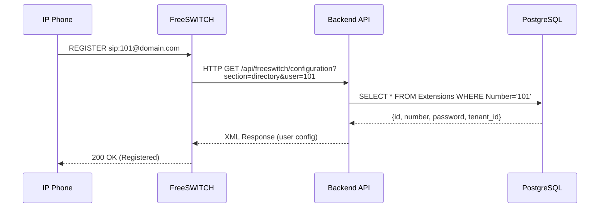

# NGÀY 6-7: MOD_XML_CURL - TÍCH HỢP VỚI BACKEND API (16 giờ)

> [!IMPORTANT]
> Mục tiêu: Kết nối FreeSWITCH với .NET Backend API để lấy cấu hình động

## Phần 1: Hiểu mod_xml_curl (3 giờ)

### 1.1. mod_xml_curl là gì?

**mod_xml_curl** cho phép FreeSWITCH lấy cấu hình từ HTTP API thay vì file XML tĩnh.

**Workflow:**



### 1.2. Các loại request

| Section | Khi nào gọi | Mục đích |
|---------|-------------|----------|
| **directory** | User REGISTER | Authentication |
| **dialplan** | Cuộc gọi bắt đầu | Call routing |
| **configuration** | Module load | Module config |

### 1.3. Request Parameters

**Directory request:**
```
GET /api/freeswitch/configuration?
    section=directory
    &tag_name=domain
    &key_name=name
    &key_value=default
    &user=101
    &domain=yourdomain.com
    &sip_auth_username=101
    &sip_auth_realm=yourdomain.com
```

**Dialplan request:**
```
GET /api/freeswitch/configuration?
    section=dialplan
    &Caller-Destination-Number=0901234567
    &Caller-Caller-ID-Number=101
    &Caller-Context=default
```

---

## Phần 2: Cấu hình mod_xml_curl (2 giờ)

### 2.1. Enable module

```bash
sudo vim /usr/local/freeswitch/conf/autoload_configs/modules.conf.xml
```

**Uncomment:**
```xml
<load module="mod_xml_curl"/>
```

### 2.2. Cấu hình xml_curl.conf.xml

```bash
sudo vim /usr/local/freeswitch/conf/autoload_configs/xml_curl.conf.xml
```

**Nội dung:**

```xml
<configuration name="xml_curl.conf" description="cURL XML Gateway">
  <bindings>
    <!-- Directory binding (User authentication) -->
    <binding name="directory">
      <param name="gateway-url" value="http://localhost:5000/api/freeswitch/configuration" bindings="directory"/>
      <param name="gateway-credentials" value="username:password"/>
      <param name="disable-100-continue" value="true"/>
      <param name="timeout" value="5"/>
    </binding>
    
    <!-- Dialplan binding (Call routing) -->
    <binding name="dialplan">
      <param name="gateway-url" value="http://localhost:5000/api/freeswitch/configuration" bindings="dialplan"/>
      <param name="gateway-credentials" value="username:password"/>
      <param name="disable-100-continue" value="true"/>
      <param name="timeout" value="5"/>
    </binding>
  </bindings>
</configuration>
```

### 2.3. Reload module

```bash
fs_cli -x "reload mod_xml_curl"
```

---

## Phần 3: Backend API - Directory Handler (5 giờ)

### 3.1. Tạo Controller (.NET 8)

```csharp
// Controllers/FreeSwitchController.cs
using Microsoft.AspNetCore.Mvc;

[ApiController]
[Route("api/freeswitch")]
public class FreeSwitchController : ControllerBase
{
    private readonly IFreeSwitchService _service;
    private readonly ILogger<FreeSwitchController> _logger;
    
    public FreeSwitchController(
        IFreeSwitchService service,
        ILogger<FreeSwitchController> logger)
    {
        _service = service;
        _logger = logger;
    }
    
    [HttpGet("configuration")]
    [HttpPost("configuration")]
    public async Task<IActionResult> GetConfiguration(
        [FromQuery] string section,
        [FromQuery] string user,
        [FromQuery] string domain,
        [FromQuery] string? sip_auth_username,
        [FromQuery(Name = "Caller-Destination-Number")] string? destinationNumber,
        [FromQuery(Name = "Caller-Caller-ID-Number")] string? callerNumber)
    {
        _logger.LogInformation("FreeSWITCH request: section={Section}, user={User}", section, user);
        
        try
        {
            string xml = section switch
            {
                "directory" => await _service.GenerateDirectoryXmlAsync(user, domain),
                "dialplan" => await _service.GenerateDialplanXmlAsync(destinationNumber, callerNumber),
                _ => GenerateNotFoundXml()
            };
            
            return Content(xml, "text/xml");
        }
        catch (Exception ex)
        {
            _logger.LogError(ex, "Error generating XML for section {Section}", section);
            return Content(GenerateNotFoundXml(), "text/xml");
        }
    }
    
    private string GenerateNotFoundXml()
    {
        return @"<?xml version=""1.0"" encoding=""UTF-8""?>
<document type=""freeswitch/xml"">
  <section name=""result"">
    <result status=""not found""/>
  </section>
</document>";
    }
}
```

### 3.2. Service Implementation

```csharp
// Services/FreeSwitchService.cs
public interface IFreeSwitchService
{
    Task<string> GenerateDirectoryXmlAsync(string user, string domain);
    Task<string> GenerateDialplanXmlAsync(string destination, string caller);
}

public class FreeSwitchService : IFreeSwitchService
{
    private readonly ApplicationDbContext _context;
    private readonly IMemoryCache _cache;
    
    public FreeSwitchService(ApplicationDbContext context, IMemoryCache cache)
    {
        _context = context;
        _cache = cache;
    }
    
    public async Task<string> GenerateDirectoryXmlAsync(string user, string domain)
    {
        // Check cache first
        var cacheKey = $"directory_{user}_{domain}";
        if (_cache.TryGetValue(cacheKey, out string cachedXml))
        {
            return cachedXml;
        }
        
        // Query database
        var extension = await _context.Extensions
            .Include(e => e.Tenant)
            .FirstOrDefaultAsync(e => e.Number == user && e.IsActive);
        
        if (extension == null)
        {
            return GenerateNotFoundXml();
        }
        
        // Generate XML
        var xml = $@"<?xml version=""1.0"" encoding=""UTF-8""?>
<document type=""freeswitch/xml"">
  <section name=""directory"">
    <domain name=""{domain}"">
      <user id=""{extension.Number}"">
        <params>
          <param name=""password"" value=""{extension.Password}""/>
          <param name=""vm-password"" value=""{extension.Number}""/>
        </params>
        <variables>
          <variable name=""tenant_id"" value=""{extension.TenantId}""/>
          <variable name=""user_context"" value=""default""/>
          <variable name=""effective_caller_id_name"" value=""{extension.CallerIdName}""/>
          <variable name=""effective_caller_id_number"" value=""{extension.Number}""/>
          <variable name=""accountcode"" value=""{extension.Number}""/>
        </variables>
      </user>
    </domain>
  </section>
</document>";
        
        // Cache for 5 minutes
        _cache.Set(cacheKey, xml, TimeSpan.FromMinutes(5));
        
        return xml;
    }
    
    public async Task<string> GenerateDialplanXmlAsync(string destination, string caller)
    {
        // Tìm extension của caller
        var callerExt = await _context.Extensions
            .Include(e => e.Tenant)
            .FirstOrDefaultAsync(e => e.Number == caller);
        
        if (callerExt == null)
        {
            return GenerateNotFoundXml();
        }
        
        // Check balance
        var balance = await _context.Balances
            .FirstOrDefaultAsync(b => b.TenantId == callerExt.TenantId);
        
        if (balance == null || balance.Amount <= 0)
        {
            return GenerateInsufficientBalanceXml();
        }
        
        // Determine call type
        if (IsInternalCall(destination))
        {
            return GenerateInternalDialplanXml(destination);
        }
        else if (IsOutboundCall(destination))
        {
            return GenerateOutboundDialplanXml(destination, callerExt.TenantId);
        }
        
        return GenerateNotFoundXml();
    }
    
    private bool IsInternalCall(string number)
    {
        return number.Length == 3 && number.StartsWith("1");
    }
    
    private bool IsOutboundCall(string number)
    {
        return number.StartsWith("0") && number.Length == 10;
    }
    
    private string GenerateInternalDialplanXml(string extension)
    {
        return $@"<?xml version=""1.0"" encoding=""UTF-8""?>
<document type=""freeswitch/xml"">
  <section name=""dialplan"">
    <context name=""default"">
      <extension name=""internal_call"">
        <condition field=""destination_number"" expression=""^{extension}$"">
          <action application=""set"" data=""call_timeout=30""/>
          <action application=""set"" data=""hangup_after_bridge=true""/>
          <action application=""bridge"" data=""user/{extension}@${{domain_name}}""/>
        </condition>
      </extension>
    </context>
  </section>
</document>";
    }
    
    private string GenerateOutboundDialplanXml(string number, int tenantId)
    {
        // Lấy trunk của tenant
        var trunk = _context.Trunks
            .FirstOrDefault(t => t.TenantId == tenantId && t.IsActive);
        
        if (trunk == null)
        {
            return GenerateNotFoundXml();
        }
        
        return $@"<?xml version=""1.0"" encoding=""UTF-8""?>
<document type=""freeswitch/xml"">
  <section name=""dialplan"">
    <context name=""default"">
      <extension name=""outbound_call"">
        <condition field=""destination_number"" expression=""^{number}$"">
          <action application=""set"" data=""hangup_after_bridge=true""/>
          <action application=""set"" data=""continue_on_fail=true""/>
          <action application=""bridge"" data=""sofia/gateway/{trunk.GatewayName}/{number}""/>
        </condition>
      </extension>
    </context>
  </section>
</document>";
    }
    
    private string GenerateInsufficientBalanceXml()
    {
        return @"<?xml version=""1.0"" encoding=""UTF-8""?>
<document type=""freeswitch/xml"">
  <section name=""dialplan"">
    <context name=""default"">
      <extension name=""insufficient_balance"">
        <condition>
          <action application=""answer""/>
          <action application=""playback"" data=""ivr/insufficient_balance.wav""/>
          <action application=""hangup""/>
        </condition>
      </extension>
    </context>
  </section>
</document>";
    }
    
    private string GenerateNotFoundXml()
    {
        return @"<?xml version=""1.0"" encoding=""UTF-8""?>
<document type=""freeswitch/xml"">
  <section name=""result"">
    <result status=""not found""/>
  </section>
</document>";
    }
}
```

### 3.3. Database Models

```csharp
public class Extension
{
    public int Id { get; set; }
    public int TenantId { get; set; }
    public string Number { get; set; }
    public string Password { get; set; }
    public string CallerIdName { get; set; }
    public bool IsActive { get; set; }
    
    public Tenant Tenant { get; set; }
}

public class Tenant
{
    public int Id { get; set; }
    public string Name { get; set; }
    public bool IsActive { get; set; }
}

public class Balance
{
    public int Id { get; set; }
    public int TenantId { get; set; }
    public decimal Amount { get; set; }
}

public class Trunk
{
    public int Id { get; set; }
    public int TenantId { get; set; }
    public string GatewayName { get; set; }
    public bool IsActive { get; set; }
}
```

---

## Phần 4: Testing (3 giờ)

### 4.1. Test Directory

```bash
# Tạo extension trong database
INSERT INTO Extensions (TenantId, Number, Password, CallerIdName, IsActive)
VALUES (1, '101', 'password101', 'Agent 101', true);

# Test API trực tiếp
curl "http://localhost:5000/api/freeswitch/configuration?section=directory&user=101&domain=yourdomain.com"
```

**Expected output:**
```xml
<?xml version="1.0" encoding="UTF-8"?>
<document type="freeswitch/xml">
  <section name="directory">
    <domain name="yourdomain.com">
      <user id="101">
        <params>
          <param name="password" value="password101"/>
          ...
        </params>
      </user>
    </domain>
  </section>
</document>
```

### 4.2. Test với FreeSWITCH

```bash
# Trong fs_cli, enable debug
console loglevel debug

# Đăng ký extension 101 từ Zoiper
# Xem logs
tail -f /usr/local/freeswitch/log/freeswitch.log | grep xml_curl
```

### 4.3. Test Dialplan

```bash
# Test API
curl "http://localhost:5000/api/freeswitch/configuration?section=dialplan&Caller-Destination-Number=0901234567&Caller-Caller-ID-Number=101"

# Gọi từ 101 → 0901234567
# Xem logs
```

---

## Phần 5: Caching & Performance (3 giờ)

### 5.1. Redis Caching

```csharp
public class FreeSwitchService : IFreeSwitchService
{
    private readonly IDistributedCache _cache;
    
    public async Task<string> GenerateDirectoryXmlAsync(string user, string domain)
    {
        var cacheKey = $"fs:directory:{user}:{domain}";
        
        // Try get from Redis
        var cachedXml = await _cache.GetStringAsync(cacheKey);
        if (!string.IsNullOrEmpty(cachedXml))
        {
            return cachedXml;
        }
        
        // Generate XML
        var xml = await GenerateXmlFromDatabase(user, domain);
        
        // Cache for 5 minutes
        await _cache.SetStringAsync(cacheKey, xml, new DistributedCacheEntryOptions
        {
            AbsoluteExpirationRelativeToNow = TimeSpan.FromMinutes(5)
        });
        
        return xml;
    }
}
```

### 5.2. Invalidate Cache khi update

```csharp
public async Task UpdateExtensionAsync(int id, UpdateExtensionDto dto)
{
    var extension = await _context.Extensions.FindAsync(id);
    extension.Password = dto.Password;
    
    await _context.SaveChangesAsync();
    
    // Invalidate cache
    var cacheKey = $"fs:directory:{extension.Number}:*";
    await _cache.RemoveAsync(cacheKey);
}
```

---

## Bài tập thực hành

### ✅ Checklist

- [ ] Cấu hình mod_xml_curl
- [ ] Tạo Backend API
- [ ] Test directory authentication
- [ ] Test dialplan routing
- [ ] Implement caching

### 🎯 Bài tập

**Bài 1:** Tạo 10 extensions trong database và test đăng ký

**Bài 2:** Implement balance check trong dialplan

**Bài 3:** Add logging để track tất cả requests từ FreeSWITCH

**Bài 4:** Implement failover: Nếu API down, fallback về file XML

---

## Troubleshooting

### Lỗi: "Connection refused"

```bash
# Check API đang chạy
curl http://localhost:5000/health

# Check firewall
sudo ufw allow 5000/tcp
```

### Lỗi: "Timeout"

```bash
# Tăng timeout trong xml_curl.conf.xml
<param name="timeout" value="10"/>
```

### Debug XML response

```bash
# Trong fs_cli
xml_curl debug_on
```

---

## Bước tiếp theo

📄 [Ngày 8-9: Event Socket Layer (ESL)](./NGAY_08_09_EVENT_SOCKET_LAYER.md)
