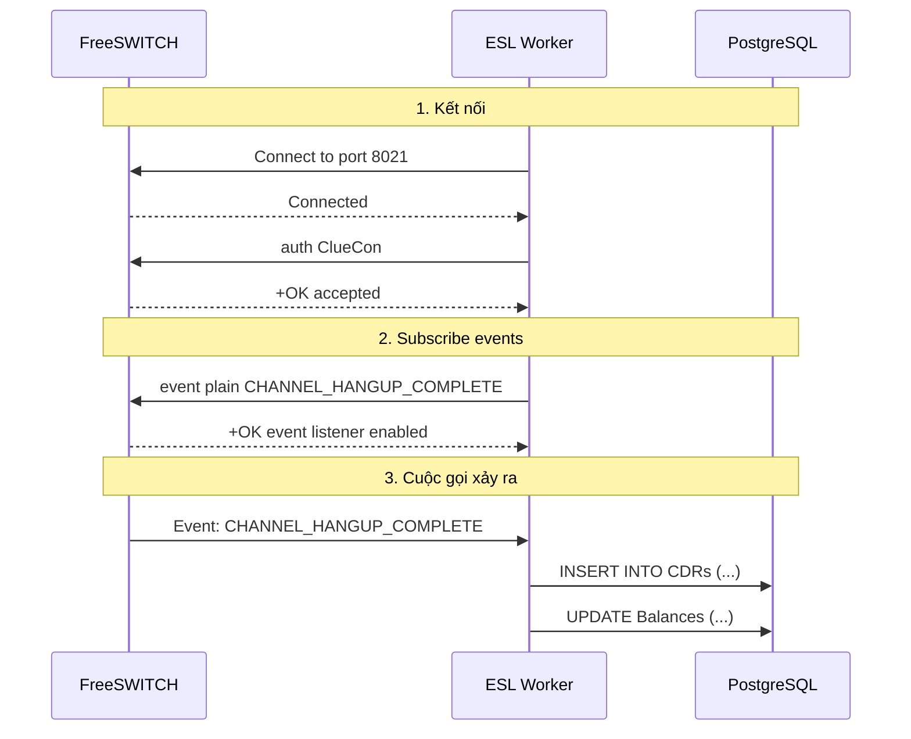

# NGÀY 8-9: EVENT SOCKET LAYER (ESL) (16 giờ)

> [!IMPORTANT]
> Mục tiêu: Lắng nghe events từ FreeSWITCH, lưu CDR, và tính billing

## Phần 1: Hiểu về ESL (3 giờ)

### 1.1. ESL là gì?

**Event Socket Layer (ESL)** = Giao tiếp 2 chiều với FreeSWITCH qua TCP

**2 modes:**
1. **Inbound** - Backend kết nối vào FreeSWITCH (port 8021)
2. **Outbound** - FreeSWITCH kết nối ra Backend

**Trong dự án, chúng ta dùng Inbound mode**

### 1.2. Workflow



### 1.3. Event Types quan trọng

| Event | Khi nào fire | Dùng để |
|-------|--------------|---------|
| **CHANNEL_CREATE** | Cuộc gọi bắt đầu | Real-time monitoring |
| **CHANNEL_ANSWER** | Cuộc gọi được trả lời | Update UI |
| **CHANNEL_HANGUP_COMPLETE** | Cuộc gọi kết thúc | Lưu CDR, billing |
| **CUSTOM callcenter::info** | Queue events | Queue monitoring |

---

## Phần 2: Cấu hình ESL (2 giờ)

### 2.1. Enable mod_event_socket

```bash
sudo vim /usr/local/freeswitch/conf/autoload_configs/event_socket.conf.xml
```

**Nội dung:**

```xml
<configuration name="event_socket.conf" description="Socket Client">
  <settings>
    <param name="nat-map" value="false"/>
    <param name="listen-ip" value="127.0.0.1"/>
    <param name="listen-port" value="8021"/>
    <param name="password" value="ClueCon"/>
    <!--<param name="apply-inbound-acl" value="lan"/>-->
  </settings>
</configuration>
```

### 2.2. Reload module

```bash
fs_cli -x "reload mod_event_socket"

# Test connection
telnet localhost 8021
# Type: auth ClueCon
# Should see: +OK accepted
```

---

## Phần 3: ESL Worker Service (.NET) (6 giờ)

### 3.1. Install NuGet Package

```bash
dotnet add package FreeSWITCH.EventSocket.Inbound
```

### 3.2. Worker Service Implementation

```csharp
// Services/FreeSwitchEslWorker.cs
using FreeSWITCH.EventSocket.Inbound;
using Microsoft.Extensions.Hosting;

public class FreeSwitchEslWorker : BackgroundService
{
    private readonly ILogger<FreeSwitchEslWorker> _logger;
    private readonly IServiceProvider _serviceProvider;
    private InboundSocket _socket;
    
    public FreeSwitchEslWorker(
        ILogger<FreeSwitchEslWorker> logger,
        IServiceProvider serviceProvider)
    {
        _logger = logger;
        _serviceProvider = serviceProvider;
    }
    
    protected override async Task ExecuteAsync(CancellationToken stoppingToken)
    {
        while (!stoppingToken.IsCancellationRequested)
        {
            try
            {
                await ConnectAndListenAsync(stoppingToken);
            }
            catch (Exception ex)
            {
                _logger.LogError(ex, "ESL connection error. Reconnecting in 5 seconds...");
                await Task.Delay(5000, stoppingToken);
            }
        }
    }
    
    private async Task ConnectAndListenAsync(CancellationToken stoppingToken)
    {
        _logger.LogInformation("Connecting to FreeSWITCH ESL...");
        
        _socket = new InboundSocket("localhost", 8021, "ClueCon");
        await _socket.ConnectAsync();
        
        _logger.LogInformation("Connected to FreeSWITCH ESL");
        
        // Subscribe to events
        await _socket.SubscribeEvents(new[]
        {
            "CHANNEL_CREATE",
            "CHANNEL_ANSWER",
            "CHANNEL_HANGUP_COMPLETE",
            "CUSTOM callcenter::info"
        });
        
        _logger.LogInformation("Subscribed to events");
        
        // Listen for events
        _socket.OnEventReceived += async (sender, e) =>
        {
            await HandleEventAsync(e);
        };
        
        // Keep alive
        while (!stoppingToken.IsCancellationRequested && _socket.IsConnected)
        {
            await Task.Delay(1000, stoppingToken);
        }
    }
    
    private async Task HandleEventAsync(EventMessage e)
    {
        var eventName = e.GetHeader("Event-Name");
        
        _logger.LogDebug("Received event: {EventName}", eventName);
        
        switch (eventName)
        {
            case "CHANNEL_CREATE":
                await HandleChannelCreateAsync(e);
                break;
                
            case "CHANNEL_ANSWER":
                await HandleChannelAnswerAsync(e);
                break;
                
            case "CHANNEL_HANGUP_COMPLETE":
                await HandleChannelHangupAsync(e);
                break;
                
            case "CUSTOM":
                await HandleCustomEventAsync(e);
                break;
        }
    }
    
    private async Task HandleChannelCreateAsync(EventMessage e)
    {
        var uuid = e.GetHeader("Unique-ID");
        var caller = e.GetHeader("Caller-Caller-ID-Number");
        var destination = e.GetHeader("Caller-Destination-Number");
        
        _logger.LogInformation("Call started: {Caller} -> {Destination} (UUID: {UUID})", 
            caller, destination, uuid);
        
        // Broadcast to SignalR
        using var scope = _serviceProvider.CreateScope();
        var hubContext = scope.ServiceProvider.GetRequiredService<IHubContext<CallMonitorHub>>();
        
        await hubContext.Clients.All.SendAsync("CallStarted", new
        {
            uuid,
            caller,
            destination,
            timestamp = DateTime.UtcNow
        });
    }
    
    private async Task HandleChannelAnswerAsync(EventMessage e)
    {
        var uuid = e.GetHeader("Unique-ID");
        
        _logger.LogInformation("Call answered: {UUID}", uuid);
        
        // Broadcast to SignalR
        using var scope = _serviceProvider.CreateScope();
        var hubContext = scope.ServiceProvider.GetRequiredService<IHubContext<CallMonitorHub>>();
        
        await hubContext.Clients.All.SendAsync("CallAnswered", new
        {
            uuid,
            timestamp = DateTime.UtcNow
        });
    }
    
    private async Task HandleChannelHangupAsync(EventMessage e)
    {
        var uuid = e.GetHeader("Unique-ID");
        var caller = e.GetHeader("Caller-Caller-ID-Number");
        var destination = e.GetHeader("Caller-Destination-Number");
        var direction = e.GetHeader("Call-Direction");
        var hangupCause = e.GetHeader("Hangup-Cause");
        
        // Parse duration
        var billsec = int.Parse(e.GetHeader("variable_billsec") ?? "0");
        var duration = int.Parse(e.GetHeader("variable_duration") ?? "0");
        
        _logger.LogInformation("Call ended: {Caller} -> {Destination}, Duration: {Duration}s", 
            caller, destination, duration);
        
        // Save CDR
        using var scope = _serviceProvider.CreateScope();
        var cdrService = scope.ServiceProvider.GetRequiredService<ICdrService>();
        
        await cdrService.SaveCdrAsync(new CdrDto
        {
            Uuid = uuid,
            CallerNumber = caller,
            DestinationNumber = destination,
            Direction = direction,
            HangupCause = hangupCause,
            Duration = duration,
            Billsec = billsec,
            StartTime = DateTime.UtcNow.AddSeconds(-duration),
            EndTime = DateTime.UtcNow
        });
        
        // Broadcast to SignalR
        var hubContext = scope.ServiceProvider.GetRequiredService<IHubContext<CallMonitorHub>>();
        await hubContext.Clients.All.SendAsync("CallEnded", new
        {
            uuid,
            duration,
            timestamp = DateTime.UtcNow
        });
    }
    
    private async Task HandleCustomEventAsync(EventMessage e)
    {
        var subclass = e.GetHeader("Event-Subclass");
        
        if (subclass == "callcenter::info")
        {
            var action = e.GetHeader("CC-Action");
            var queueName = e.GetHeader("CC-Queue");
            
            _logger.LogInformation("Queue event: {Action} in queue {Queue}", action, queueName);
        }
    }
    
    public override async Task StopAsync(CancellationToken cancellationToken)
    {
        _logger.LogInformation("Stopping ESL Worker...");
        
        if (_socket != null && _socket.IsConnected)
        {
            await _socket.DisconnectAsync();
        }
        
        await base.StopAsync(cancellationToken);
    }
}
```

### 3.3. CDR Service

```csharp
public interface ICdrService
{
    Task SaveCdrAsync(CdrDto dto);
}

public class CdrService : ICdrService
{
    private readonly ApplicationDbContext _context;
    private readonly IBillingService _billingService;
    private readonly ILogger<CdrService> _logger;
    
    public CdrService(
        ApplicationDbContext context,
        IBillingService billingService,
        ILogger<CdrService> logger)
    {
        _context = context;
        _billingService = billingService;
        _logger = logger;
    }
    
    public async Task SaveCdrAsync(CdrDto dto)
    {
        // Find extension
        var extension = await _context.Extensions
            .Include(e => e.Tenant)
            .FirstOrDefaultAsync(e => e.Number == dto.CallerNumber);
        
        if (extension == null)
        {
            _logger.LogWarning("Extension not found: {Caller}", dto.CallerNumber);
            return;
        }
        
        // Calculate cost
        decimal cost = 0;
        if (dto.Direction == "outbound" && dto.Billsec > 0)
        {
            cost = await _billingService.CalculateCostAsync(
                dto.DestinationNumber, 
                dto.Billsec, 
                extension.TenantId);
        }
        
        // Save CDR
        var cdr = new Cdr
        {
            Uuid = dto.Uuid,
            TenantId = extension.TenantId,
            CallerNumber = dto.CallerNumber,
            DestinationNumber = dto.DestinationNumber,
            Direction = dto.Direction,
            HangupCause = dto.HangupCause,
            Duration = dto.Duration,
            Billsec = dto.Billsec,
            Cost = cost,
            StartTime = dto.StartTime,
            EndTime = dto.EndTime,
            CreatedAt = DateTime.UtcNow
        };
        
        _context.Cdrs.Add(cdr);
        await _context.SaveChangesAsync();
        
        _logger.LogInformation("CDR saved: {UUID}, Cost: {Cost}", dto.Uuid, cost);
        
        // Deduct balance
        if (cost > 0)
        {
            await _billingService.DeductBalanceAsync(extension.TenantId, cost);
        }
    }
}
```

### 3.4. Billing Service

```csharp
public interface IBillingService
{
    Task<decimal> CalculateCostAsync(string destination, int billsec, int tenantId);
    Task DeductBalanceAsync(int tenantId, decimal amount);
}

public class BillingService : IBillingService
{
    private readonly ApplicationDbContext _context;
    
    public async Task<decimal> CalculateCostAsync(string destination, int billsec, int tenantId)
    {
        // Find rate
        var rate = await _context.RateTables
            .Where(r => r.TenantId == tenantId)
            .Where(r => destination.StartsWith(r.Prefix))
            .OrderByDescending(r => r.Prefix.Length)
            .FirstOrDefaultAsync();
        
        if (rate == null)
        {
            return 0;
        }
        
        // Calculate cost
        // Formula: (billsec / 60) * rate_per_minute
        decimal minutes = (decimal)billsec / 60;
        decimal cost = minutes * rate.RatePerMinute;
        
        return Math.Round(cost, 2);
    }
    
    public async Task DeductBalanceAsync(int tenantId, decimal amount)
    {
        var balance = await _context.Balances
            .FirstOrDefaultAsync(b => b.TenantId == tenantId);
        
        if (balance == null)
        {
            throw new Exception("Balance not found");
        }
        
        balance.Amount -= amount;
        
        // Save transaction
        var transaction = new Transaction
        {
            TenantId = tenantId,
            Type = "debit",
            Amount = amount,
            Description = "Call cost",
            CreatedAt = DateTime.UtcNow
        };
        
        _context.Transactions.Add(transaction);
        await _context.SaveChangesAsync();
    }
}
```

---

## Phần 4: Database Models (2 giờ)

```csharp
public class Cdr
{
    public int Id { get; set; }
    public string Uuid { get; set; }
    public int TenantId { get; set; }
    public string CallerNumber { get; set; }
    public string DestinationNumber { get; set; }
    public string Direction { get; set; } // inbound, outbound, internal
    public string HangupCause { get; set; }
    public int Duration { get; set; }
    public int Billsec { get; set; }
    public decimal Cost { get; set; }
    public string? RecordingUrl { get; set; }
    public DateTime StartTime { get; set; }
    public DateTime EndTime { get; set; }
    public DateTime CreatedAt { get; set; }
    
    public Tenant Tenant { get; set; }
}

public class RateTable
{
    public int Id { get; set; }
    public int TenantId { get; set; }
    public string Prefix { get; set; }
    public string Description { get; set; }
    public decimal RatePerMinute { get; set; }
    
    public Tenant Tenant { get; set; }
}

public class Transaction
{
    public int Id { get; set; }
    public int TenantId { get; set; }
    public string Type { get; set; } // credit, debit
    public decimal Amount { get; set; }
    public string Description { get; set; }
    public DateTime CreatedAt { get; set; }
    
    public Tenant Tenant { get; set; }
}
```

---

## Phần 5: Testing (3 giờ)

### 5.1. Test ESL Connection

```bash
# Start Worker Service
dotnet run

# Logs should show:
# Connecting to FreeSWITCH ESL...
# Connected to FreeSWITCH ESL
# Subscribed to events
```

### 5.2. Test Call Events

```bash
# Gọi từ 101 -> 102
# Xem logs Worker Service:
# Call started: 101 -> 102 (UUID: abc-123)
# Call answered: abc-123
# Call ended: 101 -> 102, Duration: 30s
# CDR saved: abc-123, Cost: 0.00
```

### 5.3. Test Billing

```bash
# Insert rate table
INSERT INTO RateTables (TenantId, Prefix, Description, RatePerMinute)
VALUES (1, '090', 'Mobile Viettel', 500);

# Gọi 0901234567, duration 60s
# Check database:
SELECT * FROM Cdrs ORDER BY Id DESC LIMIT 1;
# Cost should be 500

SELECT * FROM Balances WHERE TenantId = 1;
# Amount should be deducted

SELECT * FROM Transactions ORDER BY Id DESC LIMIT 1;
# Should have debit transaction
```

---

## Bài tập thực hành

### ✅ Checklist

- [ ] Cấu hình mod_event_socket
- [ ] Tạo ESL Worker Service
- [ ] Lưu CDR thành công
- [ ] Tính billing chính xác
- [ ] Test với nhiều cuộc gọi

### 🎯 Bài tập

**Bài 1:** Implement recording URL trong CDR

**Bài 2:** Tạo API để query CDRs với filters

**Bài 3:** Implement low balance warning

**Bài 4:** Add retry logic khi ESL disconnect

---

## Troubleshooting

### Lỗi: "Connection refused"

```bash
# Check mod_event_socket
fs_cli -x "module_exists mod_event_socket"

# Check port
netstat -an | grep 8021
```

### Lỗi: "Authentication failed"

```bash
# Check password trong event_socket.conf.xml
cat /usr/local/freeswitch/conf/autoload_configs/event_socket.conf.xml
```

---

## Bước tiếp theo

📄 [Ngày 10: SIP Trunking](./NGAY_10_SIP_TRUNKING.md)
