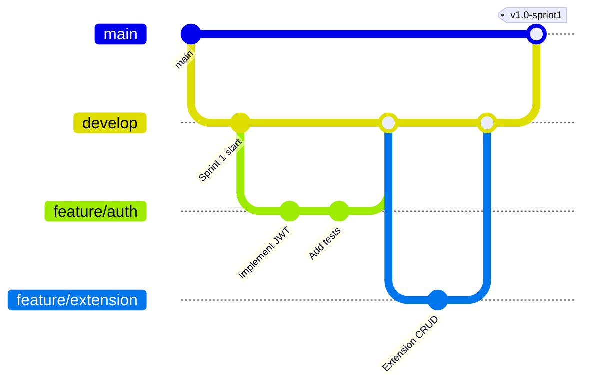
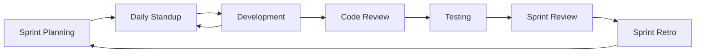

# CHUẨN BỊ BẮT TAY VÀO CODE
## Call Center SaaS Platform - Development Preparation Guide

> [!IMPORTANT]
> Tài liệu này liệt kê TẤT CẢ những gì cần chuẩn bị TRƯỚC KHI bắt đầu code. Đây là checklist bắt buộc cho toàn bộ team.

**Phiên bản:** 1.0  
**Ngày tạo:** 15/01/2026  
**Dự án:** Call Center SaaS Platform  
**Tech Stack:** .NET 10, Next.js 15, PostgreSQL 16, FreeSWITCH, RabbitMQ

---

## 📋 MỤC LỤC

1. [Tổng quan dự án](#1-tổng-quan-dự-án)
2. [Tài liệu cần đọc](#2-tài-liệu-cần-đọc)
3. [Môi trường phát triển](#3-môi-trường-phát-triển)
4. [Kiến thức cần có](#4-kiến-thức-cần-có)
5. [Checklist chuẩn bị](#5-checklist-chuẩn-bị)
6. [Quy trình làm việc](#6-quy-trình-làm-việc)

---

## 1. TỔNG QUAN DỰ ÁN

### 1.1. Thông tin cơ bản

| Thông tin | Chi tiết |
|-----------|----------|
| **Tên dự án** | Call Center SaaS Platform |
| **Loại hình** | Multi-tenant SaaS |
| **Thời gian** | 12 tuần (6 sprints × 2 tuần) |
| **Team size** | 6 người (2 BE, 2 FE, 1 BA, 1 DevOps) |
| **Phương pháp** | Agile/Scrum |
| **Sprint** | 2 tuần/sprint |

### 1.2. Mục tiêu MVP

✅ **Core Features:**
- Multi-tenant management
- Authentication & Authorization (RBAC)
- Extension management (SIP)
- Inbound/Outbound/Internal calls
- IVR (Interactive Voice Response)
- Queue (ACD - Automatic Call Distribution)
- CDR (Call Detail Records) & Recording
- Billing system
- Real-time dashboard
- WebRTC Softphone

✅ **Non-functional:**
- Performance: 100 agents, 200 concurrent calls
- Uptime: 99.5%
- Security: HTTPS, JWT, RBAC
- Scalability: 3-server architecture

---

## 2. TÀI LIỆU CẦN ĐỌC

### 2.1. Tài liệu bắt buộc (PHẢI ĐỌC)

#### **Cho TẤT CẢ thành viên:**

1. **[KIEN_TRUC_VA_TECH_STACK.md](https://github.com/leanhluong/TAILIEU_NEXTX_CALL/blob/main/Project_Documents/KIEN_TRUC_VA_TECH_STACK.md)** ⭐ **QUAN TRỌNG NHẤT**
   - Kiến trúc 3-server chi tiết
   - Tech stack analysis
   - Lý do chọn từng công nghệ
   - **Thời gian đọc:** 2-3 giờ

2. **[00_TONG_QUAN_HE_THONG.md](file:///c:/Users/LENOVO/Desktop/TTS-BE/Call/TAI_LIEU_DU_AN_MOI/Project_Documents/00_TONG_QUAN_HE_THONG.md)**
   - Executive summary
   - Business overview
   - High-level architecture
   - **Thời gian đọc:** 1 giờ

3. **[README.md](file:///c:/Users/LENOVO/Desktop/TTS-BE/Call/TAI_LIEU_DU_AN_MOI/README.md)**
   - Danh mục tài liệu
   - Quick links
   - **Thời gian đọc:** 15 phút

#### **Cho Backend Team:**

4. **[03_TAI_LIEU_THIET_KE_HE_THONG_SDS.md](file:///c:/Users/LENOVO/Desktop/TTS-BE/Call/TAI_LIEU_DU_AN_MOI/Project_Documents/03_TAI_LIEU_THIET_KE_HE_THONG_SDS.md)**
   - Clean Architecture design
   - Database schema
   - API design
   - **Thời gian đọc:** 3-4 giờ

5. **FreeSWITCH Documentation** (Tuần 1-2)
   - [00_TONG_QUAN_FREESWITCH.md](file:///c:/Users/LENOVO/Desktop/TTS-BE/Call/TAI_LIEU_DU_AN_MOI/FreeSwitchs/00_TONG_QUAN_FREESWITCH.md)
   - [NGAY_01_02_CAI_DAT_FREESWITCH.md](file:///c:/Users/LENOVO/Desktop/TTS-BE/Call/TAI_LIEU_DU_AN_MOI/FreeSwitchs/NGAY_01_02_CAI_DAT_FREESWITCH.md)
   - [NGAY_06_07_MOD_XML_CURL.md](file:///c:/Users/LENOVO/Desktop/TTS-BE/Call/TAI_LIEU_DU_AN_MOI/FreeSwitchs/NGAY_06_07_MOD_XML_CURL.md)
   - **Thời gian đọc:** 8-10 giờ

#### **Cho Frontend Team:**

6. **[02_TAI_LIEU_YEU_CAU_PHAN_MEM_SRS.md](file:///c:/Users/LENOVO/Desktop/TTS-BE/Call/TAI_LIEU_DU_AN_MOI/Project_Documents/02_TAI_LIEU_YEU_CAU_PHAN_MEM_SRS.md)**
   - Functional requirements
   - UI/UX requirements
   - **Thời gian đọc:** 2-3 giờ

#### **Cho BA:**

7. **[PRODUCT_BACKLOG.md](file:///c:/Users/LENOVO/Desktop/TTS-BE/Call/TAI_LIEU_DU_AN_MOI/AGILE_DOCS/PRODUCT_BACKLOG.md)**
   - User Stories
   - Acceptance Criteria
   - Story Points
   - **Thời gian đọc:** 3-4 giờ

8. **[ROADMAP_DEMO_TEAM_STRUCTURE.md](file:///c:/Users/LENOVO/Desktop/TTS-BE/Call/TAI_LIEU_DU_AN_MOI/AGILE_DOCS/ROADMAP_DEMO_TEAM_STRUCTURE.md)**
   - Sprint planning
   - Team structure
   - **Thời gian đọc:** 2 giờ

#### **Cho DevOps:**

9. **[01_HA_TANG_VA_NHAN_SU.md](file:///c:/Users/LENOVO/Desktop/TTS-BE/Call/TAI_LIEU_DU_AN_MOI/Project_Documents/01_HA_TANG_VA_NHAN_SU.md)**
   - Infrastructure requirements
   - Server specifications
   - **Thời gian đọc:** 1-2 giờ

---

## 3. MÔI TRƯỜNG PHÁT TRIỂN

### 3.1. Phần cứng yêu cầu

#### **Development Machine (Local)**
- **CPU:** Intel i5/i7 hoặc AMD Ryzen 5/7 (tối thiểu 4 cores)
- **RAM:** 16GB (khuyến nghị 32GB)
- **Storage:** 256GB SSD (khuyến nghị 512GB)
- **OS:** Windows 10/11, macOS, hoặc Linux (Ubuntu 22.04+)

#### **Development Server (Shared)**
- **Server 1:** 8 vCPU, 16GB RAM (Application + Database)
- **Server 2:** 8 vCPU, 16GB RAM (FreeSWITCH)
- **Server 3:** 4 vCPU, 8GB RAM (MinIO Storage)

### 3.2. Phần mềm cần cài đặt

#### **Cho TẤT CẢ:**

```bash
# Version Control
- Git 2.40+
- GitHub Desktop (optional)

# IDE/Editor
- Visual Studio Code 1.85+
  + Extensions: GitLens, Prettier, ESLint

# Communication
- Slack/Discord
- Zoom/Google Meet

# Project Management
- Jira hoặc Trello
- Confluence (documentation)
```

#### **Cho Backend Team:**

```bash
# .NET Development
- .NET 10 SDK
- Visual Studio 2022 hoặc JetBrains Rider
- SQL Server Management Studio (optional)

# Database
- PostgreSQL 16 (local)
- pgAdmin 4
- Redis Desktop Manager

# API Testing
- Postman hoặc Insomnia
- Swagger UI (built-in)

# FreeSWITCH (optional local)
- WSL2 (Windows)
- Docker Desktop
```

#### **Cho Frontend Team:**

```bash
# Node.js Development
- Node.js 20 LTS
- npm 10+ hoặc yarn 1.22+
- VS Code Extensions:
  + ES7+ React/Redux/React-Native snippets
  + Tailwind CSS IntelliSense
  + TypeScript + JavaScript

# Browser
- Chrome DevTools
- React Developer Tools
- Redux DevTools Extension
```

#### **Cho DevOps:**

```bash
# Infrastructure
- Docker Desktop
- Terraform (optional)
- Ansible (optional)

# Monitoring
- Prometheus
- Grafana

# SSH Client
- PuTTY (Windows)
- Terminal (macOS/Linux)
```

---

## 4. KIẾN THỨC CẦN CÓ

### 4.1. Backend Team

#### **Backend Senior:**

**Bắt buộc:**
- ✅ C# 12 + .NET 10
- ✅ Clean Architecture
- ✅ CQRS Pattern (MediatR)
- ✅ Entity Framework Core
- ✅ PostgreSQL
- ✅ Redis caching
- ✅ JWT Authentication
- ✅ SignalR (WebSocket)

**Nên có:**
- ⚠️ FreeSWITCH basics
- ⚠️ SIP protocol
- ⚠️ ESL (Event Socket Layer)
- ⚠️ RabbitMQ

**Học thêm:**
- 📚 FreeSWITCH Documentation (40 giờ)
- 📚 SIP RFC 3261
- 📚 WebRTC basics

#### **Backend Mid:**

**Bắt buộc:**
- ✅ C# basics
- ✅ .NET Web API
- ✅ Entity Framework Core
- ✅ SQL basics
- ✅ Unit testing (xUnit)

**Nên có:**
- ⚠️ LINQ
- ⚠️ Async/Await
- ⚠️ Dependency Injection

**Học thêm:**
- 📚 Clean Architecture
- 📚 CQRS Pattern
- 📚 Design Patterns

### 4.2. Frontend Team

#### **Frontend Senior:**

**Bắt buộc:**
- ✅ React 18 + TypeScript
- ✅ Next.js 15 (App Router)
- ✅ Redux Toolkit
- ✅ Tailwind CSS
- ✅ Ant Design
- ✅ Axios

**Nên có:**
- ⚠️ SignalR Client
- ⚠️ WebRTC (JsSIP)
- ⚠️ React Flow (IVR Builder)

**Học thêm:**
- 📚 WebRTC fundamentals
- 📚 SIP.js library
- 📚 Real-time communication

#### **Frontend Mid:**

**Bắt buộc:**
- ✅ JavaScript ES6+
- ✅ React basics
- ✅ TypeScript basics
- ✅ CSS/Tailwind

**Nên có:**
- ⚠️ Redux
- ⚠️ React Hooks
- ⚠️ Form handling

**Học thêm:**
- 📚 TypeScript advanced
- 📚 State management
- 📚 Component design

### 4.3. BA/Product Owner

**Bắt buộc:**
- ✅ Agile/Scrum methodology
- ✅ User Story writing
- ✅ Acceptance Criteria
- ✅ Jira/Trello

**Nên có:**
- ⚠️ Call Center domain knowledge
- ⚠️ VoIP basics
- ⚠️ UAT planning

**Học thêm:**
- 📚 Call Center operations
- 📚 SaaS business model
- 📚 VoIP terminology

### 4.4. DevOps

**Bắt buộc:**
- ✅ Linux (Debian/Ubuntu)
- ✅ Docker + Docker Compose
- ✅ Nginx
- ✅ PostgreSQL administration
- ✅ Git/GitHub

**Nên có:**
- ⚠️ FreeSWITCH installation
- ⚠️ CI/CD (GitHub Actions)
- ⚠️ Monitoring (Prometheus/Grafana)

**Học thêm:**
- 📚 FreeSWITCH administration
- 📚 SIP protocol
- 📚 VoIP networking

---

## 5. CHECKLIST CHUẨN BỊ

### 5.1. Tuần 0 (Trước Sprint 1)

#### **Tất cả thành viên:**

- [ ] **Ngày 1-2: Đọc tài liệu**
  - [ ] Đọc KIEN_TRUC_VA_TECH_STACK.md
  - [ ] Đọc 00_TONG_QUAN_HE_THONG.md
  - [ ] Đọc README.md
  - [ ] Hiểu rõ kiến trúc 3-server
  - [ ] Hiểu rõ tech stack

- [ ] **Ngày 3: Setup môi trường**
  - [ ] Cài đặt Git
  - [ ] Clone repository
  - [ ] Cài đặt IDE/Editor
  - [ ] Cài đặt extensions cần thiết

- [ ] **Ngày 4: Access & Accounts**
  - [ ] GitHub account + access to repo
  - [ ] Jira/Trello account
  - [ ] Slack/Discord channel
  - [ ] Development server access (SSH)
  - [ ] Database credentials

- [ ] **Ngày 5: Team Meeting**
  - [ ] Kick-off meeting
  - [ ] Q&A session
  - [ ] Sprint 1 planning preparation

#### **Backend Team:**

- [ ] **Setup Backend Environment**
  - [ ] Cài .NET 10 SDK
  - [ ] Cài Visual Studio/Rider
  - [ ] Cài PostgreSQL local
  - [ ] Cài Redis local
  - [ ] Cài Postman
  - [ ] Test connection to dev database

- [ ] **Đọc tài liệu Backend**
  - [ ] 03_TAI_LIEU_THIET_KE_HE_THONG_SDS.md
  - [ ] Clean Architecture structure
  - [ ] Database schema
  - [ ] API design patterns

- [ ] **FreeSWITCH (Backend Senior)**
  - [ ] Đọc 00_TONG_QUAN_FREESWITCH.md
  - [ ] Đọc NGAY_01_02_CAI_DAT_FREESWITCH.md
  - [ ] Cài FreeSWITCH trên WSL2/Docker (optional)
  - [ ] Test SIP registration

#### **Frontend Team:**

- [ ] **Setup Frontend Environment**
  - [ ] Cài Node.js 20 LTS
  - [ ] Cài npm/yarn
  - [ ] Cài VS Code + extensions
  - [ ] Test `npx create-next-app`

- [ ] **Đọc tài liệu Frontend**
  - [ ] 02_TAI_LIEU_YEU_CAU_PHAN_MEM_SRS.md
  - [ ] UI/UX requirements
  - [ ] Component structure

- [ ] **Học Next.js 15 (nếu chưa biết)**
  - [ ] Next.js App Router tutorial
  - [ ] Server Components vs Client Components
  - [ ] Routing basics

#### **BA/PO:**

- [ ] **Đọc tài liệu BA**
  - [ ] PRODUCT_BACKLOG.md
  - [ ] ROADMAP_DEMO_TEAM_STRUCTURE.md
  - [ ] 02_TAI_LIEU_YEU_CAU_PHAN_MEM_SRS.md

- [ ] **Chuẩn bị Sprint 1**
  - [ ] Review User Stories
  - [ ] Prepare Sprint 1 backlog
  - [ ] Prepare Sprint Planning agenda

#### **DevOps:**

- [ ] **Chuẩn bị Infrastructure**
  - [ ] Thuê VPS (3 servers)
  - [ ] Cài Debian 12
  - [ ] Setup firewall cơ bản
  - [ ] Cài Docker
  - [ ] Cài Nginx

- [ ] **Đọc tài liệu DevOps**
  - [ ] 01_HA_TANG_VA_NHAN_SU.md
  - [ ] FreeSWITCH installation guide
  - [ ] Network architecture

---

## 6. QUY TRÌNH LÀM VIỆC

### 6.1. Git Workflow



**Branch Strategy:**
- `main`: Production-ready code
- `develop`: Integration branch
- `feature/*`: Feature branches
- `hotfix/*`: Urgent fixes

**Commit Convention:**
```
<type>(<scope>): <subject>

Examples:
feat(auth): implement JWT authentication
fix(extension): resolve SIP registration bug
docs(readme): update setup instructions
test(billing): add unit tests for cost calculation
```

### 6.2. Sprint Workflow



**Sprint Ceremonies:**

1. **Sprint Planning (Monday, Week 1)**
   - Duration: 2 hours
   - Participants: All team
   - Output: Sprint Backlog

2. **Daily Standup (Every day, 9:00 AM)**
   - Duration: 15 minutes
   - Format: What did I do? What will I do? Blockers?

3. **Sprint Review (Friday, Week 2)**
   - Duration: 1 hour
   - Demo features
   - Stakeholder feedback

4. **Sprint Retrospective (Friday, Week 2)**
   - Duration: 1 hour
   - What went well? What to improve?

### 6.3. Code Review Process

**Pull Request Template:**
```markdown
## Description
Brief description of changes

## Type of Change
- [ ] Bug fix
- [ ] New feature
- [ ] Breaking change
- [ ] Documentation update

## Checklist
- [ ] Code follows style guidelines
- [ ] Self-review completed
- [ ] Comments added for complex code
- [ ] Unit tests added/updated
- [ ] All tests passing
- [ ] Documentation updated

## Related Issues
Closes #123
```

**Review Criteria:**
- ✅ Code quality
- ✅ Test coverage (>70%)
- ✅ Documentation
- ✅ Performance
- ✅ Security

---

## 7. RESOURCES & LINKS

### 7.1. Documentation

- **Project Docs:** [TAI_LIEU_DU_AN_MOI](file:///c:/Users/LENOVO/Desktop/TTS-BE/Call/TAI_LIEU_DU_AN_MOI)
- **API Docs:** Swagger UI (http://localhost:5000/swagger)
- **Database:** pgAdmin (http://localhost:5050)

### 7.2. External Resources

**Backend:**
- [.NET 10 Documentation](https://docs.microsoft.com/en-us/dotnet/)
- [Clean Architecture](https://github.com/jasontaylordev/CleanArchitecture)
- [FreeSWITCH Docs](https://freeswitch.org/confluence/)

**Frontend:**
- [Next.js 15 Docs](https://nextjs.org/docs)
- [React Documentation](https://react.dev/)
- [Tailwind CSS](https://tailwindcss.com/docs)

**DevOps:**
- [Docker Documentation](https://docs.docker.com/)
- [Nginx Documentation](https://nginx.org/en/docs/)
- [PostgreSQL Documentation](https://www.postgresql.org/docs/)

### 7.3. Communication Channels

- **Slack/Discord:** Daily communication
- **Jira:** Task tracking
- **GitHub:** Code repository
- **Confluence:** Documentation wiki

---

## 8. NEXT STEPS

### 8.1. Sau khi hoàn thành checklist

1. ✅ Tham gia Sprint 1 Planning
2. ✅ Nhận task assignments
3. ✅ Bắt đầu development
4. ✅ Daily standup

### 8.2. Liên hệ

| Role | Contact | Email |
|------|---------|-------|
| **Product Owner** | [Tên] | po@company.com |
| **Tech Lead** | [Tên] | techlead@company.com |
| **DevOps Lead** | [Tên] | devops@company.com |

---

**Ngày tạo:** 15/01/2026  
**Phiên bản:** 1.0  
**Status:** Ready for Sprint 1

> [!NOTE]
> Tài liệu này sẽ được cập nhật liên tục. Nếu có thắc mắc, vui lòng liên hệ Tech Lead hoặc Product Owner.
