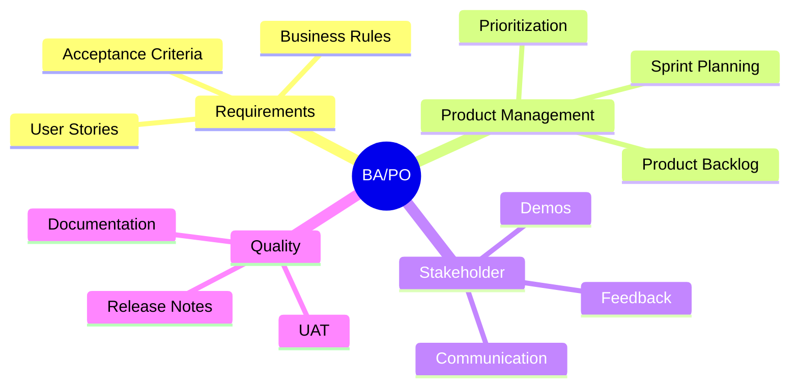

# ROADMAP CHI TIẾT CHO BUSINESS ANALYST (BA)
## Call Center SaaS Platform - BA Detailed Roadmap

> [!IMPORTANT]
> Roadmap chi tiết cho vị trí Business Analyst/Product Owner trong dự án Call Center SaaS Platform. Bao gồm công việc từng tuần, deliverables, và kỹ năng cần có.

**Phiên bản:** 1.0  
**Ngày tạo:** 15/01/2026  
**Thời gian:** 12 tuần (6 sprints)  
**Role:** Business Analyst / Product Owner

---

## 📋 MỤC LỤC

1. [Tổng quan vai trò BA](#1-tổng-quan-vai-trò-ba)
2. [Kỹ năng cần có](#2-kỹ-năng-cần-có)
3. [Roadmap chi tiết từng tuần](#3-roadmap-chi-tiết-từng-tuần)
4. [Deliverables chính](#4-deliverables-chính)
5. [Tools & Templates](#5-tools--templates)
6. [Best Practices](#6-best-practices)

---

## 1. TỔNG QUAN VAI TRÒ BA

### 1.1. Trách nhiệm chính



### 1.2. Thời gian phân bổ

| Hoạt động | % Thời gian | Giờ/tuần |
|-----------|-------------|----------|
| **Viết User Stories** | 30% | 12h |
| **Sprint Planning & Review** | 20% | 8h |
| **UAT & Testing** | 25% | 10h |
| **Documentation** | 15% | 6h |
| **Stakeholder Communication** | 10% | 4h |

---

## 2. KỸ NĂNG CẦN CÓ

### 2.1. Kỹ năng bắt buộc

#### **Agile/Scrum**
- ✅ Sprint Planning
- ✅ User Story writing (INVEST criteria)
- ✅ Acceptance Criteria (Given-When-Then)
- ✅ Story Point estimation
- ✅ Backlog grooming

#### **Domain Knowledge**
- ✅ Call Center operations
- ✅ VoIP/Telephony basics
- ✅ SaaS business model
- ✅ Multi-tenancy concepts

#### **Tools**
- ✅ Jira/Trello
- ✅ Confluence
- ✅ Miro/Figma (wireframing)
- ✅ Excel/Google Sheets

### 2.2. Kỹ năng nên có

- ⚠️ SIP protocol basics
- ⚠️ IVR design
- ⚠️ Queue management
- ⚠️ Billing systems
- ⚠️ SQL basics

### 2.3. Học thêm (Tuần 0)

**Tài liệu cần đọc:**
1. **Call Center Basics** (8 giờ)
   - Call flow (Inbound/Outbound)
   - IVR (Interactive Voice Response)
   - ACD (Automatic Call Distribution)
   - CDR (Call Detail Records)

2. **VoIP Fundamentals** (4 giờ)
   - SIP protocol overview
   - Extension vs DID
   - Trunk vs Gateway
   - Recording & Billing

3. **SaaS Multi-tenancy** (4 giờ)
   - Tenant isolation
   - Quota management
   - Billing models
   - Subscription tiers

**Khóa học đề xuất:**
- Udemy: "Call Center Management Fundamentals"
- YouTube: "VoIP Basics for Beginners"
- Scrum.org: "Professional Scrum Product Owner"

---

## 3. ROADMAP CHI TIẾT TỪNG TUẦN

### **TUẦN 0: Preparation (Trước Sprint 1)**

#### **Mục tiêu:**
- Hiểu rõ dự án
- Chuẩn bị Product Backlog
- Setup tools

#### **Công việc chi tiết:**

**Ngày 1-2: Đọc tài liệu (16h)**
- [ ] Đọc [KIEN_TRUC_VA_TECH_STACK.md](file:///c:/Users/LENOVO/Desktop/TTS-BE/Call/TAI_LIEU_DU_AN_MOI/Project_Documents/KIEN_TRUC_VA_TECH_STACK.md)
- [ ] Đọc [00_TONG_QUAN_HE_THONG.md](file:///c:/Users/LENOVO/Desktop/TTS-BE/Call/TAI_LIEU_DU_AN_MOI/Project_Documents/00_TONG_QUAN_HE_THONG.md)
- [ ] Đọc [02_TAI_LIEU_YEU_CAU_PHAN_MEM_SRS.md](file:///c:/Users/LENOVO/Desktop/TTS-BE/Call/TAI_LIEU_DU_AN_MOI/Project_Documents/02_TAI_LIEU_YEU_CAU_PHAN_MEM_SRS.md)
- [ ] Hiểu rõ business model
- [ ] Hiểu rõ target users

**Ngày 3: Review Product Backlog (8h)**
- [ ] Đọc [PRODUCT_BACKLOG.md](file:///c:/Users/LENOVO/Desktop/TTS-BE/Call/TAI_LIEU_DU_AN_MOI/AGILE_DOCS/PRODUCT_BACKLOG.md)
- [ ] Review 45 User Stories
- [ ] Hiểu Story Points (250 total)
- [ ] Hiểu Epic structure (9 Epics)

**Ngày 4: Setup Tools (8h)**
- [ ] Setup Jira project
- [ ] Import User Stories vào Jira
- [ ] Create Sprint 1 board
- [ ] Setup Confluence space
- [ ] Create documentation templates

**Ngày 5: Sprint 1 Planning Prep (8h)**
- [ ] Prioritize Sprint 1 backlog
- [ ] Prepare Sprint Goal
- [ ] Create Sprint Planning agenda
- [ ] Prepare demo scenarios

**Deliverables:**
- ✅ Jira project ready
- ✅ Product Backlog imported
- ✅ Sprint 1 backlog prioritized
- ✅ Sprint Planning agenda

---

### **SPRINT 1: Infrastructure & Authentication (Tuần 1-2)**

**Sprint Goal:** Setup infrastructure, implement authentication, và test first call

#### **Tuần 1: Sprint Planning & User Stories**

**Ngày 1 (Monday): Sprint Planning (8h)**
- [ ] **Morning: Sprint Planning Meeting (4h)**
  - Present Sprint Goal
  - Review User Stories
  - Team estimates Story Points
  - Assign tasks
  
- [ ] **Afternoon: Documentation (4h)**
  - Document Sprint 1 backlog in Jira
  - Update Sprint board
  - Create Sprint 1 wiki page

**Ngày 2-3: Viết User Stories chi tiết (16h)**

**Epic-01: Authentication & Authorization**

```markdown
US-001: User Registration
Priority: Must Have | Story Points: 5

As a: Tenant Admin
I want: Đăng ký tài khoản mới cho công ty
So that: Tôi có thể sử dụng hệ thống Call Center

Acceptance Criteria:
✅ Email phải unique trong hệ thống
✅ Password tối thiểu 8 ký tự, có chữ hoa, số, ký tự đặc biệt
✅ Tự động tạo Tenant với domain slug từ company name
✅ Gửi email xác nhận đăng ký
✅ Hiển thị thông báo thành công với thông tin đăng nhập

Business Rules:
- Domain format: lowercase, no spaces, alphanumeric + hyphen
- Email validation: RFC 5322 compliant
- Password hashing: BCrypt cost 12

Test Scenarios:
1. Happy path: Valid email + password → Success
2. Duplicate email → Error "Email already exists"
3. Weak password → Error "Password too weak"
4. Invalid email format → Error "Invalid email"
```

**Ngày 4-5: Prepare Test Scenarios (16h)**
- [ ] Viết test scenarios cho tất cả US trong Sprint 1
- [ ] Create test data
- [ ] Prepare UAT checklist
- [ ] Create bug report template

**Deliverables:**
- ✅ Sprint 1 User Stories chi tiết
- ✅ Test scenarios document
- ✅ UAT checklist

#### **Tuần 2: UAT & Sprint Review**

**Ngày 6-9: UAT Testing (32h)**
- [ ] **Authentication Module**
  - Test registration flow
  - Test login flow
  - Test JWT token
  - Test refresh token
  - Test logout
  
- [ ] **Extension Module**
  - Test create extension
  - Test SIP registration
  - Test internal call (101 → 102)
  - Test extension list
  - Test update extension

- [ ] **Bug Tracking**
  - Log bugs in Jira
  - Prioritize bugs
  - Verify bug fixes

**Ngày 10 (Friday): Sprint Review & Retro (8h)**
- [ ] **Morning: Sprint Review (2h)**
  - Demo features to stakeholders
  - Collect feedback
  - Update backlog based on feedback

- [ ] **Afternoon: Sprint Retrospective (2h)**
  - What went well?
  - What can improve?
  - Action items for next sprint

- [ ] **Documentation (4h)**
  - Write Sprint 1 summary
  - Update release notes
  - Prepare Sprint 2 backlog

**Deliverables:**
- ✅ UAT report
- ✅ Bug list
- ✅ Sprint Review notes
- ✅ Sprint Retrospective action items

---

### **SPRINT 2: Core Features & Calling (Tuần 3-4)**

**Sprint Goal:** Implement SIP trunking, outbound calls, và billing system

#### **Công việc chính:**

**Viết User Stories (12h)**
- [ ] US-017: Internal Call
- [ ] US-018: Outbound Call
- [ ] US-030: SIP Trunk Configuration
- [ ] US-032: Rate Table Management
- [ ] US-033: Billing Calculation

**Example User Story:**

```markdown
US-018: Outbound Call
Priority: Must Have | Story Points: 8

As a: Agent
I want: Gọi ra số điện thoại bên ngoài
So that: Tôi có thể liên hệ khách hàng

Acceptance Criteria:
✅ Agent gọi số ngoài (VD: 0909123456)
✅ Check Balance > 0
✅ Check Concurrent calls < Quota
✅ Route qua SIP Trunk
✅ Cuộc gọi kết nối
✅ Start billing timer
✅ Lưu CDR với direction = "outbound"

Business Rules:
- Nếu Balance = 0 → Play message "Tài khoản hết tiền"
- Nếu Quota full → Play message "Hệ thống đang bận"
- Billing increment: 6 seconds
- Rate: Theo prefix matching

Test Scenarios:
1. Happy path: Balance > 0, Quota OK → Call success
2. Balance = 0 → Hear "Hết tiền" message
3. Quota full → Hear "Đang bận" message
4. Invalid number → Error message
```

**UAT Testing (20h)**
- [ ] Test outbound calls
- [ ] Test billing calculation
- [ ] Test balance deduction
- [ ] Test rate table
- [ ] Test quota limits

**Deliverables:**
- ✅ Sprint 2 User Stories
- ✅ UAT report
- ✅ Updated Product Backlog

---

### **SPRINT 3: CDR & IVR (Tuần 5-6)**

**Sprint Goal:** Implement CDR reporting, recording, và IVR system

#### **Công việc chính:**

**Viết User Stories (15h)**
- [ ] US-024: IVR Builder
- [ ] US-025: Queue Management
- [ ] US-026: IVR Execution
- [ ] US-028: Generate CDR
- [ ] US-029: View CDR Report
- [ ] US-030: Play Recording

**IVR Flow Design (8h)**
- [ ] Design IVR flow structure (JSON)
- [ ] Create IVR node types
- [ ] Define DTMF input handling
- [ ] Create sample IVR flows

**Example IVR Flow:**

```json
{
  "name": "Main IVR",
  "description": "Welcome IVR for incoming calls",
  "steps": [
    {
      "id": "1",
      "type": "play",
      "audio": "welcome.mp3",
      "text": "Xin chào, bấm 1 gặp bộ phận kinh doanh, bấm 2 gặp kỹ thuật"
    },
    {
      "id": "2",
      "type": "get_digits",
      "timeout": 5,
      "max_digits": 1,
      "variable": "choice"
    },
    {
      "id": "3",
      "type": "condition",
      "variable": "choice",
      "cases": {
        "1": {"action": "transfer", "destination": "queue:sales"},
        "2": {"action": "transfer", "destination": "queue:support"},
        "default": {"action": "play", "audio": "invalid.mp3"}
      }
    }
  ]
}
```

**UAT Testing (20h)**
- [ ] Test IVR Builder UI
- [ ] Test IVR execution
- [ ] Test DTMF input
- [ ] Test CDR creation
- [ ] Test recording playback
- [ ] Test CDR filters

**Deliverables:**
- ✅ IVR flow specification
- ✅ Sprint 3 User Stories
- ✅ UAT report
- ✅ IVR demo flows

---

### **SPRINT 4: Real-time & Queue (Tuần 7-8)**

**Sprint Goal:** Implement real-time dashboard và advanced queue features

#### **Công việc chính:**

**Viết User Stories (12h)**
- [ ] US-035: Live Call Monitoring
- [ ] US-036: Agent Status Board
- [ ] US-037: Real-time Dashboard
- [ ] US-027: Queue Call Distribution

**Define Real-time Events (8h)**
- [ ] OnCallStarted event
- [ ] OnCallEnded event
- [ ] OnAgentStatusChanged event
- [ ] OnQueueUpdate event

**Performance Requirements (8h)**
- [ ] Define latency requirements (< 500ms)
- [ ] Define concurrent connections (100+)
- [ ] Define update frequency (1s)

**UAT Testing (20h)**
- [ ] Test SignalR connection
- [ ] Test real-time updates
- [ ] Test with multiple clients
- [ ] Test queue distribution
- [ ] Stress test (100 concurrent users)

**Deliverables:**
- ✅ Real-time event specification
- ✅ Performance requirements
- ✅ Sprint 4 User Stories
- ✅ UAT report

---

### **SPRINT 5: WebRTC & Mobile (Tuần 9-10)**

**Sprint Goal:** Implement WebRTC softphone và mobile app foundation

#### **Công việc chính:**

**Viết User Stories (12h)**
- [ ] US-040: WebRTC Softphone
- [ ] US-041: Click-to-Call
- [ ] US-042: Mobile Login
- [ ] US-043: Mobile Dashboard
- [ ] US-044: Push Notifications

**Mobile UX Requirements (8h)**
- [ ] Define mobile screens
- [ ] Define navigation flow
- [ ] Define offline behavior
- [ ] Define push notification triggers

**UAT Testing (20h)**
- [ ] Test WebRTC on Chrome, Firefox, Edge
- [ ] Test audio quality
- [ ] Test mobile app on Android/iOS
- [ ] Test push notifications
- [ ] Test offline mode

**Deliverables:**
- ✅ Mobile UX specification
- ✅ Sprint 5 User Stories
- ✅ UAT report

---

### **SPRINT 6: Polish & Launch (Tuần 11-12)**

**Sprint Goal:** Performance optimization, security hardening, và production deployment

#### **Công việc chính:**

**Final UAT (40h)**
- [ ] **Week 1: Full regression testing**
  - Test all features end-to-end
  - Test all user roles
  - Test all browsers
  - Test mobile app
  
- [ ] **Week 2: Production readiness**
  - Performance testing
  - Security testing
  - Load testing
  - Disaster recovery testing

**Documentation (20h)**
- [ ] **User Documentation**
  - User manual
  - Admin guide
  - API documentation
  - FAQ

- [ ] **Release Notes**
  - Features list
  - Known issues
  - Migration guide

**Training Materials (10h)**
- [ ] Create training videos
- [ ] Create quick start guide
- [ ] Create troubleshooting guide

**Deliverables:**
- ✅ Final UAT report
- ✅ User documentation
- ✅ Release notes
- ✅ Training materials
- ✅ Production sign-off

---

## 4. DELIVERABLES CHÍNH

### 4.1. Deliverables theo Sprint

| Sprint | Deliverables | Deadline |
|--------|--------------|----------|
| **Sprint 1** | User Stories (Auth, Extension), UAT Report, Sprint Review Notes | Week 2 Friday |
| **Sprint 2** | User Stories (Calling, Billing), Rate Table Spec, UAT Report | Week 4 Friday |
| **Sprint 3** | User Stories (CDR, IVR), IVR Flow Spec, UAT Report | Week 6 Friday |
| **Sprint 4** | User Stories (Real-time), Event Spec, Perf Requirements, UAT Report | Week 8 Friday |
| **Sprint 5** | User Stories (WebRTC, Mobile), Mobile UX Spec, UAT Report | Week 10 Friday |
| **Sprint 6** | Final UAT Report, User Docs, Release Notes, Training Materials | Week 12 Friday |

### 4.2. Documentation Artifacts

**Product Documents:**
- Product Backlog (updated weekly)
- Sprint Backlogs (6 sprints)
- User Stories (45 total)
- Acceptance Criteria
- Test Scenarios

**Process Documents:**
- Sprint Planning notes (6 sprints)
- Sprint Review notes (6 sprints)
- Sprint Retrospective action items (6 sprints)
- UAT Reports (6 sprints)

**Release Documents:**
- Release Notes
- User Manual
- Admin Guide
- Training Materials
- FAQ

---

## 5. TOOLS & TEMPLATES

### 5.1. Jira Setup

**Project Structure:**
```
Call Center SaaS
├── Epics (9)
│   ├── EP-01: Authentication & Authorization
│   ├── EP-02: Tenant Management
│   ├── EP-03: Extension Management
│   ├── EP-04: Call Handling
│   ├── EP-05: IVR & Queue
│   ├── EP-06: CDR & Recording
│   ├── EP-07: Billing System
│   ├── EP-08: Real-time Dashboard
│   └── EP-09: WebRTC Softphone
│
├── User Stories (45)
├── Tasks
├── Bugs
└── Sub-tasks
```

**Custom Fields:**
- Story Points
- Sprint
- Epic Link
- Acceptance Criteria
- Test Scenarios
- Priority (Must/Should/Could/Won't)

### 5.2. User Story Template

```markdown
# [US-XXX] Title

**Epic:** [Epic Name]
**Priority:** Must Have / Should Have / Could Have / Won't Have
**Story Points:** X

## User Story
As a: [Role]
I want: [Goal]
So that: [Benefit]

## Acceptance Criteria
✅ [Criterion 1]
✅ [Criterion 2]
✅ [Criterion 3]

## Business Rules
- [Rule 1]
- [Rule 2]

## Test Scenarios
1. [Scenario 1]
2. [Scenario 2]

## Dependencies
- [Dependency 1]

## Notes
[Additional notes]
```

### 5.3. UAT Test Case Template

```markdown
# UAT Test Case: [Feature Name]

**Test ID:** TC-XXX
**User Story:** US-XXX
**Priority:** High / Medium / Low
**Tester:** [Name]
**Date:** [Date]

## Pre-conditions
- [Pre-condition 1]
- [Pre-condition 2]

## Test Steps
| Step | Action | Expected Result | Actual Result | Status |
|------|--------|-----------------|---------------|--------|
| 1 | [Action] | [Expected] | [Actual] | Pass/Fail |
| 2 | [Action] | [Expected] | [Actual] | Pass/Fail |

## Post-conditions
- [Post-condition 1]

## Notes
[Additional notes]

## Bugs Found
- [Bug ID] - [Description]
```

---

## 6. BEST PRACTICES

### 6.1. Writing User Stories

**INVEST Criteria:**
- **I**ndependent: Có thể develop độc lập
- **N**egotiable: Có thể thay đổi chi tiết
- **V**aluable: Mang lại giá trị cho user
- **E**stimable: Có thể ước lượng effort
- **S**mall: Đủ nhỏ để hoàn thành trong 1 sprint
- **T**estable: Có thể test được

**Good Example:**
```
As an Agent
I want to see my call history
So that I can review my performance
```

**Bad Example:**
```
The system should have a call history feature
```

### 6.2. Acceptance Criteria

**Given-When-Then Format:**
```
Given [initial context]
When [event occurs]
Then [expected outcome]

Example:
Given I am logged in as an Agent
When I click on "Call History"
Then I see a list of my calls from the last 30 days
```

### 6.3. Sprint Planning

**Velocity Tracking:**
- Sprint 1: Baseline (estimate 40-45 SP)
- Sprint 2-6: Adjust based on actual velocity
- Track: Planned vs Completed SP

**Capacity Planning:**
- BA: 40h/week
- Buffer: 20% for meetings, blockers
- Effective: 32h/week for stories

### 6.4. UAT Best Practices

**Test Coverage:**
- Happy path: 60%
- Error handling: 30%
- Edge cases: 10%

**Bug Severity:**
- **Critical:** Blocks release
- **High:** Major functionality broken
- **Medium:** Minor functionality issue
- **Low:** Cosmetic issue

---

## 7. SUCCESS METRICS

### 7.1. Sprint Metrics

| Metric | Target | Actual |
|--------|--------|--------|
| **Velocity** | 40-45 SP/sprint | [Track] |
| **Story Completion** | 90%+ | [Track] |
| **Bug Rate** | < 10 bugs/sprint | [Track] |
| **UAT Pass Rate** | 95%+ | [Track] |

### 7.2. Quality Metrics

| Metric | Target |
|--------|--------|
| **Requirements Coverage** | 100% |
| **Test Coverage** | 90%+ |
| **Documentation Completeness** | 100% |
| **Stakeholder Satisfaction** | 4.5/5 |

---

## 8. LIÊN HỆ & HỖ TRỢ

**Escalation Path:**
1. Tech Lead (technical questions)
2. Product Owner (business questions)
3. Scrum Master (process questions)

**Daily Standup:** 9:00 AM
**Sprint Review:** Friday 2:00 PM
**Sprint Retro:** Friday 3:00 PM

---

**Ngày tạo:** 15/01/2026  
**Phiên bản:** 1.0  
**Next Review:** Sprint 1 Planning

> [!TIP]
> Đọc kỹ tài liệu [PRODUCT_BACKLOG.md](file:///c:/Users/LENOVO/Desktop/TTS-BE/Call/TAI_LIEU_DU_AN_MOI/AGILE_DOCS/PRODUCT_BACKLOG.md) để hiểu rõ tất cả User Stories trước khi bắt đầu Sprint 1.
