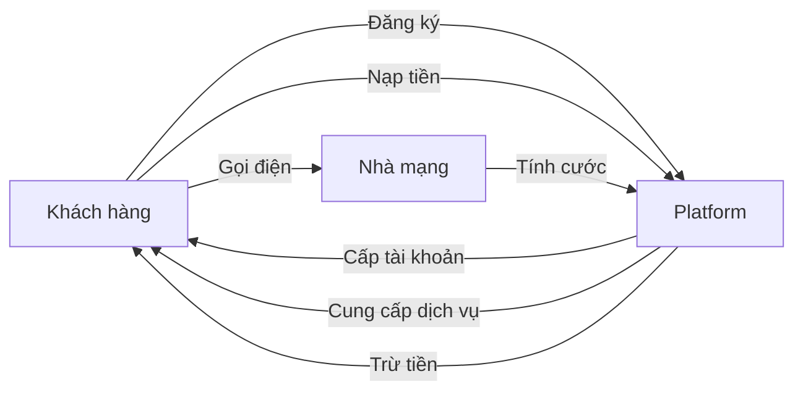
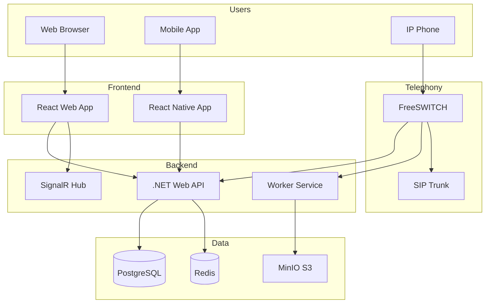
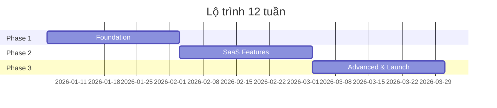

# TỔNG QUAN HỆ THỐNG
## Call Center SaaS Platform - System Overview Document

> [!IMPORTANT]
> Đây là tài liệu tổng quan cấp cao về toàn bộ hệ thống Call Center SaaS Platform. Tài liệu này cung cấp cái nhìn toàn cảnh cho tất cả stakeholders.

**Phiên bản:** 1.0  
**Ngày tạo:** 02/01/2026  
**Người tạo:** Project Manager & Tech Lead  
**Mục đích:** Executive Summary & System Overview

---

## MỤC LỤC

1. [Executive Summary](#1-executive-summary)
2. [Giới thiệu dự án](#2-giới-thiệu-dự-án)
3. [Mục tiêu kinh doanh](#3-mục-tiêu-kinh-doanh)
4. [Tổng quan giải pháp](#4-tổng-quan-giải-pháp)
5. [Kiến trúc hệ thống](#5-kiến-trúc-hệ-thống)
6. [Tính năng chính](#6-tính-năng-chính)
7. [Công nghệ sử dụng](#7-công-nghệ-sử-dụng)
8. [Lộ trình triển khai](#8-lộ-trình-triển-khai)
9. [Rủi ro và giải pháp](#9-rủi-ro-và-giải-pháp)
10. [Tài liệu tham khảo](#10-tài-liệu-tham-khảo)

---

## 1. EXECUTIVE SUMMARY

### 1.1. Tóm tắt dự án

**Call Center SaaS Platform** là giải pháp tổng đài điện thoại đám mây (Cloud-based Call Center) theo mô hình SaaS (Software as a Service), cho phép nhiều doanh nghiệp thuê và sử dụng trên cùng một hạ tầng.

**Điểm nổi bật:**
- ☁️ **100% Cloud-based** - Không cần đầu tư phần cứng
- 🏢 **Multi-tenant** - Phục vụ nhiều khách hàng đồng thời
- 💰 **Pay-as-you-go** - Trả tiền theo sử dụng
- 🚀 **Quick Setup** - Triển khai trong 5 phút
- 📊 **Real-time Analytics** - Báo cáo thời gian thực

---

### 1.2. Thông tin dự án

| Thông tin | Chi tiết |
|-----------|----------|
| **Tên dự án** | Call Center SaaS Platform |
| **Loại hình** | SaaS Multi-tenant |
| **Thời gian** | 12 tuần (3 tháng) cho MVP |
| **Ngân sách** | 880M - 1,133M VND |
| **Team size** | 9 người |
| **Phương pháp** | Agile/Scrum |
| **Sprint** | 2 tuần/sprint |

---

## 2. GIỚI THIỆU DỰ ÁN

### 2.1. Bối cảnh

Thị trường Call Center tại Việt Nam đang phát triển mạnh mẽ với nhu cầu:
- Doanh nghiệp SME cần giải pháp tổng đài giá rẻ
- Startup muốn triển khai nhanh không cần đầu tư phần cứng
- Doanh nghiệp lớn cần scale linh hoạt theo mùa vụ

**Vấn đề hiện tại:**
- ❌ Giải pháp on-premise đắt đỏ (>500M setup)
- ❌ Khó scale khi tăng trưởng
- ❌ Thiếu tính năng hiện đại (WebRTC, Real-time dashboard)
- ❌ Vendor lock-in với các nhà cung cấp nước ngoài

**Giải pháp của chúng ta:**
- ✅ SaaS model - Không cần đầu tư ban đầu
- ✅ Auto-scaling - Tự động mở rộng
- ✅ Modern features - Công nghệ mới nhất
- ✅ Made in Vietnam - Hỗ trợ tốt, giá cạnh tranh

---

### 2.2. Đối tượng khách hàng

#### Khách hàng mục tiêu chính

**1. SME (Small & Medium Enterprises)**
- Quy mô: 10-100 nhân viên
- Nhu cầu: 5-20 agent
- Budget: 5-20M VND/tháng
- Use case: Chăm sóc khách hàng, Telesales

**2. Startup/E-commerce**
- Quy mô: 5-50 nhân viên
- Nhu cầu: 3-15 agent
- Budget: 3-15M VND/tháng
- Use case: Hỗ trợ đơn hàng, Tư vấn sản phẩm

**3. Enterprise (Giai đoạn sau)**
- Quy mô: 100+ nhân viên
- Nhu cầu: 50-500 agent
- Budget: 50-200M VND/tháng
- Use case: Contact Center, BPO

---

## 3. MỤC TIÊU KINH DOANH

### 3.1. Mục tiêu ngắn hạn (6 tháng)

| Mục tiêu | KPI | Thời gian |
|----------|-----|-----------|
| **MVP Launch** | 100% features hoàn thành | Tháng 3/2026 |
| **Beta Users** | 10 khách hàng pilot | Tháng 4/2026 |
| **Paying Customers** | 20 khách hàng trả tiền | Tháng 6/2026 |
| **Revenue** | 50M VND/tháng | Tháng 6/2026 |
| **Uptime** | 99.5% | Ongoing |

---

### 3.2. Mục tiêu dài hạn (12-24 tháng)

| Mục tiêu | KPI | Thời gian |
|----------|-----|-----------|
| **Market Share** | Top 3 SaaS Call Center VN | Tháng 12/2026 |
| **Customers** | 200+ khách hàng | Tháng 12/2026 |
| **Revenue** | 500M VND/tháng | Tháng 12/2026 |
| **Concurrent Calls** | 1000+ calls | Tháng 6/2027 |
| **Uptime** | 99.9% | Tháng 12/2026 |

---

### 3.3. Lợi thế cạnh tranh

| Tiêu chí | Chúng ta | Đối thủ nước ngoài | Đối thủ VN |
|----------|----------|-------------------|------------|
| **Giá** | ⭐⭐⭐⭐⭐ | ⭐⭐ | ⭐⭐⭐⭐ |
| **Tính năng** | ⭐⭐⭐⭐ | ⭐⭐⭐⭐⭐ | ⭐⭐⭐ |
| **Hỗ trợ** | ⭐⭐⭐⭐⭐ | ⭐⭐ | ⭐⭐⭐⭐ |
| **Tích hợp VN** | ⭐⭐⭐⭐⭐ | ⭐⭐ | ⭐⭐⭐⭐ |
| **Công nghệ** | ⭐⭐⭐⭐⭐ | ⭐⭐⭐⭐ | ⭐⭐⭐ |

**Điểm mạnh:**
- 🇻🇳 Tích hợp sẵn với nhà mạng VN (Viettel, FPT, VNPT)
- 💬 Hỗ trợ tiếng Việt 24/7
- 💰 Giá cạnh tranh hơn 30-50% so với nước ngoài
- 🚀 Công nghệ hiện đại (.NET 8, ReactJS, FreeSWITCH)
- 🔧 Customization linh hoạt theo yêu cầu VN

---

## 4. TỔNG QUAN GIẢI PHÁP

### 4.1. Mô hình hoạt động



**Quy trình sử dụng:**
1. Khách hàng đăng ký tài khoản trên website
2. Nạp tiền vào ví (tối thiểu 500K VND)
3. Tạo Extension (số máy nhánh) cho nhân viên
4. Cấu hình IVR, Queue (nếu cần)
5. Bắt đầu gọi điện và nhận cuộc gọi
6. Xem báo cáo, nghe ghi âm
7. Nạp tiền khi hết

---

### 4.2. Mô hình kinh doanh

#### Revenue Streams

**1. Subscription Fee (Phí thuê bao)**
- Basic Plan: 500K VND/tháng (5 agent)
- Pro Plan: 1.5M VND/tháng (20 agent)
- Enterprise: Custom pricing

**2. Usage Fee (Phí sử dụng)**
- Cuộc gọi nội địa: 500 VND/phút
- Cuộc gọi quốc tế: 1,000-5,000 VND/phút
- SMS: 500 VND/tin

**3. Add-on Services**
- Số hotline đẹp: 5-50M VND/số
- Storage mở rộng: 500K VND/100GB/tháng
- API integration: 2M VND/tháng

**4. Professional Services**
- Training: 5M VND/ngày
- Customization: 50-200M VND/project
- Support SLA: 5-20M VND/tháng

---

### 4.3. Pricing Strategy

| Plan | Basic | Pro | Enterprise |
|------|-------|-----|------------|
| **Giá** | 500K/tháng | 1.5M/tháng | Custom |
| **Agent** | 5 | 20 | Unlimited |
| **Concurrent Calls** | 10 | 50 | Custom |
| **Storage** | 10GB | 50GB | Custom |
| **Recording** | 30 ngày | 90 ngày | Custom |
| **Support** | Email | Email + Chat | 24/7 Phone |
| **SLA** | 99.5% | 99.7% | 99.9% |

---

## 5. KIẾN TRÚC HỆ THỐNG

### 5.1. Kiến trúc tổng quan



---

### 5.2. Tech Stack Summary

| Layer | Technology | Lý do chọn |
|-------|------------|------------|
| **Frontend Web** | ReactJS + TypeScript | Modern, component-based, strong typing |
| **Frontend Mobile** | React Native | Code sharing, cross-platform |
| **Backend API** | .NET 8 + Clean Architecture | Performance, scalability, maintainability |
| **Telephony** | FreeSWITCH | Open-source, proven, flexible |
| **Database** | PostgreSQL 15 | ACID, JSON support, reliable |
| **Cache** | Redis 7 | Fast, pub/sub, distributed |
| **Storage** | MinIO | S3-compatible, self-hosted |
| **Real-time** | SignalR | WebSocket, .NET native |

---

### 5.3. Deployment Model

**MVP (Phase 1):** All-in-One Server
- 1 VPS: 8 vCPU, 16GB RAM
- Chi phí: ~3.5M VND/tháng
- Phù hợp: 100-200 concurrent calls

**Production (Phase 2):** Microservices
- App Server: 4 vCPU, 8GB RAM
- Media Server: 8 vCPU, 16GB RAM
- Storage Server: 2 vCPU, 4GB, 1TB
- Chi phí: ~8M VND/tháng
- Phù hợp: 500-1000 concurrent calls

**Scale (Phase 3):** Kubernetes Cluster
- Auto-scaling
- Multi-region
- Chi phí: 20-50M VND/tháng
- Phù hợp: 2000+ concurrent calls

---

## 6. TÍNH NĂNG CHÍNH

### 6.1. Core Features (MVP)

#### 1. Multi-tenant Management
- ✅ Quản lý nhiều khách hàng (Tenant)
- ✅ Phân quyền theo role (SuperAdmin, TenantAdmin, Supervisor, Agent)
- ✅ Tenant isolation (dữ liệu tách biệt hoàn toàn)
- ✅ Quota management (giới hạn agent, concurrent calls)

#### 2. Extension Management
- ✅ Tạo/sửa/xóa Extension (số máy nhánh)
- ✅ SIP authentication
- ✅ Softphone (gọi trên browser)
- ✅ Mobile app calling

#### 3. Call Handling
- ✅ Inbound calls (cuộc gọi vào)
- ✅ Outbound calls (cuộc gọi ra)
- ✅ Internal calls (gọi nội bộ)
- ✅ Call transfer (chuyển máy)
- ✅ Call hold/resume
- ✅ Conference call (3-way calling)

#### 4. IVR (Interactive Voice Response)
- ✅ IVR Builder (kéo thả)
- ✅ Upload audio files
- ✅ DTMF input (bấm phím)
- ✅ Conditional routing

#### 5. Queue (ACD)
- ✅ Queue management
- ✅ Distribution strategies (round-robin, longest-idle)
- ✅ Music on hold
- ✅ Queue statistics

#### 6. Recording & CDR
- ✅ Auto recording
- ✅ CDR (Call Detail Records)
- ✅ Play recording
- ✅ Download recording
- ✅ CDR reports với filters

#### 7. Billing
- ✅ Balance management
- ✅ Auto billing (tính cước tự động)
- ✅ Rate tables
- ✅ Transaction history
- ✅ Low balance alert

#### 8. Real-time Dashboard
- ✅ Live call monitoring
- ✅ Agent status
- ✅ Queue statistics
- ✅ Real-time charts

---

### 6.2. Advanced Features (Phase 2)

- 📞 **Predictive Dialer** - Gọi tự động
- 🤖 **AI Chatbot** - Tích hợp chatbot
- 📊 **Advanced Analytics** - Phân tích nâng cao
- 🔗 **CRM Integration** - Tích hợp CRM (Salesforce, HubSpot)
- 📱 **WhatsApp/Zalo** - Omnichannel
- 🎯 **Campaign Management** - Quản lý chiến dịch
- 🔊 **Speech Analytics** - Phân tích giọng nói
- 📈 **Quality Monitoring** - Giám sát chất lượng

---

## 7. CÔNG NGHỆ SỬ DỤNG

### 7.1. Backend Technologies

```
.NET 8 (LTS)
├── ASP.NET Core Web API
├── Entity Framework Core 8
├── MediatR (CQRS)
├── FluentValidation
├── AutoMapper
├── SignalR
├── Serilog
└── xUnit (Testing)
```

### 7.2. Frontend Technologies

```
React 18
├── TypeScript
├── Redux Toolkit
├── React Query
├── Material-UI
├── React Hook Form
├── Recharts
├── JsSIP (WebRTC)
└── SignalR Client
```

### 7.3. Infrastructure

```
Infrastructure
├── FreeSWITCH 1.10.9
├── PostgreSQL 15
├── Redis 7
├── MinIO
├── Nginx
├── Docker
├── Prometheus + Grafana
└── GitHub Actions (CI/CD)
```

---

## 8. LỘ TRÌNH TRIỂN KHAI

### 8.1. Timeline Overview



---

### 8.2. Milestones

| Milestone | Date | Deliverables |
|-----------|------|--------------|
| **M1: Foundation** | 02/02/2026 | Server setup, Auth, Extension, Basic calls |
| **M2: SaaS Core** | 02/03/2026 | IVR, Queue, CDR, Billing, Real-time |
| **M3: Production** | 30/03/2026 | WebRTC, Reports, Security, Load tested, Deployed |

---

### 8.3. Sprint Planning (Agile)

**Sprint Duration:** 2 tuần

| Sprint | Dates | Focus | Story Points |
|--------|-------|-------|--------------|
| **Sprint 1** | 06-19/01 | Infrastructure & Core Backend | 40 |
| **Sprint 2** | 20/01-02/02 | Auth & Tenant Management | 45 |
| **Sprint 3** | 03-16/02 | Telephony Core (IVR, Queue) | 50 |
| **Sprint 4** | 17/02-02/03 | Billing & Real-time | 45 |
| **Sprint 5** | 03-16/03 | Advanced Features | 40 |
| **Sprint 6** | 17-30/03 | Testing & Launch | 30 |

**Total:** 250 story points

---

## 9. RỦI RO VÀ GIẢI PHÁP

### 9.1. Rủi ro kỹ thuật

| Rủi ro | Mức độ | Impact | Giải pháp |
|--------|--------|--------|-----------|
| FreeSWITCH phức tạp | High | Delay timeline | Thuê consultant VoIP, training team |
| Performance không đạt | Medium | User experience kém | Load testing sớm, optimization |
| SIP Trunk không ổn định | Medium | Call quality kém | Dùng nhiều provider, failover |
| Security breach | High | Mất dữ liệu | Penetration testing, security audit |

---

### 9.2. Rủi ro kinh doanh

| Rủi ro | Mức độ | Impact | Giải pháp |
|--------|--------|--------|-----------|
| Không có khách hàng | High | Dự án thất bại | Marketing sớm, pilot program |
| Đối thủ giảm giá | Medium | Mất thị phần | Tập trung vào service quality |
| Thay đổi quy định | Low | Phải điều chỉnh | Theo dõi sát quy định |

---

### 9.3. Rủi ro nhân sự

| Rủi ro | Mức độ | Impact | Giải pháp |
|--------|--------|--------|-----------|
| Key person nghỉ việc | Medium | Delay dự án | Knowledge sharing, documentation |
| Skill gap | High | Quality thấp | Training, mentoring |
| Burnout | Medium | Productivity giảm | Work-life balance, realistic timeline |

---

## 10. TÀI LIỆU THAM KHẢO

### 10.1. Tài liệu dự án

Dự án này bao gồm các tài liệu sau:

1. **[00_TONG_QUAN_HE_THONG.md](file:///c:/Users/LENOVO/Desktop/TTS-BE/Call/TAI_LIEU_DU_AN_MOI/00_TONG_QUAN_HE_THONG.md)** (Tài liệu này)
   - Executive summary
   - Business overview
   - High-level architecture

2. **[01_HA_TANG_VA_NHAN_SU.md](file:///c:/Users/LENOVO/Desktop/TTS-BE/Call/TAI_LIEU_DU_AN_MOI/01_HA_TANG_VA_NHAN_SU.md)**
   - Tech stack chi tiết
   - Server requirements
   - Team structure (9 người)
   - Ngân sách (880M-1.1B VND)

3. **[02_TAI_LIEU_YEU_CAU_PHAN_MEM_SRS.md](file:///c:/Users/LENOVO/Desktop/TTS-BE/Call/TAI_LIEU_DU_AN_MOI/02_TAI_LIEU_YEU_CAU_PHAN_MEM_SRS.md)**
   - Functional requirements
   - Non-functional requirements
   - Use cases
   - API requirements

4. **[03_TAI_LIEU_THIET_KE_HE_THONG_SDS.md](file:///c:/Users/LENOVO/Desktop/TTS-BE/Call/TAI_LIEU_DU_AN_MOI/03_TAI_LIEU_THIET_KE_HE_THONG_SDS.md)**
   - Clean Architecture
   - Database design
   - API design
   - Sequence diagrams
   - Security design

5. **[04_ROADMAP_VA_TIMELINE.md](file:///c:/Users/LENOVO/Desktop/TTS-BE/Call/TAI_LIEU_DU_AN_MOI/04_ROADMAP_VA_TIMELINE.md)**
   - Timeline 12 tuần chi tiết
   - Phân công công việc từng tuần
   - Milestones & deliverables
   - Risk management

---

### 10.2. External References

**VoIP & Telephony:**
- [FreeSWITCH Documentation](https://freeswitch.org/confluence/)
- [SIP RFC 3261](https://www.ietf.org/rfc/rfc3261.txt)
- [WebRTC Specification](https://www.w3.org/TR/webrtc/)

**.NET & Architecture:**
- [Clean Architecture by Jason Taylor](https://github.com/jasontaylordev/CleanArchitecture)
- [.NET 8 Documentation](https://docs.microsoft.com/en-us/dotnet/)
- [CQRS Pattern](https://martinfowler.com/bliki/CQRS.html)

**React & Frontend:**
- [React Documentation](https://react.dev/)
- [Material-UI](https://mui.com/)
- [JsSIP](https://jssip.net/)

---

## PHỤ LỤC

### A. Glossary (Thuật ngữ)

| Thuật ngữ | Định nghĩa |
|-----------|------------|
| **SaaS** | Software as a Service - Phần mềm dưới dạng dịch vụ |
| **Multi-tenant** | Nhiều khách hàng dùng chung hạ tầng |
| **Extension** | Số máy nhánh (VD: 101, 102) |
| **SIP** | Session Initiation Protocol - Giao thức VoIP |
| **IVR** | Interactive Voice Response - Trả lời tự động |
| **ACD** | Automatic Call Distribution - Phân phối cuộc gọi tự động |
| **CDR** | Call Detail Record - Bản ghi cuộc gọi |
| **Trunk** | Kết nối với nhà mạng |
| **WebRTC** | Web Real-Time Communication - Gọi điện trên browser |

---

### B. Contact Information

| Role | Name | Email | Phone |
|------|------|-------|-------|
| Project Manager | [TBD] | pm@company.com | [TBD] |
| Tech Lead | [TBD] | techlead@company.com | [TBD] |
| Product Owner | [TBD] | po@company.com | [TBD] |

---

### C. Change Log

| Version | Date | Author | Changes |
|---------|------|--------|---------|
| 1.0 | 02/01/2026 | PM & Tech Lead | Initial version |

---

**Ngày cập nhật:** 02/01/2026  
**Phiên bản:** 1.0  
**Trạng thái:** Draft - Chờ phê duyệt

---

> [!NOTE]
> **Tài liệu này là bản tóm tắt cấp cao.** Để biết chi tiết kỹ thuật, vui lòng tham khảo các tài liệu chuyên sâu khác trong dự án.

**Liên hệ:** Nếu có câu hỏi, vui lòng liên hệ Project Manager hoặc Tech Lead.
