# TÀI LIỆU THIẾT KẾ HỆ THỐNG (SDS)
## System Design Specification
### Dự án: Call Center SaaS Platform

> [!IMPORTANT]
> Tài liệu này mô tả chi tiết kiến trúc hệ thống, database design, API design, và các luồng xử lý kỹ thuật. Đây là blueprint cho team phát triển.

**Phiên bản:** 2.0  
**Ngày cập nhật:** 06/01/2026  
**Kiến trúc:** 3-Server Architecture  
**Tech Stack:** .NET 10, Next.js 15, PostgreSQL 16, RabbitMQ, SignalR

---

## MỤC LỤC

1. [Tổng quan kiến trúc](#1-tổng-quan-kiến-trúc)
2. [Clean Architecture Design](#2-clean-architecture-design)
3. [Database Design](#3-database-design)
4. [API Design](#4-api-design)
5. [FreeSWITCH Integration](#5-freeswitch-integration)
6. [Sequence Diagrams](#6-sequence-diagrams)
7. [Security Design](#7-security-design)
8. [Caching Strategy](#8-caching-strategy)
9. [File Storage Design](#9-file-storage-design)
10. [Real-time Communication](#10-real-time-communication)

---

## 1. TỔNG QUAN KIẾN TRÚC

### 1.1. High-Level Architecture (3-Server Setup)

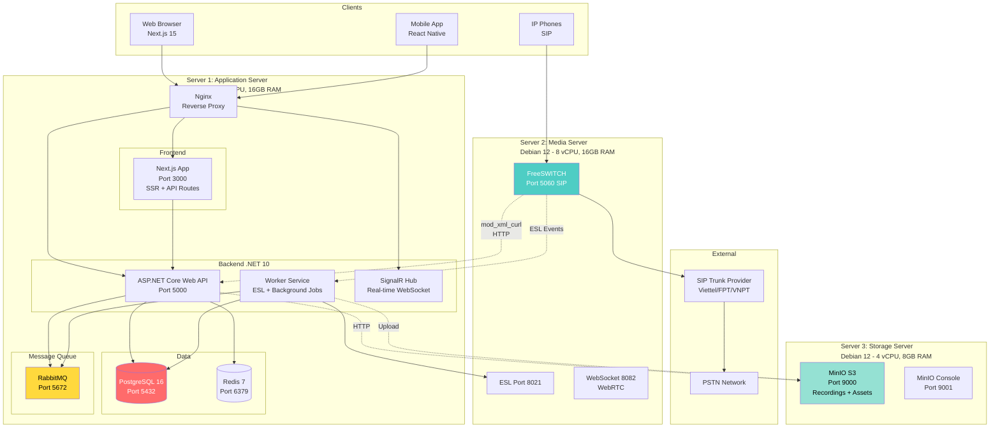

---

### 1.2. Deployment Architecture (Production)

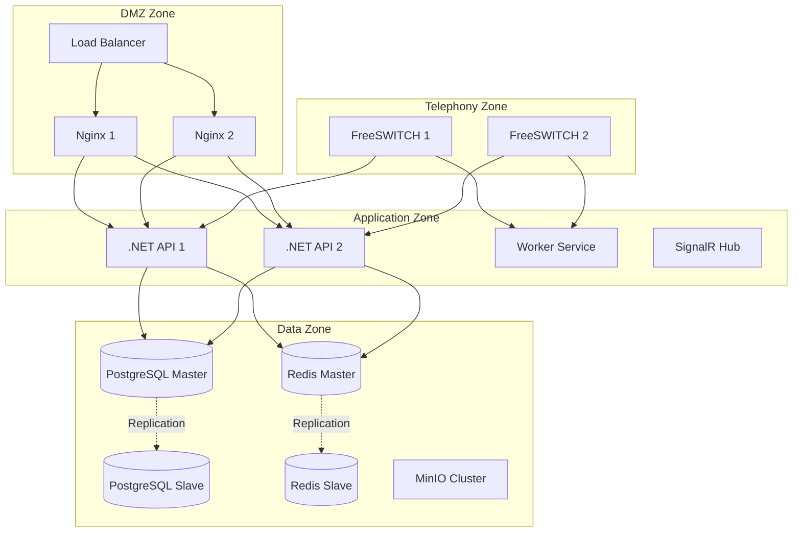

---

## 2. CLEAN ARCHITECTURE DESIGN

### 2.1. Solution Structure

```
CallCenterSaaS.sln
│
├── src/
│   ├── Core/
│   │   ├── CallCenterSaaS.Domain/
│   │   │   ├── Entities/
│   │   │   │   ├── Tenant.cs
│   │   │   │   ├── User.cs
│   │   │   │   ├── Extension.cs
│   │   │   │   ├── CallDetailRecord.cs
│   │   │   │   ├── Queue.cs
│   │   │   │   ├── IVR.cs
│   │   │   │   └── ...
│   │   │   ├── Enums/
│   │   │   ├── ValueObjects/
│   │   │   └── Common/
│   │   │
│   │   └── CallCenterSaaS.Application/
│   │       ├── Common/
│   │       │   ├── Interfaces/
│   │       │   ├── Behaviors/
│   │       │   └── Mappings/
│   │       ├── Features/
│   │       │   ├── Tenants/
│   │       │   │   ├── Commands/
│   │       │   │   │   ├── CreateTenant/
│   │       │   │   │   │   ├── CreateTenantCommand.cs
│   │       │   │   │   │   ├── CreateTenantCommandHandler.cs
│   │       │   │   │   │   └── CreateTenantCommandValidator.cs
│   │       │   │   │   └── ...
│   │       │   │   └── Queries/
│   │       │   │       ├── GetTenants/
│   │       │   │       └── ...
│   │       │   ├── Extensions/
│   │       │   ├── CDRs/
│   │       │   ├── Billing/
│   │       │   └── ...
│   │       └── DependencyInjection.cs
│   │
│   ├── Infrastructure/
│   │   ├── CallCenterSaaS.Infrastructure/
│   │   │   ├── Persistence/
│   │   │   │   ├── ApplicationDbContext.cs
│   │   │   │   ├── Configurations/
│   │   │   │   └── Repositories/
│   │   │   ├── FreeSWITCH/
│   │   │   │   ├── XmlCurlService.cs
│   │   │   │   ├── ESLClient.cs
│   │   │   │   └── DialplanBuilder.cs
│   │   │   ├── Storage/
│   │   │   │   └── MinIOService.cs
│   │   │   ├── Caching/
│   │   │   │   └── RedisCacheService.cs
│   │   │   └── DependencyInjection.cs
│   │
│   ├── Presentation/
│   │   ├── CallCenterSaaS.WebAPI/
│   │   │   ├── Controllers/
│   │   │   ├── Filters/
│   │   │   ├── Middleware/
│   │   │   ├── Hubs/
│   │   │   └── Program.cs
│   │   │
│   │   └── CallCenterSaaS.WorkerService/
│   │       ├── Workers/
│   │       │   ├── ESLEventWorker.cs
│   │       │   ├── RecordingProcessWorker.cs
│   │       │   └── BillingWorker.cs
│   │       └── Program.cs
│   │
│   └── Shared/
│       └── CallCenterSaaS.Shared/
│           ├── DTOs/
│           └── Constants/
│
└── tests/
    ├── CallCenterSaaS.Application.Tests/
    ├── CallCenterSaaS.Infrastructure.Tests/
    └── CallCenterSaaS.WebAPI.Tests/
```

---

### 2.2. Dependency Flow

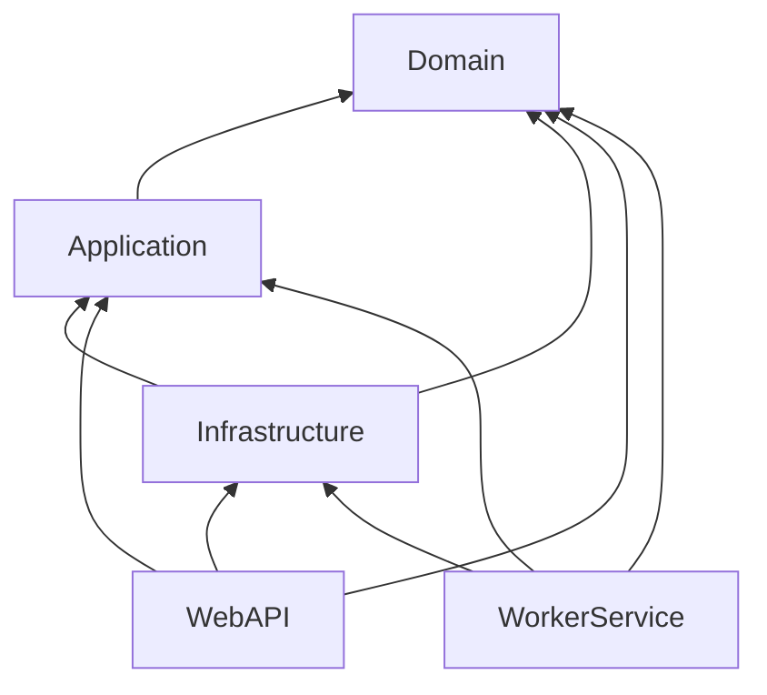

**Nguyên tắc:**
- Domain không phụ thuộc vào layer nào
- Application chỉ phụ thuộc Domain
- Infrastructure implement interfaces từ Application
- Presentation phụ thuộc tất cả (Dependency Injection)

---

### 2.3. CQRS Pattern

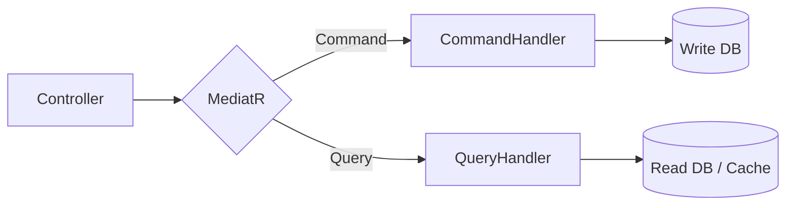

**Commands (Write):**
- CreateTenantCommand
- UpdateExtensionCommand
- DeleteQueueCommand

**Queries (Read):**
- GetTenantsQuery
- GetCDRsQuery
- GetDashboardStatsQuery

---

## 3. DATABASE DESIGN

### 3.1. Entity Relationship Diagram

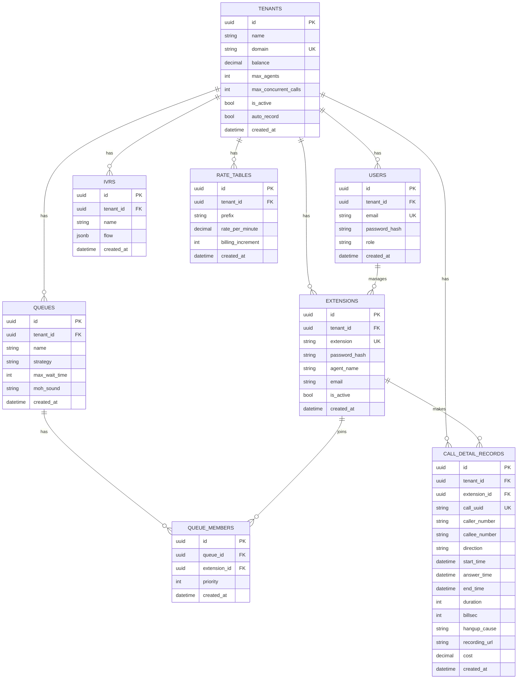

---

### 3.2. Table Definitions (PostgreSQL)

#### Tenants Table
```sql
CREATE TABLE tenants (
    id UUID PRIMARY KEY DEFAULT gen_random_uuid(),
    name VARCHAR(255) NOT NULL,
    domain VARCHAR(100) NOT NULL UNIQUE,
    balance DECIMAL(15, 2) DEFAULT 0.00,
    max_agents INT DEFAULT 10,
    max_concurrent_calls INT DEFAULT 20,
    is_active BOOLEAN DEFAULT TRUE,
    auto_record BOOLEAN DEFAULT TRUE,
    created_at TIMESTAMP DEFAULT CURRENT_TIMESTAMP,
    updated_at TIMESTAMP DEFAULT CURRENT_TIMESTAMP
);

CREATE INDEX idx_tenants_domain ON tenants(domain);
CREATE INDEX idx_tenants_is_active ON tenants(is_active);
```

---

#### Users Table
```sql
CREATE TABLE users (
    id UUID PRIMARY KEY DEFAULT gen_random_uuid(),
    tenant_id UUID NOT NULL REFERENCES tenants(id) ON DELETE CASCADE,
    email VARCHAR(255) NOT NULL UNIQUE,
    password_hash VARCHAR(255) NOT NULL,
    role VARCHAR(50) NOT NULL, -- SuperAdmin, TenantAdmin, Supervisor, Agent
    first_name VARCHAR(100),
    last_name VARCHAR(100),
    is_active BOOLEAN DEFAULT TRUE,
    created_at TIMESTAMP DEFAULT CURRENT_TIMESTAMP,
    updated_at TIMESTAMP DEFAULT CURRENT_TIMESTAMP
);

CREATE INDEX idx_users_tenant_id ON users(tenant_id);
CREATE INDEX idx_users_email ON users(email);
CREATE INDEX idx_users_role ON users(role);
```

---

#### Extensions Table
```sql
CREATE TABLE extensions (
    id UUID PRIMARY KEY DEFAULT gen_random_uuid(),
    tenant_id UUID NOT NULL REFERENCES tenants(id) ON DELETE CASCADE,
    user_id UUID REFERENCES users(id) ON DELETE SET NULL,
    extension VARCHAR(10) NOT NULL,
    password_hash VARCHAR(255) NOT NULL,
    agent_name VARCHAR(255),
    email VARCHAR(255),
    is_active BOOLEAN DEFAULT TRUE,
    is_deleted BOOLEAN DEFAULT FALSE,
    created_at TIMESTAMP DEFAULT CURRENT_TIMESTAMP,
    updated_at TIMESTAMP DEFAULT CURRENT_TIMESTAMP,
    UNIQUE(tenant_id, extension)
);

CREATE INDEX idx_extensions_tenant_id ON extensions(tenant_id);
CREATE INDEX idx_extensions_extension ON extensions(extension);
CREATE INDEX idx_extensions_is_active ON extensions(is_active);
```

---

#### Call Detail Records Table
```sql
CREATE TABLE call_detail_records (
    id UUID PRIMARY KEY DEFAULT gen_random_uuid(),
    tenant_id UUID NOT NULL REFERENCES tenants(id),
    extension_id UUID REFERENCES extensions(id),
    call_uuid VARCHAR(255) NOT NULL UNIQUE,
    caller_number VARCHAR(50),
    callee_number VARCHAR(50),
    direction VARCHAR(20), -- inbound, outbound, internal
    start_time TIMESTAMP,
    answer_time TIMESTAMP,
    end_time TIMESTAMP,
    duration INT, -- seconds
    billsec INT, -- seconds
    hangup_cause VARCHAR(100),
    recording_url TEXT,
    cost DECIMAL(10, 4) DEFAULT 0.00,
    created_at TIMESTAMP DEFAULT CURRENT_TIMESTAMP
);

CREATE INDEX idx_cdr_tenant_id ON call_detail_records(tenant_id);
CREATE INDEX idx_cdr_extension_id ON call_detail_records(extension_id);
CREATE INDEX idx_cdr_start_time ON call_detail_records(start_time);
CREATE INDEX idx_cdr_direction ON call_detail_records(direction);
CREATE INDEX idx_cdr_call_uuid ON call_detail_records(call_uuid);

-- Partition by month for performance
CREATE TABLE call_detail_records_2026_01 PARTITION OF call_detail_records
    FOR VALUES FROM ('2026-01-01') TO ('2026-02-01');
```

---

#### Queues Table
```sql
CREATE TABLE queues (
    id UUID PRIMARY KEY DEFAULT gen_random_uuid(),
    tenant_id UUID NOT NULL REFERENCES tenants(id) ON DELETE CASCADE,
    name VARCHAR(255) NOT NULL,
    strategy VARCHAR(50) DEFAULT 'longest-idle', -- ring-all, round-robin, longest-idle
    max_wait_time INT DEFAULT 300, -- seconds
    moh_sound VARCHAR(255), -- Music on Hold file
    created_at TIMESTAMP DEFAULT CURRENT_TIMESTAMP,
    updated_at TIMESTAMP DEFAULT CURRENT_TIMESTAMP,
    UNIQUE(tenant_id, name)
);

CREATE INDEX idx_queues_tenant_id ON queues(tenant_id);
```

---

#### Queue Members Table
```sql
CREATE TABLE queue_members (
    id UUID PRIMARY KEY DEFAULT gen_random_uuid(),
    queue_id UUID NOT NULL REFERENCES queues(id) ON DELETE CASCADE,
    extension_id UUID NOT NULL REFERENCES extensions(id) ON DELETE CASCADE,
    priority INT DEFAULT 1,
    created_at TIMESTAMP DEFAULT CURRENT_TIMESTAMP,
    UNIQUE(queue_id, extension_id)
);

CREATE INDEX idx_queue_members_queue_id ON queue_members(queue_id);
CREATE INDEX idx_queue_members_extension_id ON queue_members(extension_id);
```

---

#### IVRs Table
```sql
CREATE TABLE ivrs (
    id UUID PRIMARY KEY DEFAULT gen_random_uuid(),
    tenant_id UUID NOT NULL REFERENCES tenants(id) ON DELETE CASCADE,
    name VARCHAR(255) NOT NULL,
    flow JSONB NOT NULL, -- IVR flow definition
    created_at TIMESTAMP DEFAULT CURRENT_TIMESTAMP,
    updated_at TIMESTAMP DEFAULT CURRENT_TIMESTAMP,
    UNIQUE(tenant_id, name)
);

CREATE INDEX idx_ivrs_tenant_id ON ivrs(tenant_id);
```

---

#### Rate Tables Table
```sql
CREATE TABLE rate_tables (
    id UUID PRIMARY KEY DEFAULT gen_random_uuid(),
    tenant_id UUID NOT NULL REFERENCES tenants(id) ON DELETE CASCADE,
    prefix VARCHAR(20) NOT NULL,
    description VARCHAR(255),
    rate_per_minute DECIMAL(10, 4) NOT NULL,
    billing_increment INT DEFAULT 6, -- seconds
    created_at TIMESTAMP DEFAULT CURRENT_TIMESTAMP,
    updated_at TIMESTAMP DEFAULT CURRENT_TIMESTAMP,
    UNIQUE(tenant_id, prefix)
);

CREATE INDEX idx_rate_tables_tenant_id ON rate_tables(tenant_id);
CREATE INDEX idx_rate_tables_prefix ON rate_tables(prefix);
```

---

#### Billing Transactions Table
```sql
CREATE TABLE billing_transactions (
    id UUID PRIMARY KEY DEFAULT gen_random_uuid(),
    tenant_id UUID NOT NULL REFERENCES tenants(id),
    type VARCHAR(20) NOT NULL, -- topup, deduct
    amount DECIMAL(15, 2) NOT NULL,
    balance_before DECIMAL(15, 2),
    balance_after DECIMAL(15, 2),
    description TEXT,
    reference_id UUID, -- CDR ID if deduct
    created_at TIMESTAMP DEFAULT CURRENT_TIMESTAMP
);

CREATE INDEX idx_billing_transactions_tenant_id ON billing_transactions(tenant_id);
CREATE INDEX idx_billing_transactions_created_at ON billing_transactions(created_at);
```

---

### 3.3. Database Indexes Strategy

**Composite Indexes:**
```sql
-- For CDR queries with filters
CREATE INDEX idx_cdr_tenant_date ON call_detail_records(tenant_id, start_time DESC);
CREATE INDEX idx_cdr_tenant_direction ON call_detail_records(tenant_id, direction);

-- For extension lookup
CREATE INDEX idx_ext_tenant_active ON extensions(tenant_id, is_active) WHERE is_deleted = FALSE;
```

**Partial Indexes:**
```sql
-- Only index active extensions
CREATE INDEX idx_extensions_active ON extensions(tenant_id, extension) 
    WHERE is_active = TRUE AND is_deleted = FALSE;
```

---

## 4. API DESIGN

### 4.1. API Architecture

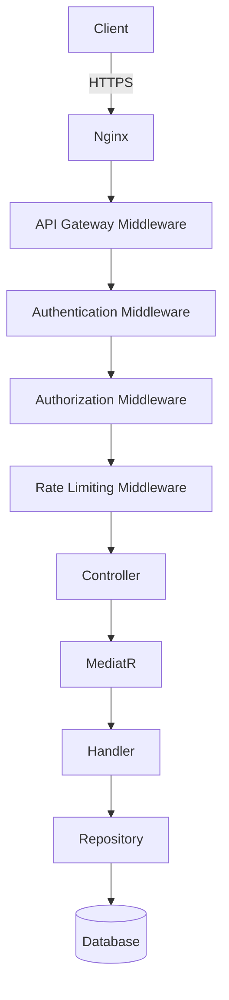

---

### 4.2. RESTful API Conventions

**Base URL:** `https://api.callcenter-saas.com/v1`

**HTTP Methods:**
- `GET`: Retrieve resources
- `POST`: Create resources
- `PUT`: Update entire resource
- `PATCH`: Partial update
- `DELETE`: Delete resource

**Response Format:**
```json
{
  "success": true,
  "data": { ... },
  "message": "Success",
  "timestamp": "2026-01-02T10:30:00Z"
}
```

**Error Format:**
```json
{
  "success": false,
  "error": {
    "code": "VALIDATION_ERROR",
    "message": "Validation failed",
    "details": [
      {
        "field": "email",
        "message": "Email is required"
      }
    ]
  },
  "timestamp": "2026-01-02T10:30:00Z"
}
```

---

### 4.3. API Endpoints Detail

#### Authentication API

**POST /api/auth/register**
```json
Request:
{
  "email": "admin@company.com",
  "password": "SecurePass123!",
  "companyName": "ABC Company",
  "phoneNumber": "+84909123456"
}

Response:
{
  "success": true,
  "data": {
    "tenantId": "uuid",
    "userId": "uuid",
    "email": "admin@company.com"
  }
}
```

---

**POST /api/auth/login**
```json
Request:
{
  "email": "admin@company.com",
  "password": "SecurePass123!"
}

Response:
{
  "success": true,
  "data": {
    "accessToken": "eyJhbGciOiJIUzI1NiIs...",
    "refreshToken": "uuid",
    "expiresIn": 86400,
    "user": {
      "id": "uuid",
      "email": "admin@company.com",
      "role": "TenantAdmin",
      "tenantId": "uuid"
    }
  }
}
```

---

#### Tenants API

**GET /api/tenants**
```
Query Parameters:
- page: int (default 1)
- pageSize: int (default 20)
- search: string
- isActive: bool

Response:
{
  "success": true,
  "data": {
    "items": [
      {
        "id": "uuid",
        "name": "ABC Company",
        "domain": "abc-company",
        "balance": 1000000.00,
        "maxAgents": 50,
        "maxConcurrentCalls": 100,
        "isActive": true,
        "createdAt": "2026-01-01T00:00:00Z"
      }
    ],
    "totalCount": 100,
    "page": 1,
    "pageSize": 20
  }
}
```

---

**POST /api/tenants**
```json
Request:
{
  "name": "ABC Company",
  "domain": "abc-company",
  "adminEmail": "admin@abc.com",
  "maxAgents": 50,
  "maxConcurrentCalls": 100,
  "initialBalance": 1000000.00
}

Response:
{
  "success": true,
  "data": {
    "id": "uuid",
    "name": "ABC Company",
    "domain": "abc-company",
    "adminCredentials": {
      "email": "admin@abc.com",
      "temporaryPassword": "TempPass123!"
    }
  }
}
```

---

#### Extensions API

**POST /api/extensions**
```json
Request:
{
  "extension": "101",
  "agentName": "Nguyen Van A",
  "email": "a@company.com",
  "password": "SipPass123" // optional, auto-generate if not provided
}

Response:
{
  "success": true,
  "data": {
    "id": "uuid",
    "extension": "101",
    "agentName": "Nguyen Van A",
    "sipCredentials": {
      "username": "101",
      "password": "SipPass123",
      "domain": "abc-company.pbx.local",
      "server": "sip.callcenter-saas.com"
    }
  }
}
```

---

#### CDRs API

**GET /api/cdrs**
```
Query Parameters:
- startDate: datetime
- endDate: datetime
- direction: string (inbound/outbound/internal)
- extensionId: uuid
- page: int
- pageSize: int

Response:
{
  "success": true,
  "data": {
    "items": [
      {
        "id": "uuid",
        "callUuid": "uuid",
        "callerNumber": "0909123456",
        "calleeNumber": "0912345678",
        "direction": "outbound",
        "startTime": "2026-01-02T10:00:00Z",
        "answerTime": "2026-01-02T10:00:05Z",
        "endTime": "2026-01-02T10:05:00Z",
        "duration": 300,
        "billsec": 295,
        "hangupCause": "NORMAL_CLEARING",
        "recordingUrl": "https://...",
        "cost": 2500.00
      }
    ],
    "totalCount": 5000,
    "statistics": {
      "totalCalls": 5000,
      "answeredCalls": 4500,
      "missedCalls": 500,
      "averageDuration": 180,
      "totalCost": 1250000.00
    }
  }
}
```

---

### 4.4. API Versioning

**Strategy:** URL Path Versioning

```
/api/v1/tenants
/api/v2/tenants (future)
```

**Deprecation Policy:**
- Support old version for 6 months
- Add `X-API-Deprecated` header
- Document migration guide

---

### 4.5. API Rate Limiting

| User Role | Rate Limit |
|-----------|------------|
| SuperAdmin | 1000 req/min |
| TenantAdmin | 500 req/min |
| Agent | 100 req/min |
| Anonymous | 10 req/min |

**Headers:**
```
X-RateLimit-Limit: 500
X-RateLimit-Remaining: 450
X-RateLimit-Reset: 1640000000
```

---

## 5. FREESWITCH INTEGRATION

### 5.1. mod_xml_curl Configuration

**FreeSWITCH Config:** `/etc/freeswitch/autoload_configs/xml_curl.conf.xml`
```xml
<configuration name="xml_curl.conf">
  <bindings>
    <binding name="directory">
      <param name="gateway-url" value="http://localhost:5000/api/freeswitch/configuration" method="POST"/>
      <param name="timeout" value="5"/>
    </binding>
    <binding name="dialplan">
      <param name="gateway-url" value="http://localhost:5000/api/freeswitch/configuration" method="POST"/>
      <param name="timeout" value="5"/>
    </binding>
  </bindings>
</configuration>
```

---

### 5.2. Directory XML Response (User Authentication)

**Request từ FreeSWITCH:**
```
POST /api/freeswitch/configuration
Content-Type: application/x-www-form-urlencoded

section=directory
tag_name=domain
key_name=name
key_value=abc-company.pbx.local
user=101
```

**Response từ .NET API:**
```xml
<?xml version="1.0" encoding="UTF-8"?>
<document type="freeswitch/xml">
  <section name="directory">
    <domain name="abc-company.pbx.local">
      <user id="101">
        <params>
          <param name="password" value="hashed_password"/>
          <param name="dial-string" value="{presence_id=${dialed_user}@${dialed_domain}}${sofia_contact(${dialed_user}@${dialed_domain})}"/>
        </params>
        <variables>
          <variable name="tenant_id" value="uuid"/>
          <variable name="extension_id" value="uuid"/>
          <variable name="user_context" value="default"/>
          <variable name="record_calls" value="true"/>
        </variables>
      </user>
    </domain>
  </section>
</document>
```

---

### 5.3. Dialplan XML Response (Call Routing)

**Request từ FreeSWITCH:**
```
POST /api/freeswitch/configuration
Content-Type: application/x-www-form-urlencoded

section=dialplan
Caller-Caller-ID-Number=101
Caller-Destination-Number=0909123456
variable_tenant_id=uuid
```

**Response từ .NET API (Outbound Call):**
```xml
<?xml version="1.0" encoding="UTF-8"?>
<document type="freeswitch/xml">
  <section name="dialplan">
    <context name="default">
      <extension name="outbound">
        <condition field="destination_number" expression="^(\d{10})$">
          <!-- Check balance -->
          <action application="set" data="tenant_id=uuid"/>
          <action application="set" data="extension_id=uuid"/>
          
          <!-- Recording -->
          <action application="set" data="RECORD_STEREO=true"/>
          <action application="record_session" data="/var/lib/freeswitch/recordings/${tenant_id}/${strftime(%Y-%m-%d)}/${uuid}.wav"/>
          
          <!-- Bridge to trunk -->
          <action application="bridge" data="sofia/gateway/trunk_provider/$1"/>
          
          <!-- Hangup -->
          <action application="hangup"/>
        </condition>
      </extension>
    </context>
  </section>
</document>
```

---

### 5.4. ESL (Event Socket Library) Integration

**Worker Service Code:**
```csharp
public class ESLEventWorker : BackgroundService
{
    private readonly ILogger<ESLEventWorker> _logger;
    private readonly IServiceProvider _serviceProvider;
    private InboundSocket _eslClient;

    protected override async Task ExecuteAsync(CancellationToken stoppingToken)
    {
        _eslClient = new InboundSocket("127.0.0.1", 8021, "ClueCon");
        await _eslClient.ConnectAsync();
        
        _eslClient.Events.Where(x => x.EventName == "CHANNEL_HANGUP_COMPLETE")
            .Subscribe(async e => await HandleHangupEvent(e));
        
        await _eslClient.SubscribeEvents(EventName.ChannelHangupComplete);
    }

    private async Task HandleHangupEvent(EslEvent e)
    {
        var cdr = new CallDetailRecord
        {
            CallUuid = e.GetVariable("uuid"),
            TenantId = Guid.Parse(e.GetVariable("tenant_id")),
            CallerNumber = e.GetVariable("caller_id_number"),
            CalleeNumber = e.GetVariable("destination_number"),
            StartTime = DateTime.Parse(e.GetVariable("start_stamp")),
            AnswerTime = DateTime.Parse(e.GetVariable("answer_stamp")),
            EndTime = DateTime.Parse(e.GetVariable("end_stamp")),
            Duration = int.Parse(e.GetVariable("duration")),
            Billsec = int.Parse(e.GetVariable("billsec")),
            HangupCause = e.GetVariable("hangup_cause")
        };
        
        // Calculate cost
        await CalculateAndDeductCost(cdr);
        
        // Save CDR
        await SaveCDR(cdr);
    }
}
```

---

## 6. SEQUENCE DIAGRAMS

### 6.1. User Registration Flow

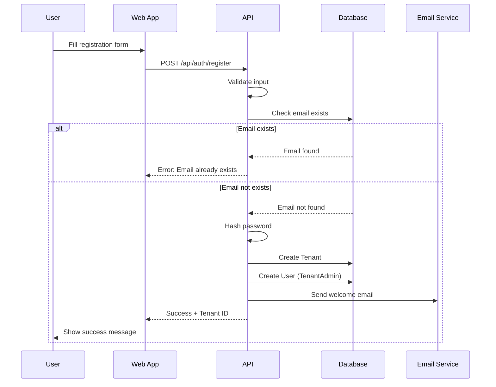

---

### 6.2. Outbound Call Flow

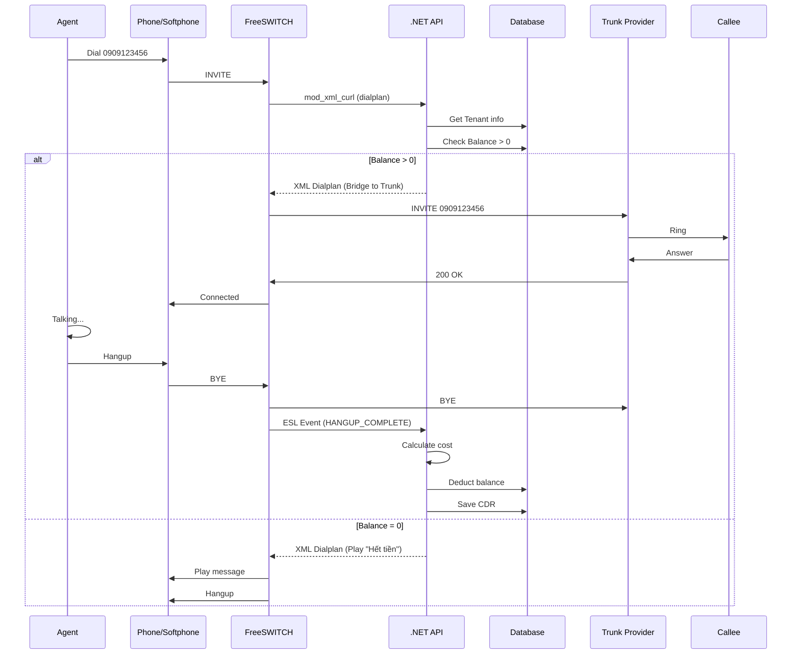

---

### 6.3. Inbound Call with IVR Flow

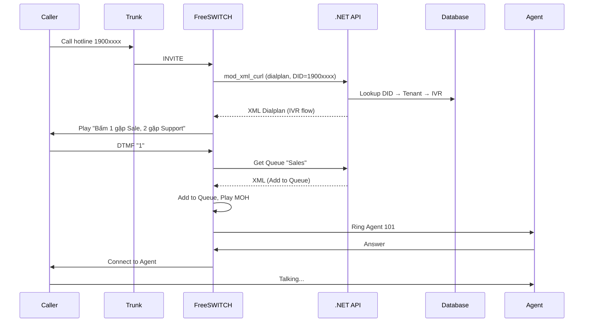

---

### 6.4. Recording Processing Flow

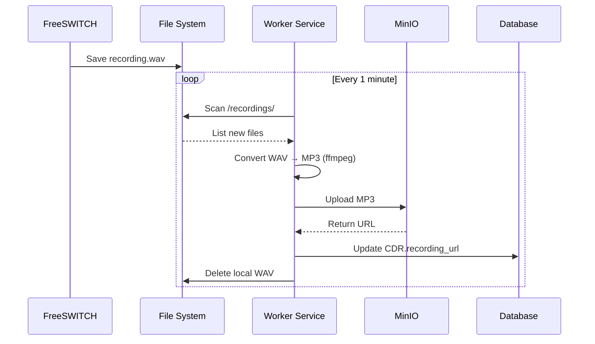

---

## 7. SECURITY DESIGN

### 7.1. Authentication Flow (JWT)

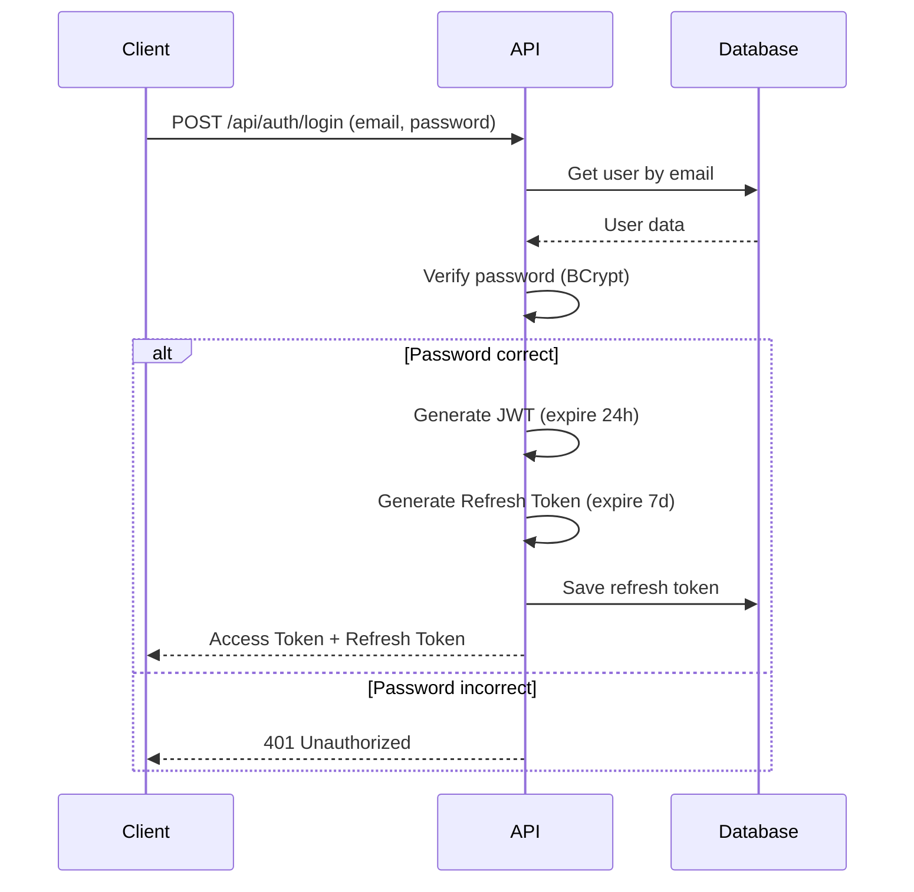

**JWT Payload:**
```json
{
  "sub": "user-uuid",
  "email": "admin@company.com",
  "role": "TenantAdmin",
  "tenant_id": "tenant-uuid",
  "iat": 1640000000,
  "exp": 1640086400
}
```

---

### 7.2. Authorization (RBAC)

**Policy-based Authorization:**
```csharp
[Authorize(Policy = "TenantAdminOnly")]
public class ExtensionsController : ControllerBase
{
    [HttpPost]
    public async Task<IActionResult> CreateExtension(CreateExtensionCommand command)
    {
        // Only TenantAdmin can create extensions
    }
}
```

**Policy Definition:**
```csharp
services.AddAuthorization(options =>
{
    options.AddPolicy("TenantAdminOnly", policy =>
        policy.RequireRole("TenantAdmin", "SuperAdmin"));
    
    options.AddPolicy("SameTenant", policy =>
        policy.Requirements.Add(new SameTenantRequirement()));
});
```

---

### 7.3. Data Isolation (Multi-tenancy)

**Global Query Filter:**
```csharp
public class ApplicationDbContext : DbContext
{
    private readonly ICurrentUserService _currentUserService;
    
    protected override void OnModelCreating(ModelBuilder modelBuilder)
    {
        // Global filter for tenant isolation
        modelBuilder.Entity<Extension>()
            .HasQueryFilter(e => e.TenantId == _currentUserService.TenantId);
        
        modelBuilder.Entity<CallDetailRecord>()
            .HasQueryFilter(c => c.TenantId == _currentUserService.TenantId);
    }
}
```

---

### 7.4. SIP Security

**Fail2Ban Configuration:**
```ini
[freeswitch]
enabled = true
port = 5060,5061
protocol = udp
filter = freeswitch
logpath = /var/log/freeswitch/freeswitch.log
maxretry = 5
bantime = 3600
findtime = 600
```

**FreeSWITCH ACL:**
```xml
<list name="domains" default="deny">
  <node type="allow" cidr="10.0.0.0/8"/>
  <node type="allow" cidr="192.168.0.0/16"/>
  <node type="deny" cidr="0.0.0.0/0"/>
</list>
```

---

## 8. CACHING STRATEGY

### 8.1. Cache Layers

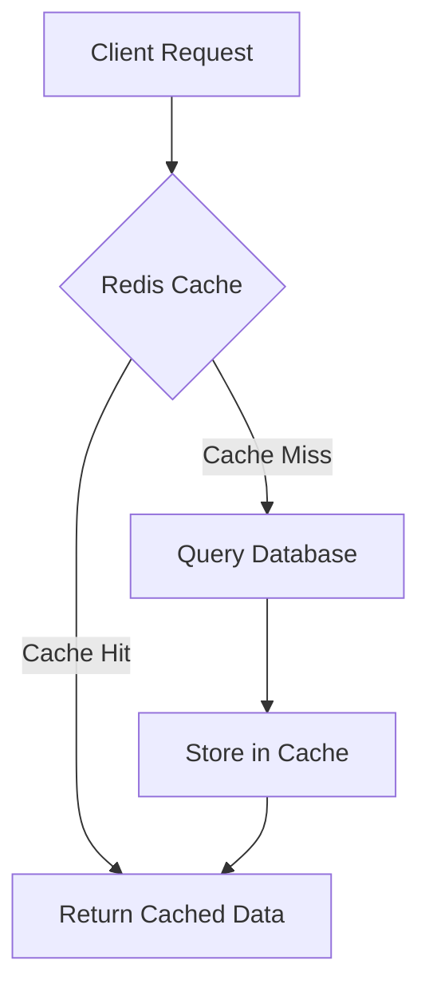

---

### 8.2. Cache Keys Design

| Data Type | Cache Key Pattern | TTL |
|-----------|-------------------|-----|
| User | `user:{user_id}` | 1 hour |
| Extension | `ext:{tenant_id}:{extension}` | 30 min |
| Tenant Config | `tenant:{tenant_id}:config` | 1 hour |
| Directory XML | `xml:dir:{domain}:{user}` | 10 min |
| Dialplan XML | `xml:dp:{tenant_id}:{dest}` | 5 min |
| Balance | `balance:{tenant_id}` | 1 min |

---

### 8.3. Cache Invalidation

**Event-based Invalidation:**
```csharp
public class UpdateExtensionCommandHandler : IRequestHandler<UpdateExtensionCommand>
{
    private readonly ICacheService _cache;
    
    public async Task<Unit> Handle(UpdateExtensionCommand request, CancellationToken cancellationToken)
    {
        // Update database
        await _repository.UpdateAsync(extension);
        
        // Invalidate cache
        await _cache.RemoveAsync($"ext:{extension.TenantId}:{extension.Extension}");
        await _cache.RemoveAsync($"xml:dir:{extension.Domain}:{extension.Extension}");
        
        return Unit.Value;
    }
}
```

---

## 9. FILE STORAGE DESIGN

### 9.1. MinIO Bucket Structure

```
callcenter-saas/
├── recordings/
│   ├── {tenant_id}/
│   │   ├── 2026-01-01/
│   │   │   ├── uuid1.mp3
│   │   │   ├── uuid2.mp3
│   │   │   └── ...
│   │   ├── 2026-01-02/
│   │   └── ...
├── voicemails/
│   ├── {tenant_id}/
│   │   └── {extension}/
│   │       ├── msg1.mp3
│   │       └── ...
├── ivr-prompts/
│   ├── {tenant_id}/
│   │   ├── welcome.mp3
│   │   ├── menu.mp3
│   │   └── ...
└── reports/
    ├── {tenant_id}/
    │   ├── cdr-2026-01.csv
    │   └── ...
```

---

### 9.2. Presigned URL Generation

```csharp
public async Task<string> GetRecordingUrlAsync(Guid cdrId)
{
    var cdr = await _repository.GetByIdAsync(cdrId);
    
    // Generate presigned URL (expire in 1 hour)
    var presignedUrl = await _minioClient.PresignedGetObjectAsync(
        bucketName: "callcenter-saas",
        objectName: $"recordings/{cdr.TenantId}/{cdr.StartTime:yyyy-MM-dd}/{cdr.CallUuid}.mp3",
        expiresInt: 3600
    );
    
    return presignedUrl;
}
```

---

## 10. REAL-TIME COMMUNICATION

### 10.1. SignalR Hub Design

```csharp
public class CallMonitorHub : Hub
{
    public async Task JoinTenantGroup(Guid tenantId)
    {
        await Groups.AddToGroupAsync(Context.ConnectionId, $"tenant_{tenantId}");
    }
    
    public async Task NotifyCallStarted(Guid tenantId, CallEventDto callEvent)
    {
        await Clients.Group($"tenant_{tenantId}").SendAsync("OnCallStarted", callEvent);
    }
    
    public async Task NotifyCallEnded(Guid tenantId, CallEventDto callEvent)
    {
        await Clients.Group($"tenant_{tenantId}").SendAsync("OnCallEnded", callEvent);
    }
    
    public async Task NotifyAgentStatusChanged(Guid tenantId, AgentStatusDto status)
    {
        await Clients.Group($"tenant_{tenantId}").SendAsync("OnAgentStatusChanged", status);
    }
}
```

---

### 10.2. Client-side Integration (React)

```typescript
import * as signalR from "@microsoft/signalr";

const connection = new signalR.HubConnectionBuilder()
  .withUrl("https://api.callcenter-saas.com/hubs/call-monitor", {
    accessTokenFactory: () => getAccessToken()
  })
  .withAutomaticReconnect()
  .build();

connection.on("OnCallStarted", (callEvent) => {
  console.log("Call started:", callEvent);
  // Update UI
});

connection.on("OnCallEnded", (callEvent) => {
  console.log("Call ended:", callEvent);
  // Update UI
});

await connection.start();
await connection.invoke("JoinTenantGroup", tenantId);
```

---

## PHỤ LỤC

### A. Technology Versions

| Technology | Version |
|------------|---------|
| .NET | 8.0 LTS |
| PostgreSQL | 15+ |
| Redis | 7+ |
| FreeSWITCH | 1.10.9+ |
| MinIO | Latest |
| Nginx | 1.24+ |

---

### B. Performance Benchmarks

| Metric | Target | Measurement Method |
|--------|--------|-------------------|
| API Response Time | < 200ms (p95) | Application Insights |
| Database Query | < 100ms (p95) | pg_stat_statements |
| Concurrent Calls | 200+ | SIPP load test |
| WebSocket Latency | < 100ms | Custom monitoring |

---

**Ngày cập nhật:** 02/01/2026  
**Phiên bản:** 1.0  
**Người phê duyệt:** Solution Architect
