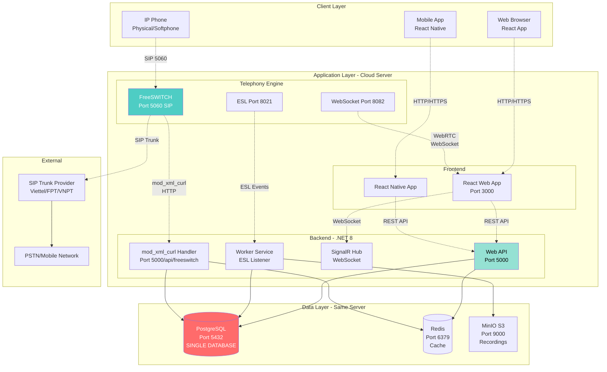
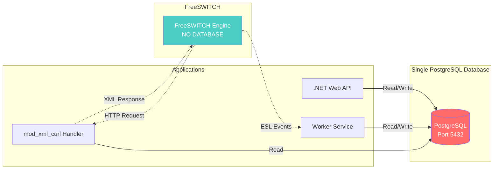
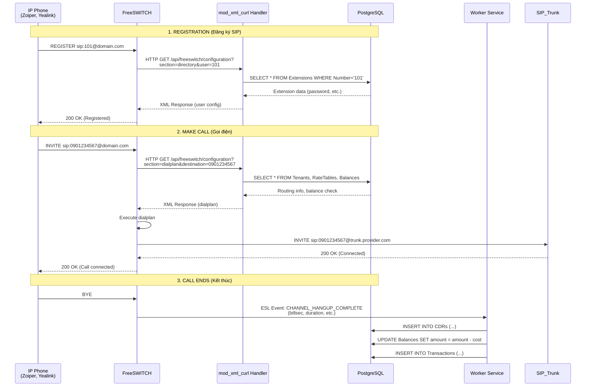
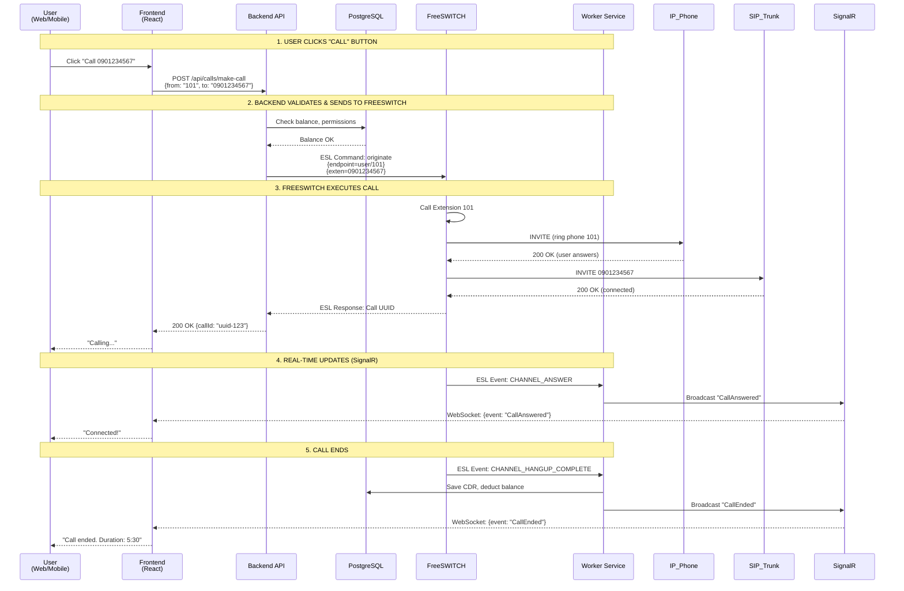
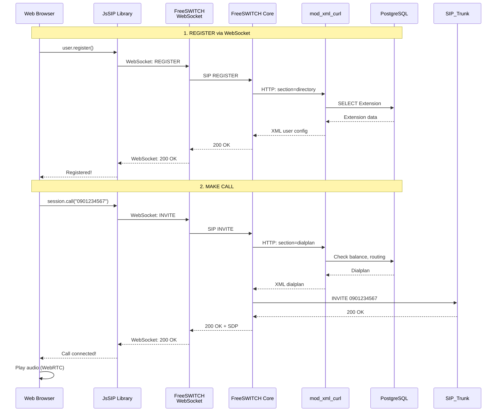
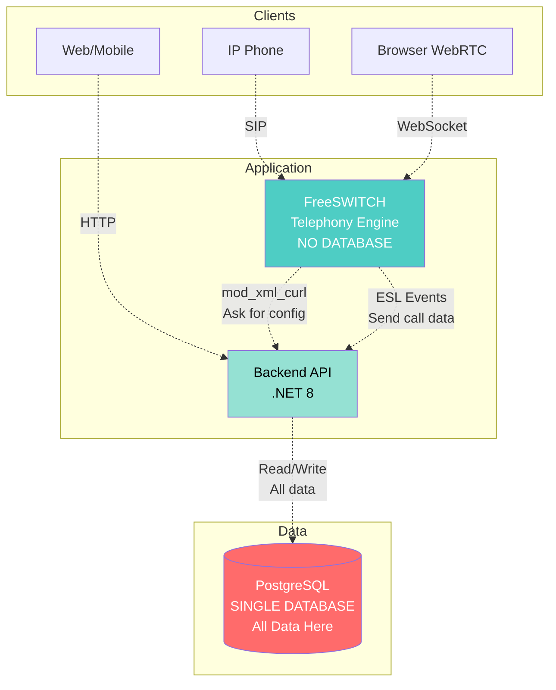

# KIẾN TRÚC CHI TIẾT VÀ LUỒNG GỌI
## Call Center SaaS Platform - Architecture Deep Dive

> [!IMPORTANT]
> Tài liệu này giải thích chi tiết về kiến trúc hệ thống, luồng gọi điện, và cách các thành phần tương tác với nhau.

**Phiên bản:** 1.0  
**Ngày tạo:** 05/01/2026  
**Mục đích:** Làm rõ kiến trúc và luồng hoạt động

---

## MỤC LỤC

1. [Kiến trúc tổng quan chính xác](#1-kiến-trúc-tổng-quan-chính-xác)
2. [Database Architecture](#2-database-architecture)
3. [Luồng gọi điện chi tiết](#3-luồng-gọi-điện-chi-tiết)
4. [Tương tác giữa các thành phần](#4-tương-tác-giữa-các-thành-phần)
5. [So sánh các phương thức gọi](#5-so-sánh-các-phương-thức-gọi)

---

## 1. KIẾN TRÚC TỔNG QUAN CHÍNH XÁC

### 1.1. Sơ đồ kiến trúc đầy đủ



### 1.2. Giải thích các thành phần

#### **Client Layer (Người dùng)**

**1. Web Browser (React App)**
- Truy cập qua HTTPS
- Giao diện quản lý (Dashboard, CDR, Reports)
- **WebRTC Softphone** (gọi điện trên browser)
- Kết nối SignalR để nhận real-time updates

**2. Mobile App (React Native)**
- Tương tự Web App
- Push notifications
- Mobile-optimized UI

**3. IP Phone (Physical/Softphone)**
- Đăng ký SIP trực tiếp vào FreeSWITCH
- Không qua Backend API
- VD: Yealink, Cisco, Zoiper, Linphone

---

#### **Application Layer (Cloud Server)**

**Backend - .NET 8:**

**1. Web API (Port 5000)**
- REST API cho Frontend
- CRUD operations (Tenant, User, Extension, etc.)
- Authentication & Authorization (JWT)
- Business logic

**2. Worker Service (Background Service)**
- Lắng nghe ESL events từ FreeSWITCH
- Xử lý CDR (lưu vào database)
- Xử lý Recording (convert, upload MinIO)
- Billing calculation

**3. SignalR Hub (WebSocket)**
- Real-time communication
- Push events đến Frontend
- Live call monitoring
- Agent status updates

**4. mod_xml_curl Handler**
- Endpoint đặc biệt cho FreeSWITCH
- FreeSWITCH gọi HTTP đến endpoint này
- Trả về XML configuration
- **2 loại request:**
  - `section=directory` → User authentication
  - `section=dialplan` → Call routing

---

**Telephony Engine:**

**FreeSWITCH:**
- **Port 5060:** SIP (IP Phone đăng ký vào đây)
- **Port 8021:** ESL (Event Socket Layer) - Backend lắng nghe events
- **Port 8082:** WebSocket (WebRTC cho browser)

**Modules quan trọng:**
- `mod_xml_curl` → Hỏi Backend API để lấy config
- `mod_event_socket` → Gửi events đến Backend
- `mod_sofia` → SIP stack
- `mod_callcenter` → Queue/ACD

---

#### **Data Layer (Cùng server)**

**1. PostgreSQL (Port 5432) - SINGLE DATABASE**
> [!IMPORTANT]
> **CHỈ CÓ 1 DATABASE DUY NHẤT** lưu TẤT CẢ dữ liệu:

**Tables chính:**
```
Tenants                 → Thông tin khách hàng
Users                   → Người dùng
Extensions              → Số máy nhánh (101, 102, ...)
Trunks                  → Kết nối SIP Trunk
DIDs                    → Đầu số (hotline)
IVRs                    → IVR flows
Queues                  → Hàng đợi
CDRs                    → Call Detail Records
Recordings              → Metadata ghi âm
Transactions            → Lịch sử giao dịch
RateTables              → Bảng giá cước
Balances                → Số dư tài khoản
```

**2. Redis (Port 6379)**
- Cache XML responses (mod_xml_curl)
- Session storage
- Pub/Sub cho SignalR
- Rate limiting

**3. MinIO S3 (Port 9000)**
- Lưu file ghi âm (MP3)
- Lưu audio files cho IVR
- Object storage

---

## 2. DATABASE ARCHITECTURE

### 2.1. Câu trả lời cho câu hỏi của bạn

> **Câu hỏi:** "Tổng kết là mình chỉ có 1 database server để lưu chữ thôi chứ đúng k? như kiểu tất cả mình lưu đầu số, truck .... hay 2 database ở server tổng đài và server cloud của mình là khác nhau?"

**Trả lời:**

✅ **ĐÚNG! Chỉ có 1 DATABASE duy nhất (PostgreSQL)**

**Lý do:**
1. **Đơn giản hóa:** Không cần sync data giữa 2 database
2. **Consistency:** Dữ liệu luôn đồng nhất
3. **Cost-effective:** Tiết kiệm chi phí
4. **Easier backup:** Chỉ cần backup 1 database

**FreeSWITCH KHÔNG CÓ DATABASE:**
- FreeSWITCH chỉ là **telephony engine** (xử lý cuộc gọi)
- Mọi thông tin đều lấy từ Backend API (qua mod_xml_curl)
- FreeSWITCH **stateless** (không lưu trữ gì)

### 2.2. Sơ đồ Data Flow



**Giải thích:**
1. **Web API** → CRUD operations vào PostgreSQL
2. **Worker Service** → Lưu CDR, Billing vào PostgreSQL
3. **mod_xml_curl Handler** → ĐỌC từ PostgreSQL, trả XML cho FreeSWITCH
4. **FreeSWITCH** → KHÔNG lưu gì, chỉ hỏi Backend

---

## 3. LUỒNG GỌI ĐIỆN CHI TIẾT

### 3.1. Phương thức 1: IP Phone → FreeSWITCH (Traditional SIP)



**Giải thích từng bước:**

**Bước 1: Registration (Đăng ký)**
1. IP Phone gửi REGISTER đến FreeSWITCH
2. FreeSWITCH hỏi Backend: "User 101 có tồn tại không? Password là gì?"
3. Backend query PostgreSQL
4. Backend trả XML cho FreeSWITCH
5. FreeSWITCH xác thực và cho phép đăng ký

**Bước 2: Make Call (Gọi điện)**
1. IP Phone gửi INVITE (gọi số 0901234567)
2. FreeSWITCH hỏi Backend: "Số này route như thế nào? User có đủ tiền không?"
3. Backend check balance, rate table
4. Backend trả dialplan XML
5. FreeSWITCH thực hiện cuộc gọi qua SIP Trunk

**Bước 3: Call Ends (Kết thúc)**
1. Cuộc gọi kết thúc
2. FreeSWITCH gửi event qua ESL
3. Worker Service nhận event
4. Worker lưu CDR vào database
5. Worker trừ tiền từ balance
6. Worker lưu transaction history

---

### 3.2. Phương thức 2: Web/Mobile → Backend API → FreeSWITCH (Click-to-Call)



**Giải thích từng bước:**

**Bước 1: User clicks "Call"**
- User click button trên Web/Mobile
- Frontend gọi API `POST /api/calls/make-call`

**Bước 2: Backend validates**
- Backend check balance trong PostgreSQL
- Backend gửi lệnh ESL đến FreeSWITCH: "Gọi từ 101 đến 0901234567"

**Bước 3: FreeSWITCH executes**
- FreeSWITCH gọi điện thoại của Extension 101
- User nhấc máy
- FreeSWITCH gọi ra ngoài qua SIP Trunk
- Cuộc gọi kết nối

**Bước 4: Real-time updates**
- FreeSWITCH gửi events (ANSWER, HANGUP) qua ESL
- Worker Service nhận events
- Worker broadcast qua SignalR
- Frontend nhận WebSocket và update UI

**Bước 5: Call ends**
- Lưu CDR, trừ tiền, update UI

---

### 3.3. Phương thức 3: WebRTC Softphone (Browser)



**Giải thích:**
- Browser sử dụng **JsSIP library** (WebRTC)
- Kết nối đến FreeSWITCH qua **WebSocket** (port 8082)
- Sau đó giống như IP Phone (FreeSWITCH hỏi Backend qua mod_xml_curl)
- Audio stream qua WebRTC (peer-to-peer)

---

## 4. TƯƠNG TÁC GIỮA CÁC THÀNH PHẦN

### 4.1. FreeSWITCH ↔ Backend API

**mod_xml_curl (FreeSWITCH → Backend):**

```http
GET /api/freeswitch/configuration?section=directory&tag_name=domain&key_name=name&key_value=default&user=101 HTTP/1.1
Host: localhost:5000
```

**Backend Response (XML):**
```xml
<?xml version="1.0" encoding="UTF-8"?>
<document type="freeswitch/xml">
  <section name="directory">
    <domain name="default">
      <user id="101">
        <params>
          <param name="password" value="hashed_password"/>
          <param name="vm-password" value="101"/>
        </params>
        <variables>
          <variable name="tenant_id" value="123"/>
          <variable name="user_context" value="default"/>
        </variables>
      </user>
    </domain>
  </section>
</document>
```

---

**ESL Events (FreeSWITCH → Backend):**

```json
{
  "Event-Name": "CHANNEL_HANGUP_COMPLETE",
  "Caller-Caller-ID-Number": "101",
  "Caller-Destination-Number": "0901234567",
  "variable_billsec": "330",
  "variable_duration": "335",
  "variable_hangup_cause": "NORMAL_CLEARING",
  "variable_sip_hangup_disposition": "recv_bye"
}
```

Worker Service nhận event này và:
1. Parse event data
2. Calculate cost: `billsec * rate_per_second`
3. Save CDR to PostgreSQL
4. Deduct balance
5. Broadcast to SignalR

---

### 4.2. Frontend ↔ Backend API

**REST API Examples:**

```typescript
// 1. Login
POST /api/auth/login
{
  "email": "admin@company.com",
  "password": "password123"
}
Response: { "token": "jwt_token", "refreshToken": "..." }

// 2. Get Extensions
GET /api/extensions?tenantId=123
Response: [
  { "id": 1, "number": "101", "name": "John Doe", "status": "registered" },
  { "id": 2, "number": "102", "name": "Jane Smith", "status": "unregistered" }
]

// 3. Make Call (Click-to-Call)
POST /api/calls/make-call
{
  "fromExtension": "101",
  "toNumber": "0901234567"
}
Response: { "callId": "uuid-123", "status": "initiated" }

// 4. Get CDRs
GET /api/cdrs?startDate=2026-01-01&endDate=2026-01-31&direction=outbound
Response: [
  {
    "id": 1,
    "callerId": "101",
    "destination": "0901234567",
    "duration": 330,
    "cost": 2750,
    "recordingUrl": "https://minio.../recording.mp3"
  }
]
```

---

**SignalR (Real-time):**

```typescript
// Frontend connects
const connection = new HubConnectionBuilder()
  .withUrl("https://api.example.com/hubs/callmonitor")
  .build();

// Subscribe to events
connection.on("CallStarted", (data) => {
  console.log("New call:", data);
  // Update UI
});

connection.on("CallEnded", (data) => {
  console.log("Call ended:", data);
  // Update UI
});

connection.on("AgentStatusChanged", (data) => {
  console.log("Agent status:", data);
  // Update agent board
});
```

---

## 5. SO SÁNH CÁC PHƯƠNG THỨC GỌI

### 5.1. Bảng so sánh

| Tiêu chí | IP Phone → FS | Web/Mobile → API → FS | WebRTC (Browser) |
|----------|---------------|----------------------|------------------|
| **Client** | IP Phone (Zoiper, Yealink) | Web/Mobile App | Web Browser |
| **Protocol** | SIP (UDP/TCP) | HTTP API + SIP | WebSocket + WebRTC |
| **Kết nối** | Trực tiếp đến FS | Qua Backend API | WebSocket đến FS |
| **Use case** | Agent có IP Phone | Click-to-call, automation | Gọi trên browser |
| **Audio quality** | ⭐⭐⭐⭐⭐ | ⭐⭐⭐⭐⭐ | ⭐⭐⭐⭐ |
| **Setup** | Cần config IP Phone | Chỉ cần click button | Không cần cài đặt |
| **NAT issues** | Có thể có | Không | Có thể có (cần TURN) |
| **Latency** | Thấp | Thấp | Trung bình |

---

### 5.2. Khi nào dùng phương thức nào?

**IP Phone → FreeSWITCH:**
- ✅ Agent chuyên nghiệp (call center)
- ✅ Cần audio quality cao nhất
- ✅ Gọi nhiều (8 giờ/ngày)
- ✅ Có IP Phone sẵn

**Web/Mobile → API → FreeSWITCH:**
- ✅ Click-to-call từ CRM
- ✅ Automation (auto-dialer)
- ✅ Gọi theo lịch
- ✅ Integration với hệ thống khác

**WebRTC (Browser):**
- ✅ Agent làm remote
- ✅ Không muốn cài softphone
- ✅ Gọi tạm thời
- ✅ Demo, testing

---

## 6. TÓM TẮT KIẾN TRÚC

### 6.1. Các điểm chính

✅ **1 DATABASE duy nhất (PostgreSQL)**
- Lưu TẤT CẢ dữ liệu: tenant, user, extension, trunk, DID, CDR, billing, etc.
- FreeSWITCH KHÔNG có database riêng
- Backend API là single source of truth

✅ **FreeSWITCH là Telephony Engine**
- Chỉ xử lý cuộc gọi (SIP, RTP)
- Hỏi Backend để lấy config (mod_xml_curl)
- Gửi events về Backend (ESL)
- Stateless (không lưu trữ)

✅ **Backend API là trung tâm**
- Quản lý tất cả business logic
- Cung cấp REST API cho Frontend
- Cung cấp XML cho FreeSWITCH
- Lắng nghe events từ FreeSWITCH
- Lưu CDR, billing vào database

✅ **3 cách gọi điện:**
1. IP Phone → FreeSWITCH (traditional)
2. Web/Mobile → API → FreeSWITCH (click-to-call)
3. Browser → WebRTC → FreeSWITCH (softphone)

---

### 6.2. Sơ đồ tóm tắt luồng data



---

## 7. FAQ

**Q1: Tại sao không dùng database cho FreeSWITCH?**
- A: FreeSWITCH hỗ trợ database (ODBC), nhưng chúng ta dùng mod_xml_curl để linh hoạt hơn
- Backend API có thể implement business logic phức tạp
- Dễ scale, dễ maintain

**Q2: FreeSWITCH có lưu CDR không?**
- A: FreeSWITCH có thể lưu CDR vào file CSV hoặc database
- Nhưng chúng ta dùng ESL events để Backend tự lưu
- Linh hoạt hơn, có thể tính billing real-time

**Q3: Nếu Backend API down thì sao?**
- A: FreeSWITCH sẽ không authenticate được user mới
- Nhưng user đã đăng ký vẫn gọi được (FreeSWITCH cache)
- Cần implement failover mechanism

**Q4: Có thể dùng nhiều FreeSWITCH servers không?**
- A: Có! Giai đoạn scale sẽ dùng nhiều FreeSWITCH
- Tất cả đều kết nối đến cùng 1 Backend API
- Cùng 1 PostgreSQL database

---

**Ngày cập nhật:** 05/01/2026  
**Phiên bản:** 1.0  

> [!NOTE]
> Tài liệu này giải thích chi tiết về kiến trúc. Nếu còn thắc mắc, vui lòng hỏi thêm!
