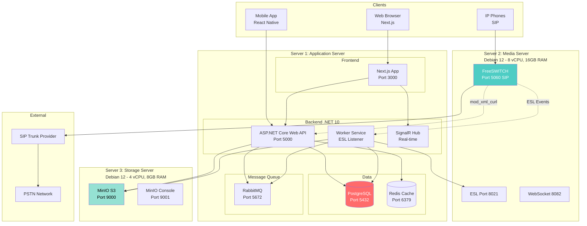

# KIẾN TRÚC HỆ THỐNG & TECH STACK
## Call Center SaaS Platform

> [!IMPORTANT]
> Tài liệu này giải thích **TẠI SAO** chọn từng công nghệ, **ƯU NHƯỢC ĐIỂM**, và **CÁCH SCALE** trong tương lai.

**Phiên bản:** 2.0  
**Ngày:** 06/01/2026  
**Kiến trúc:** 3 Servers riêng biệt

---

## 📋 MỤC LỤC

1. [Kiến trúc 3-Server](#1-kiến-trúc-3-server) - Tại sao tách ra 3 servers?
2. [Backend: .NET 10](#2-backend-net-10) - Tại sao không dùng Node.js/Python?
3. [Frontend: Next.js 15](#3-frontend-nextjs-15) - Tại sao không dùng React thuần?
4. [Database: PostgreSQL](#4-database-postgresql) - Tại sao không dùng MySQL/MongoDB?
5. [Storage: MinIO S3](#5-storage-minio-s3) - **Tại sao không dùng NAS/FTP?** ⭐
6. [Message Queue: RabbitMQ](#6-message-queue-rabbitmq) - Tại sao cần?
7. [Roadmap Scale](#7-roadmap-scale) - Kế hoạch mở rộng

---

## 1. TỔNG QUAN KIẾN TRÚC 3-SERVER

### 1.1. Sơ đồ kiến trúc



### 1.2. Lý do chọn kiến trúc 3-server

#### ✅ Ưu điểm

**1. Separation of Concerns**
- Application logic tách biệt với Media processing
- Storage tách biệt → Không ảnh hưởng performance
- Dễ scale từng component riêng

**2. Performance**
- FreeSWITCH có dedicated resources (CPU, RAM)
- Database không bị ảnh hưởng bởi media processing
- MinIO có dedicated disk I/O

**3. Security**
- FreeSWITCH isolated → Giảm attack surface
- Database không expose ra internet
- Storage có thể restrict access

**4. Scalability**
- Dễ thêm Application Server (horizontal scaling)
- Dễ thêm FreeSWITCH server
- Dễ thêm MinIO nodes (cluster)

**5. Maintenance**
- Update FreeSWITCH không ảnh hưởng Application
- Restart Application không ảnh hưởng cuộc gọi đang diễn ra
- Backup storage riêng biệt

#### ⚠️ Nhược điểm

**1. Chi phí cao hơn**
- 3 servers thay vì 1
- Network bandwidth giữa servers
- Tổng: ~$150-250/tháng (vs $50-100 cho 1 server)

**2. Phức tạp hơn**
- Cần cấu hình network giữa servers
- Monitoring 3 servers
- Deployment phức tạp hơn

**3. Network latency**
- API → FreeSWITCH qua network
- API → MinIO qua network
- Cần optimize network

#### 💡 Tại sao không chọn các kiến trúc khác?

| Kiến trúc | Lý do KHÔNG chọn |
|-----------|------------------|
| **1 server (All-in-one)** | ❌ Single point of failure<br/>❌ Khó scale<br/>❌ Performance bottleneck |
| **2 servers (App + DB)** | ❌ FreeSWITCH vẫn ảnh hưởng App<br/>❌ Storage vẫn shared |
| **4+ servers (Full HA)** | ❌ Quá phức tạp cho giai đoạn đầu<br/>❌ Chi phí cao ($500+/tháng) |

**Kết luận:** 3-server là **sweet spot** giữa performance, cost, và scalability cho startup/SMB.

---

## 2. BACKEND TECH STACK (.NET 10)

### 2.1. Core Framework

#### ASP.NET Core Web API (.NET 10)

**Tại sao chọn .NET 10?**

✅ **Performance**
- Fastest web framework (TechEmpower Benchmark)
- Native AOT compilation
- Minimal API → Low overhead

✅ **Modern Features**
- C# 12 với Primary Constructors
- Native JSON serialization (System.Text.Json)
- Built-in dependency injection
- Minimal APIs

✅ **Cross-platform**
- Chạy trên Linux (Debian 12)
- Docker support tốt
- Cloud-native

✅ **Long-term Support (LTS)**
- .NET 10 support đến 2027
- Stable, production-ready
- Microsoft backing

✅ **Ecosystem**
- NuGet packages phong phú
- Strong community
- Enterprise adoption

#### ❌ Tại sao KHÔNG chọn các framework khác?

**Node.js (Express, NestJS)**
- ❌ Single-threaded → Không tốt cho CPU-intensive tasks
- ❌ Type safety yếu hơn (TypeScript vẫn runtime errors)
- ❌ Performance thấp hơn .NET
- ✅ Nhưng tốt cho I/O-bound, real-time

**Python (Django, FastAPI)**
- ❌ Performance thấp (GIL - Global Interpreter Lock)
- ❌ Không phù hợp real-time telephony
- ✅ Nhưng tốt cho ML, Data Science

**Java (Spring Boot)**
- ❌ Verbose code
- ❌ Startup time chậm
- ❌ Memory footprint lớn
- ✅ Nhưng enterprise-proven

**Go (Gin, Echo)**
- ✅ Performance cao
- ✅ Concurrency tốt
- ❌ Ecosystem nhỏ hơn .NET
- ❌ Ít developers

**Rust (Actix, Rocket)**
- ✅ Performance cao nhất
- ❌ Learning curve dốc
- ❌ Development speed chậm
- ❌ Ít developers

### 2.2. Architecture Pattern

#### Clean Architecture + CQRS

```
src/
├── Core/
│   ├── Domain/              # Entities, Value Objects
│   └── Application/         # Use Cases, Interfaces
│       ├── Commands/        # Write operations (CQRS)
│       └── Queries/         # Read operations (CQRS)
├── Infrastructure/          # External concerns
│   ├── Persistence/         # EF Core, Repositories
│   ├── FreeSWITCH/         # FreeSWITCH integration
│   └── Storage/            # MinIO integration
└── Presentation/
    ├── WebAPI/             # Controllers, Middleware
    └── WorkerService/      # Background services
```

**Tại sao Clean Architecture?**

✅ **Testability**
- Business logic tách biệt
- Easy to unit test
- Mock dependencies dễ dàng

✅ **Maintainability**
- Clear separation of concerns
- Dễ hiểu, dễ modify
- Onboarding developers nhanh

✅ **Flexibility**
- Dễ thay đổi database (PostgreSQL → MongoDB)
- Dễ thay đổi framework
- Technology-agnostic core

✅ **Scalability**
- Microservices-ready
- Dễ tách thành services riêng

### 2.3. Libraries & Packages

#### MediatR - CQRS Pattern

```csharp
// Command
public record CreateExtensionCommand(string Number, string Password) : IRequest<Guid>;

public class CreateExtensionCommandHandler : IRequestHandler<CreateExtensionCommand, Guid>
{
    public async Task<Guid> Handle(CreateExtensionCommand request, CancellationToken ct)
    {
        // Business logic
    }
}

// Query
public record GetExtensionsQuery(int TenantId) : IRequest<List<ExtensionDto>>;
```

**Tại sao MediatR?**

✅ **Decoupling**
- Controllers không biết về Handlers
- Loose coupling

✅ **Single Responsibility**
- Mỗi handler làm 1 việc
- Easy to test

✅ **Pipeline Behaviors**
- Logging, Validation, Caching tự động
- Cross-cutting concerns

**So sánh:**
- **MediatR** ✅ Chosen - Lightweight, flexible
- **MassTransit** ❌ Too heavy for in-process messaging
- **Manual** ❌ Boilerplate code

#### Entity Framework Core - ORM

```csharp
public class ApplicationDbContext : DbContext
{
    public DbSet<Tenant> Tenants { get; set; }
    public DbSet<Extension> Extensions { get; set; }
    public DbSet<CallDetailRecord> CallDetailRecords { get; set; }
}
```

**Tại sao EF Core?**

✅ **Productivity**
- Code-first migrations
- LINQ queries
- Change tracking

✅ **Performance**
- Compiled queries
- Split queries
- No-tracking queries

✅ **Features**
- Global query filters (Multi-tenancy)
- Interceptors
- Value converters

**So sánh:**
- **EF Core** ✅ Chosen - Best for .NET
- **Dapper** ❌ Micro-ORM, more boilerplate
- **NHibernate** ❌ Legacy, less active

#### FluentValidation - Input Validation

```csharp
public class CreateExtensionCommandValidator : AbstractValidator<CreateExtensionCommand>
{
    public CreateExtensionCommandValidator()
    {
        RuleFor(x => x.Number)
            .NotEmpty()
            .Matches(@"^\d{3,4}$")
            .WithMessage("Extension must be 3-4 digits");
    }
}
```

**Tại sao FluentValidation?**

✅ **Separation of Concerns**
- Validation logic tách khỏi models
- Reusable validators

✅ **Expressive**
- Fluent API dễ đọc
- Complex validation rules

✅ **Integration**
- ASP.NET Core integration
- MediatR pipeline behavior

**So sánh:**
- **FluentValidation** ✅ Chosen - Most popular
- **Data Annotations** ❌ Limited, coupled with models
- **Custom** ❌ Reinvent the wheel

#### AutoMapper - Object Mapping

```csharp
public class MappingProfile : Profile
{
    public MappingProfile()
    {
        CreateMap<Extension, ExtensionDto>();
        CreateMap<CreateExtensionCommand, Extension>();
    }
}
```

**Tại sao AutoMapper?**

✅ **Reduce Boilerplate**
- Tự động map properties
- Convention-based

✅ **Maintainability**
- Centralized mapping logic
- Easy to update

**So sánh:**
- **AutoMapper** ✅ Chosen - Industry standard
- **Mapster** ⚠️ Faster but less features
- **Manual** ❌ Too much code

---

## 3. FRONTEND TECH STACK (NEXT.JS)

### 3.1. Core Framework

#### Next.js 15 (App Router)

**Tại sao chọn Next.js thay vì React?**

✅ **Server-Side Rendering (SSR)**
- SEO-friendly
- Faster initial load
- Better performance

✅ **File-based Routing**
- No react-router config
- Automatic code splitting
- Nested layouts

✅ **API Routes**
- Backend for Frontend (BFF) pattern
- Serverless functions
- Edge runtime

✅ **Image Optimization**
- Automatic image optimization
- Lazy loading
- WebP conversion

✅ **Built-in TypeScript**
- Type-safe routing
- Type-safe API routes

✅ **Production-Ready**
- Vercel deployment
- Edge caching
- ISR (Incremental Static Regeneration)

#### ❌ Tại sao KHÔNG chọn các framework khác?

**React (CRA, Vite)**
- ❌ Client-side only → SEO kém
- ❌ Cần setup routing, SSR manually
- ❌ No built-in optimization
- ✅ Nhưng đơn giản hơn cho SPA

**Vue.js (Nuxt.js)**
- ✅ Tương tự Next.js
- ❌ Ecosystem nhỏ hơn React
- ❌ Ít developers

**Angular**
- ❌ Too opinionated
- ❌ Steep learning curve
- ❌ Verbose code
- ✅ Nhưng tốt cho enterprise

**Svelte (SvelteKit)**
- ✅ Performance tốt
- ❌ Ecosystem nhỏ
- ❌ Ít developers

### 3.2. State Management

#### Redux Toolkit

```typescript
// Store
const store = configureStore({
  reducer: {
    auth: authReducer,
    extensions: extensionsReducer,
    calls: callsReducer,
  },
});

// Slice
const extensionsSlice = createSlice({
  name: 'extensions',
  initialState,
  reducers: {
    addExtension: (state, action) => {
      state.items.push(action.payload);
    },
  },
});
```

**Tại sao Redux Toolkit?**

✅ **Predictable State**
- Single source of truth
- Time-travel debugging
- DevTools

✅ **Redux Toolkit**
- Less boilerplate
- Built-in Immer
- RTK Query (API caching)

✅ **Ecosystem**
- Redux DevTools
- Middleware (thunk, saga)
- Persist

**So sánh:**
- **Redux Toolkit** ✅ Chosen - Industry standard
- **Zustand** ⚠️ Simpler but less features
- **Recoil** ❌ Facebook-specific
- **Context API** ❌ Not for complex state

### 3.3. UI Libraries

#### Tailwind CSS + Ant Design

**Tại sao Tailwind CSS?**

✅ **Utility-First**
- Rapid development
- No CSS files
- Consistent design

✅ **Customization**
- Easy to customize
- Design system
- Dark mode built-in

✅ **Performance**
- PurgeCSS → Small bundle
- JIT compiler

**Tại sao Ant Design?**
✅ **Enterprise Components**
- Table, Form, Modal, etc.
- Accessibility
- i18n support

✅ **Customization**
- Theme customization
- CSS-in-JS

**So sánh:**
- **Tailwind + Ant Design** ✅ Chosen
- **Material-UI** ❌ Heavier, opinionated
- **Chakra UI** ⚠️ Good but smaller ecosystem
- **Bootstrap** ❌ Outdated, jQuery-based

### 3.4. HTTP Client

#### Axios

```typescript
const api = axios.create({
  baseURL: process.env.NEXT_PUBLIC_API_URL,
  headers: {
    'Content-Type': 'application/json',
  },
});

api.interceptors.request.use((config) => {
  const token = getToken();
  if (token) {
    config.headers.Authorization = `Bearer ${token}`;
  }
  return config;
});
```

**Tại sao Axios?**

✅ **Features**
- Interceptors
- Automatic JSON parsing
- Request/Response transformation
- Cancel requests

✅ **Browser Support**
- IE11+ support
- Isomorphic (Node + Browser)

**So sánh:**
- **Axios** ✅ Chosen - Most popular
- **Fetch API** ❌ No interceptors, less features
- **SWR/React Query** ⚠️ Good for caching but different use case

---

## 4. DATABASE & STORAGE

### 4.1. PostgreSQL

**Tại sao chọn PostgreSQL?**

✅ **Features**
- JSONB support (IVR flows)
- Full-text search
- Partitioning (CDR tables)
- Materialized views
- Triggers & Stored Procedures

✅ **Performance**
- Faster than MySQL for complex queries
- Better indexing (GIN, GiST, BRIN)
- Parallel queries

✅ **Reliability**
- ACID compliant
- MVCC (Multi-Version Concurrency Control)
- Point-in-time recovery

✅ **Scalability**
- Replication (Master-Slave)
- Logical replication
- Partitioning

✅ **Open Source**
- Free, no licensing cost
- Large community
- Extensions (PostGIS, pg_stat_statements)

#### ❌ Tại sao KHÔNG chọn databases khác?

**MySQL/MariaDB**
- ❌ Ít features hơn PostgreSQL
- ❌ JSONB support kém
- ✅ Nhưng đơn giản hơn

**MongoDB**
- ❌ No ACID transactions (trước đây)
- ❌ No JOIN → Denormalization
- ❌ Không phù hợp billing (cần ACID)
- ✅ Nhưng tốt cho flexible schema

**SQL Server**
- ❌ Licensing cost ($$$)
- ❌ Windows-only (Express trên Linux limited)
- ✅ Nhưng enterprise features tốt

**Oracle**
- ❌ Very expensive
- ❌ Overkill

### 4.2. Redis Cache

**Tại sao Redis?**

✅ **Performance**
- In-memory → Sub-millisecond latency
- Pub/Sub for SignalR backplane

✅ **Data Structures**
- Strings, Hashes, Lists, Sets, Sorted Sets
- HyperLogLog, Bitmaps

✅ **Use Cases**
- Session storage
- API response caching
- Rate limiting
- Real-time leaderboards

**So sánh:**
- **Redis** ✅ Chosen - Most popular
- **Memcached** ❌ Less features
- **In-memory cache** ❌ Not distributed

## 5. STORAGE: MINIO S3 ⭐

### 5.1. Tại sao chọn MinIO thay vì NAS/FTP?

> [!IMPORTANT]
> Đây là câu hỏi quan trọng! Nhiều người nghĩ NAS/FTP đơn giản hơn, nhưng MinIO tốt hơn cho dự án này.

#### So sánh nhanh

| Tiêu chí | MinIO S3 | NAS/FTP |
|----------|----------|---------|
| **API** | ✅ RESTful HTTP API | ❌ FTP protocol (cũ) |
| **Scalability** | ✅ Dễ scale (cluster) | ❌ Khó scale |
| **Cloud-ready** | ✅ S3-compatible | ❌ Không compatible |
| **Security** | ✅ IAM, Bucket policies | ⚠️ Basic auth |
| **Performance** | ✅ HTTP/HTTPS | ⚠️ FTP chậm hơn |
| **Code** | ✅ SDK cho mọi ngôn ngữ | ❌ Phải dùng FTP client |
| **Chi phí** | ✅ Free, open source | ✅ Free |

---

### 5.2. Lý do chi tiết

#### ✅ 1. API hiện đại (S3-compatible)

**MinIO:**
```csharp
// .NET code đơn giản
var minioClient = new MinioClient()
    .WithEndpoint("minio:9000")
    .WithCredentials("accessKey", "secretKey")
    .Build();

// Upload file
await minioClient.PutObjectAsync(new PutObjectArgs()
    .WithBucket("recordings")
    .WithObject("call-123.mp3")
    .WithFileName("/tmp/call-123.mp3"));

// Get presigned URL (share link)
string url = await minioClient.PresignedGetObjectAsync(
    "recordings", "call-123.mp3", 3600); // 1 hour
```

**NAS/FTP:**
```csharp
// Phải dùng FTP client, phức tạp hơn
FtpClient client = new FtpClient("ftp://nas-server");
client.Credentials = new NetworkCredential("user", "pass");
client.Connect();
client.UploadFile("/tmp/call-123.mp3", "/recordings/call-123.mp3");
client.Disconnect();

// Không có presigned URL → Phải tự code
// Phải setup web server riêng để serve files
```

**Kết luận:** MinIO code đơn giản hơn, có sẵn presigned URL.

---

#### ✅ 2. Tương thích AWS S3 (Migration dễ dàng)

**Tại sao quan trọng?**
- Nếu sau này muốn chuyển lên AWS S3 → **Chỉ cần đổi endpoint**
- Code không cần sửa gì
- Dùng chung SDK với AWS

**Ví dụ migration:**
```csharp
// Development (MinIO)
var client = new MinioClient()
    .WithEndpoint("localhost:9000")  // MinIO local
    .Build();

// Production (AWS S3)
var client = new MinioClient()
    .WithEndpoint("s3.amazonaws.com")  // AWS S3
    .Build();

// Code còn lại GIỐNG HỆT NHAU!
```

**NAS/FTP:** Không tương thích AWS → Phải viết lại code hoàn toàn.

---

#### ✅ 3. Scalability (Mở rộng dễ dàng)

**MinIO - Distributed Mode:**
```
Server 1: MinIO Node 1 (1TB)
Server 2: MinIO Node 2 (1TB)
Server 3: MinIO Node 3 (1TB)
Server 4: MinIO Node 4 (1TB)

→ Total: 4TB, High Availability
→ 1 node down vẫn hoạt động
```

**NAS/FTP:**
- Chỉ 1 server
- Muốn thêm dung lượng → Phải thêm disk vào server đó
- Server down = mất hết

---

#### ✅ 4. Security & Access Control

**MinIO:**
```json
// Bucket Policy - Kiểm soát chi tiết
{
  "Version": "2012-10-17",
  "Statement": [
    {
      "Effect": "Allow",
      "Principal": {"AWS": ["tenant-123"]},
      "Action": ["s3:GetObject"],
      "Resource": ["arn:aws:s3:::recordings/tenant-123/*"]
    }
  ]
}
```
- IAM users/policies
- Bucket-level permissions
- Object-level permissions
- Encryption at rest

**NAS/FTP:**
- Chỉ có username/password
- Không có fine-grained control
- Khó phân quyền theo tenant

---

#### ✅ 5. Performance

**MinIO:**
- HTTP/HTTPS protocol → Nhanh
- Multi-part upload → Upload file lớn nhanh hơn
- Parallel downloads
- CDN-ready

**NAS/FTP:**
- FTP protocol → Chậm hơn HTTP
- Không có multi-part upload
- Khó integrate với CDN

---

#### ✅ 6. Features cho Production

**MinIO có sẵn:**
- ✅ **Versioning** - Lưu nhiều phiên bản file
- ✅ **Lifecycle policies** - Tự động xóa file cũ
- ✅ **Encryption** - Mã hóa dữ liệu
- ✅ **Replication** - Sao lưu tự động
- ✅ **Event notifications** - Webhook khi upload/delete
- ✅ **Metrics** - Prometheus metrics

**NAS/FTP:**
- ❌ Không có features này
- Phải tự code tất cả

---

### 5.3. Use Cases trong dự án

#### Recording Storage

```csharp
// Worker Service - Sau khi cuộc gọi kết thúc
public async Task ProcessRecordingAsync(string callUuid)
{
    // 1. Convert WAV to MP3
    string mp3File = await ConvertToMp3Async($"{callUuid}.wav");
    
    // 2. Upload to MinIO
    await minioClient.PutObjectAsync(new PutObjectArgs()
        .WithBucket("recordings")
        .WithObject($"{tenantId}/{callUuid}.mp3")
        .WithFileName(mp3File));
    
    // 3. Get presigned URL (valid 7 days)
    string url = await minioClient.PresignedGetObjectAsync(
        "recordings", $"{tenantId}/{callUuid}.mp3", 
        60 * 60 * 24 * 7);
    
    // 4. Save URL to database
    await UpdateCdrAsync(callUuid, url);
    
    // 5. Delete local file
    File.Delete(mp3File);
}
```

**Ưu điểm:**
- URL có thời hạn (security)
- Không cần web server riêng
- Frontend chỉ cần URL để play

---

### 5.4. Khi nào dùng NAS/FTP?

**NAS/FTP phù hợp khi:**
- ❌ Dự án nhỏ, không cần scale
- ❌ Chỉ lưu file nội bộ, không share
- ❌ Team quen với FTP
- ❌ Không cần integrate với code

**MinIO phù hợp khi:**
- ✅ Cần API để upload/download từ code
- ✅ Cần share files với presigned URLs
- ✅ Cần scale trong tương lai
- ✅ Muốn tương thích AWS S3
- ✅ Cần security tốt hơn

---

### 5.5. Setup MinIO

```bash
# Docker Compose
version: '3.8'
services:
  minio:
    image: minio/minio:latest
    ports:
      - "9000:9000"  # API
      - "9001:9001"  # Console
    environment:
      MINIO_ROOT_USER: admin
      MINIO_ROOT_PASSWORD: password123
    command: server /data --console-address ":9001"
    volumes:
      - minio_data:/data

volumes:
  minio_data:
```

**Truy cập:**
- API: http://localhost:9000
- Console (UI): http://localhost:9001

---

### 5.6. Kết luận

**Chọn MinIO vì:**
1. ✅ **Modern API** - RESTful, dễ code
2. ✅ **S3-compatible** - Dễ migrate lên AWS
3. ✅ **Scalable** - Cluster mode
4. ✅ **Secure** - IAM, policies
5. ✅ **Production-ready** - Versioning, lifecycle, encryption
6. ✅ **Free** - Open source

**Không chọn NAS/FTP vì:**
1. ❌ **Old protocol** - FTP lỗi thời
2. ❌ **Hard to code** - Phải dùng FTP client
3. ❌ **Not scalable** - Single server
4. ❌ **No cloud migration** - Không tương thích AWS
5. ❌ **Basic security** - Chỉ username/password

**Tóm lại:** MinIO là **best choice** cho dự án hiện đại, có khả năng scale.

---

## 5. INFRASTRUCTURE & DEVOPS

### 5.1. Operating System

#### Debian 12 (Bookworm)

**Tại sao Debian 12?**

✅ **Stability**
- Long-term support (5 years)
- Well-tested packages
- Production-proven

✅ **Performance**
- Lightweight
- Minimal bloat
- Fast boot time

✅ **Security**
- Security updates
- AppArmor
- Unattended upgrades

✅ **Package Management**
- APT package manager
- Large repository
- Easy to install software

**So sánh:**
- **Debian 12** ✅ Chosen - Most stable
- **Ubuntu 22.04** ⚠️ More user-friendly but less stable
- **CentOS/Rocky Linux** ⚠️ Good but RedHat-based
- **Alpine Linux** ❌ Too minimal for production

### 5.2. Containerization

#### Docker + Docker Compose

```yaml
version: '3.8'
services:
  api:
    image: callcenter-api:latest
    ports:
      - "5000:5000"
    environment:
      - ConnectionStrings__DefaultConnection=...
    depends_on:
      - postgres
      - redis
  
  postgres:
    image: postgres:16
    volumes:
      - postgres_data:/var/lib/postgresql/data
  
  redis:
    image: redis:7-alpine
```

**Tại sao Docker?**

✅ **Consistency**
- Dev = Staging = Production
- No "works on my machine"

✅ **Isolation**
- Each service isolated
- No dependency conflicts

✅ **Portability**
- Easy to move between servers
- Cloud-agnostic

✅ **Scalability**
- Easy to scale services
- Orchestration (Kubernetes later)

**So sánh:**
- **Docker** ✅ Chosen - Industry standard
- **Podman** ⚠️ Daemonless but less ecosystem
- **LXC** ❌ Lower-level
- **VMs** ❌ Heavy, slow

### 5.3. Reverse Proxy

#### Nginx

```nginx
upstream api_backend {
    server localhost:5000;
}

server {
    listen 80;
    server_name api.example.com;
    
    location / {
        proxy_pass http://api_backend;
        proxy_set_header Host $host;
        proxy_set_header X-Real-IP $remote_addr;
    }
}
```

**Tại sao Nginx?**

✅ **Performance**
- Event-driven architecture
- Low memory footprint
- High concurrency

✅ **Features**
- Load balancing
- SSL termination
- Caching
- Rate limiting

**So sánh:**
- **Nginx** ✅ Chosen - Best performance
- **Apache** ❌ Slower, more memory
- **Caddy** ⚠️ Auto HTTPS but less mature
- **Traefik** ⚠️ Good for Docker but overkill

---

## 6. MESSAGE QUEUE & REAL-TIME

### 6.1. RabbitMQ

**Tại sao RabbitMQ?**

✅ **Reliability**
- Message persistence
- Acknowledgments
- Dead letter queues

✅ **Routing**
- Exchanges (direct, topic, fanout)
- Flexible routing
- Message filtering

✅ **Features**
- Priority queues
- Delayed messages
- Message TTL

✅ **Management**
- Web UI
- Monitoring
- Clustering

**Use Cases trong dự án:**
- CDR processing (async)
- Recording conversion (async)
- Email notifications
- SMS notifications
- Billing calculations

**So sánh:**
- **RabbitMQ** ✅ Chosen - Feature-rich, reliable
- **Redis Pub/Sub** ❌ No persistence
- **Kafka** ❌ Overkill, complex setup
- **Azure Service Bus** ❌ Cloud vendor lock-in

### 6.2. SignalR

**Tại sao SignalR?**

✅ **Real-time**
- WebSocket with fallback (SSE, Long Polling)
- Automatic reconnection
- Backplane support (Redis)

✅ **Integration**
- Native .NET integration
- TypeScript client
- Strongly-typed hubs

✅ **Scalability**
- Redis backplane for scale-out
- Azure SignalR Service (future)

**Use Cases:**
- Live call monitoring
- Agent status updates
- Queue statistics
- Dashboard real-time updates

**So sánh:**
- **SignalR** ✅ Chosen - Best for .NET
- **Socket.IO** ❌ Node.js-based
- **WebSocket (raw)** ❌ Too low-level
- **SSE** ❌ One-way only

---

## 7. SO SÁNH VỚI CÁC LỰA CHỌN KHÁC

### 7.1. Backend Frameworks

| Framework | Performance | Ecosystem | Learning Curve | Production-Ready | Verdict |
|-----------|-------------|-----------|----------------|------------------|---------|
| **.NET 10** | ⭐⭐⭐⭐⭐ | ⭐⭐⭐⭐⭐ | ⭐⭐⭐⭐ | ⭐⭐⭐⭐⭐ | ✅ **Chosen** |
| Node.js | ⭐⭐⭐ | ⭐⭐⭐⭐⭐ | ⭐⭐⭐⭐⭐ | ⭐⭐⭐⭐ | ❌ |
| Python | ⭐⭐ | ⭐⭐⭐⭐ | ⭐⭐⭐⭐⭐ | ⭐⭐⭐ | ❌ |
| Java | ⭐⭐⭐⭐ | ⭐⭐⭐⭐⭐ | ⭐⭐⭐ | ⭐⭐⭐⭐⭐ | ❌ |
| Go | ⭐⭐⭐⭐⭐ | ⭐⭐⭐ | ⭐⭐⭐ | ⭐⭐⭐⭐ | ❌ |

### 7.2. Frontend Frameworks

| Framework | SSR | SEO | Ecosystem | Learning Curve | Verdict |
|-----------|-----|-----|-----------|----------------|---------|
| **Next.js** | ⭐⭐⭐⭐⭐ | ⭐⭐⭐⭐⭐ | ⭐⭐⭐⭐⭐ | ⭐⭐⭐⭐ | ✅ **Chosen** |
| React (SPA) | ❌ | ⭐⭐ | ⭐⭐⭐⭐⭐ | ⭐⭐⭐⭐⭐ | ❌ |
| Vue/Nuxt | ⭐⭐⭐⭐⭐ | ⭐⭐⭐⭐⭐ | ⭐⭐⭐⭐ | ⭐⭐⭐⭐⭐ | ❌ |
| Angular | ⭐⭐⭐⭐ | ⭐⭐⭐⭐ | ⭐⭐⭐⭐ | ⭐⭐ | ❌ |

### 7.3. Databases

| Database | Performance | Features | Scalability | Cost | Verdict |
|----------|-------------|----------|-------------|------|---------|
| **PostgreSQL** | ⭐⭐⭐⭐⭐ | ⭐⭐⭐⭐⭐ | ⭐⭐⭐⭐ | Free | ✅ **Chosen** |
| MySQL | ⭐⭐⭐⭐ | ⭐⭐⭐ | ⭐⭐⭐⭐ | Free | ❌ |
| MongoDB | ⭐⭐⭐⭐ | ⭐⭐⭐⭐ | ⭐⭐⭐⭐⭐ | Free | ❌ |
| SQL Server | ⭐⭐⭐⭐ | ⭐⭐⭐⭐⭐ | ⭐⭐⭐⭐ | $$$ | ❌ |

---

## 8. ROADMAP SCALE

### Phase 1: MVP (Tháng 1-3) - Current

```
Server 1: Application (8 vCPU, 16GB)
    ├── Next.js
    ├── .NET 10 API
    ├── PostgreSQL
    ├── Redis
    └── RabbitMQ

Server 2: FreeSWITCH (8 vCPU, 16GB)
    └── FreeSWITCH

Server 3: Storage (4 vCPU, 8GB)
    └── MinIO

Capacity: 100 agents, 200 concurrent calls
Cost: ~$150-250/month
```

### Phase 2: Growth (Tháng 4-6)

```
Server 1: Application (16 vCPU, 32GB)
Server 2: FreeSWITCH (16 vCPU, 32GB)
Server 3: Storage (8 vCPU, 16GB)
Server 4: Database (8 vCPU, 16GB) ← NEW
    ├── PostgreSQL Master
    └── PostgreSQL Slave

Capacity: 500 agents, 500 concurrent calls
Cost: ~$400-600/month
```

### Phase 3: Scale (Tháng 7-12)

```
Load Balancer
    ├── Server 1-2: Application (2 instances)
    ├── Server 3-4: FreeSWITCH (2 instances)
    ├── Server 5: Database Master
    ├── Server 6: Database Slave
    └── Server 7: MinIO Cluster (3 nodes)

Capacity: 2000 agents, 2000 concurrent calls
Cost: ~$1000-1500/month
```

### Phase 4: Enterprise (Năm 2+)

```
Kubernetes Cluster
    ├── API Pods (Auto-scaling)
    ├── FreeSWITCH Pods (Auto-scaling)
    ├── PostgreSQL Cluster (Patroni)
    ├── Redis Cluster
    ├── RabbitMQ Cluster
    └── MinIO Distributed

Capacity: Unlimited (horizontal scaling)
Cost: $2000+/month
```

---

## 9. CÔNG NGHỆ BỔ SUNG ĐỀ XUẤT

### 9.1. Monitoring & Observability

#### Prometheus + Grafana

**Tại sao cần?**
- Monitor server metrics (CPU, RAM, Disk)
- Monitor application metrics (API latency, error rate)
- Monitor FreeSWITCH (active calls, registrations)
- Alerting (email, Slack)

**Setup:**
```yaml
prometheus:
  image: prom/prometheus
  volumes:
    - ./prometheus.yml:/etc/prometheus/prometheus.yml

grafana:
  image: grafana/grafana
  ports:
    - "3001:3000"
```

### 9.2. Logging

#### Serilog + Seq

**Tại sao cần?**
- Centralized logging
- Structured logging (JSON)
- Search & filter logs
- Correlation IDs

**Setup:**
```csharp
Log.Logger = new LoggerConfiguration()
    .WriteTo.Console()
    .WriteTo.Seq("http://seq:5341")
    .CreateLogger();
```

### 9.3. API Documentation

#### Swagger/OpenAPI

**Tại sao cần?**
- Auto-generated API docs
- Try API directly
- Client SDK generation

**Setup:**
```csharp
builder.Services.AddSwaggerGen(c =>
{
    c.SwaggerDoc("v1", new OpenApiInfo { Title = "Call Center API", Version = "v1" });
});
```

### 9.4. CI/CD

#### GitHub Actions

**Tại sao cần?**
- Automated testing
- Automated deployment
- Code quality checks

**Setup:**
```yaml
name: CI/CD
on: [push]
jobs:
  build:
    runs-on: ubuntu-latest
    steps:
      - uses: actions/checkout@v2
      - name: Build
        run: dotnet build
      - name: Test
        run: dotnet test
      - name: Deploy
        run: ./deploy.sh
```

### 9.5. Security

#### Let's Encrypt SSL

**Tại sao cần?**
- HTTPS for API
- WSS for SignalR
- Free SSL certificates

#### Fail2Ban

**Tại sao cần?**
- Protect against brute-force
- Auto-ban attackers
- SIP attack protection

---

## 10. TECH STACK SUMMARY

### Backend
- ✅ .NET 10 (ASP.NET Core Web API)
- ✅ Entity Framework Core
- ✅ MediatR (CQRS)
- ✅ FluentValidation
- ✅ AutoMapper
- ✅ SignalR (Real-time)
- ✅ RabbitMQ (Message Queue)

### Frontend
- ✅ Next.js 15 (App Router)
- ✅ TypeScript
- ✅ Redux Toolkit
- ✅ Axios
- ✅ Tailwind CSS
- ✅ Ant Design

### Database & Storage
- ✅ PostgreSQL 16
- ✅ Redis 7
- ✅ MinIO (S3-compatible)

### Infrastructure
- ✅ Debian 12
- ✅ Docker + Docker Compose
- ✅ Nginx
- ✅ FreeSWITCH

### DevOps & Monitoring
- ✅ Prometheus + Grafana
- ✅ Serilog + Seq
- ✅ GitHub Actions
- ✅ Let's Encrypt
- ✅ Fail2Ban

---

**Kết luận:** Tech stack này được chọn để **cân bằng giữa performance, scalability, cost, và developer experience**. Phù hợp cho startup/SMB với khả năng scale lên enterprise.

**Ngày tạo:** 06/01/2026  
**Phiên bản:** 2.0
